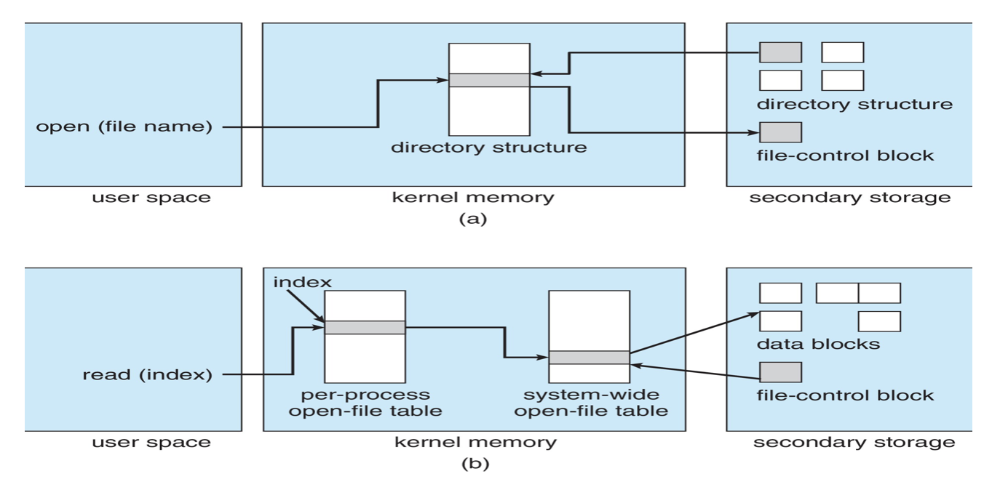

# 14. 파일 시스템 구현(Implementing File Systems)

- 파일 시스템은 데이터와 프로그램을 포함하여 파일 내용의 온라인 접근과 온라인 저장을 위한 기법을 제공한다
- 보통 파일 시스템은 많은 양의 자료를 보관하도록 설계된 보조저장장치에 영구적으로 상주한다
- 이 장에서는 가장 일반적인 `보조자장 매체`인 하드 디스크 드라이브와 비휘발성 메모리 장치상의 `파일 저장과 접근을 둘러싸고 있는 이슈들을 주로 다룬다`
- 파일 사용을 구조화하고, 저장장치 공간을 할당하고, 반납된 공간을 재사용하고, 데이터의 위치를 추적하고, 그리고 운영체제의 다른 부분과 보조저장장치와 연결하는 방법들을 토의한다
- 범용 운영체제는 여러 파일 시스템을 제공한다
  - 다른 파일 시스템은 다른 목적을 가지고 수행한다
  - 예를 들어, 임시 파일 시스템은 비 지속적 파일의 빠른 저장 및 검색에 사용되는 반면
    - 디폴트 보조저장장치 파일 시스템(e.g. Linux ext4)은 안정성과 기능을 추구하기 위하여 성능을 희생시킨다

#### 이 장의 목표

- 지역 `파일 시스템` 및 `디렉터리 구조` 구현에 대한 세부 사항을 설명한다
- 블록 할당과 가용 블록 알고리즘 및 그의 절충에 대해 논의한다
- 파일 시스템의 효율 및 성능 문제를 탐색한다
- 파일 시스템 장애로부터의 복구를 살펴본다
- 구체적인 예로서 WAFL 파일 시스템을 설명한다

## 14.1 파일 시스텤 구조

- 파일 시스템을 유지하기 위한 보조저장장치로 디스크가 대부분 사용된다
- 디스크가 보조저장장치로 사용되는 2가지 특성

  - (1) 디스크는 추가 장소를 사용하지 않고 재기록이 가능하다
    - 디스크로부터 한 블록을 읽고, 변경하여 같은 블록에 재기록이 가능하다
  - (2) 디스크에 있는 임의의 블록의 정보를 직접 접근할 수 있다
    - 디스크에 있는 임의의 블록의 정보를 직접 접근할 수 있다
    - 따라서 임의의 파일을 순차적 또는 무작위 방법으로 접근할 수 있다
    - 그리고 한 파일로부터 다른 파일로 전환이 요구될 때, 드라이브가 읽기 - 쓰기 헤드를 이동시키고 매체가 회전하는 동안 기다리면 된다

- 비휘발성 메모리(NVM) 장치는 파일 저장 및 파일 시스템의 장소로 점저 더 많이 사용되고 있다

  - 하드 디스크와는 달리 재기록이 불가능하며, 성능 특성이 다르다
  - 디스크 및 NVM 장치 구조에 대해서는 11장에서 자세히 설명한다

- `I/O` 효율성을 향상하기 위해 메모리와 대용량 스토리지 간의 I/O 전송이 `블록 단위로 수행`된다

  - 하드 디스크 드라이브의 각 블록에는 하나 이상의 섹터가 있다
  - 디스크 드라이브에 따라 `섹터 크기`는 일반적으로 `512바이트 또는 4096바이트`이다
    - NVM장치에는 일반적으로 4096 바이트의 블록이 있으며 디스크 드라이브에서 사용하는 것과 유사한 전송 방법이 사용된다

- 파일 시스템은 쉽게 데이터를 저장하고, 찾고 또한 인출할 수 있게 함으로써 저장장치를 더욱 효율적이고 편리하게 사용할 수 있게 한다

- 파일 시스템은 두 가지 설계 문제를 제기한다

  - 파일 시스템이 사용자에게 어떻게 보여야 할지를 정의
  - 논리 파일 시스템을 물리적인 2차 저장장치로 매핑하는 알골즘과 데이터 구조를 만든다

- 계층적 파일 시스템(그림 14.1) : 계층 설계의 예

  - 응용 프로그램 -> 논리적 파일 시스템 -> 파일-구성 모듈 -> `기본 파일 시스템` -> 입출력 제어 -> 장치
  - 입출력 제어 층
    - 장치 드라이버 루틴들과 인터럽트 핸들러로 이루어져 있다 : 메모리와 디스크 시스템 간의 정보 전송을 담당한다
      - 장치 드라이버 : 번역기와 비슷.(고수준 입력 -> 저수준 출력)
  - 기본 파일 시스템(Linux에서 블록 입출력 서브시스템으로 불림)
    - 적절한 장치 드라이버에게 저장장치상의 블록을 읽고 쓰도록 일반적인 명령을 내리는 층
    - 논리 블록 주소를 기반으로 드라이브에 명령을 내린다
    - I/O 요청 스케줄링도 고려한다
    - 다양한 파일 시스템, 디렉터리 및 데이터 블록을 저장하는 메모리 버퍼와 캐시를 관리
      - 버퍼 내의 블록은 대용량 저장장치 블록을 전송이 일어나기 전에 할당된다
        - 버퍼가 가득 차면, 버퍼 관리자는 요청된 입출력이 완료될 수 있도록 더 많은 버퍼 메모리를 찾아내거나 버퍼의 가용공간을 확보해야 한다
      - 캐시는 종종 성능을 향상하기 위해 파일 시스템 메타데이터를 저장하는 데 사용된다
  - 파일-구성 모듈(file-organization module) : 파일과 상응하는 논리 블록을 알고 있다
    - 각 파일의 논리 블록은 0부터 N까지 번호를 준다
    - 이 모듈은 어느 디스크 공간이 비어있는지를 파악하는 가용 공간 관리자도 포함하고 있다
      - 파일 구성모듈이 요구할 때 이들 블록을 제공한다
  - 논리적 파일 시스템(logical file system) : 메타데이터 정보를 관리한다
    - 메타데이터는 파일의 내용 자체인 데이터를 제외한 모든 파일 시스템 구조를 말한다
    - 파일 이름을 심볼기하게 줄 경우 처리하여 하위층인 `파일 구성 모듈에 필요한 정보를 넘겨`주기 위해 디렉터리 구조를 관리한다
  - 파일 제어 블록(file control block, FCB) : 소유, 허가 그리고 파일 내용의 위치를 포함하여 파일에 관한 정보를 가지고 있다
    - 파일 구조는 파일 제어 블록을 통해 유지
    - 내 생각) 프로세스 제어 블록(PCB)와 유사한 역할을 하는 것 같다
    - UNIX 파일 시스템에서는 inode로 구현된다
  - 논리 파일 시스템
    - 보호를 책임 진다
    - 13장과 17장에서 자세히 다룬다

- 파일 시스템 구현을 위해 계층 구조를 사용 -> 코드의 중복이 최소화
- 계층화 -> 오버헤드 야기 -> 성능 저하
  - 몇 개의 계층을 사용하고 각 층은 어떤 작업을 하는 가를 포함하여 계층의 사용 여부는 새시스템을 설계하는 데 있어 주요한 결정 사항이다
- 현재 많은 파일 시스템들이 사용되고 있고, 대부분의 운영체제가 하나 이상의 파일 시스템을 지원하고 있다
  - 예를 들어, 대부분의 CD-ROM들은 ISO 9660 포맷을 사용한다
  - 이동 가능한 미디어 파일 시스템뿐 아니라 각 운영체제는 하나 이상의 디스크 기반 파일 시스템을 가지고 있다
    - UNIX는 기본으로 Berkeley Fast File System(Berkeley FFS)에 기반을 둔 UFS(Unix File System)를 사용한다
    - Windows는 FAT와 NTFS 포맷을 지원한다
    - Linux의 표준 파일 시스템은 extended file system으로 알려져 있다
      - 현재 가장 많이 사용되는 버전은 ext3, ext4 버전이다
    - 또한 분산 파일 시스템도 존재하며, 이는 네트워크 상에 존재하는 하나 이상의 다수의 클라이언트가 마운트하여 사용할 수 있다
    - FUSE : 커널 수준 코드가 아니라 사용자 수준 코드로 파일 시스템을 구현
      - 다양한 운영체제에 새로운 파일 시스템을 추가할 수 있고, 자신의 파일을 관리하기 위해 이 파일 시스템을 사용할 수 있다

## 14.2 파일 시스템 구현(File system implementation)

- 파일 시스템 연산을 구현하는 데 사용되는 구조와 연산에 대해 깊이 살펴보자

### 14.2.1 개요(Overview)

- 저장장치의 구조, 메모리 구조 -> 파일 시스템을 구현하는 데 사용
  - 이들은 운영체제와 파일 시스템에 따라 다르지만 몇 개의 일반적인 원칙은 공동 적용된다
- 파일 시스템은 아래와 같은 것들을 디스크 상에 가지고 있다

  - 저장장치에 저장된 운영체제를 어떻게 부트시키는지
  - 블록의 총수
  - 가용 블록의 수와 위치
  - 디렉터리 구조
  - 개별 파일에 대한 정보

- 디스크 상의 구조는 다음을 포함한다

  - 부트 제어 블록
  - 볼륨 제어 블록
  - 디렉터리 구조
  - 파일별 FCB

#### 디스크 상 구조

- 부트 제어 블록

  - 시스템이 그 파티션으로 부터 운영체제를 부트시키는 데 필요한 정보를 가지고 있다
  - 부트 제어 블록은 일반적으로 한 파티션의 첫 번째 블록이다
  - UFS(Unix File System)에서는 부트 블록, NTFS(Windows NT File System)에서는 파티션 부트 섹터라고 부른다

- 볼륨 제어 블록

  - 아래와 같은 볼륨 정보를 포함한다
    - 볼륨 블록의 수
    - 블록의 크기
    - 가용 블록의 수와 포인터
    - FCB수와 포인터
  - UFS에서는 슈퍼블록, NTFS에서는 마스터 파일 테이블(master file table)이라 불린다

- 디렉터리 구조

  - 파일을 조직화하는 데 사용
  - UFS에서는 디렉터리 구조에 `파일 이름 및 해당 inode 번호`가 저장된다
  - NTFS에서는 마스터 파일 테이블에 이러한 정보가 저장된다

- 파일별 FCB
  - 자세한 파일 정보를 가지고 있다
  - FCB는 디렉터리 항목과의 연결을 위해 고윻산 식별 번호를 가지고 있다
  - NTFS에서 이 정보는 실제로 마스터 파일 테이블 안에 저장되며, 파일마다 한 행을 가진 관계 데이터베이스 구조를 사용한다

#### 메모리 내의 정보

- 파일 시스템 관리와 캐싱을 통한 성능 향상을 위해 사용된다
- 마운트 시점에 적재되고, 파일 시스템 동작 중에 갱신되며, 마운트 해제 시에 제거된다

- 메모리 내 파티션 테이블은 마운트된 모든 파티션 정보를 포함한다
- 메모리 내 디렉터리 구조
  - 최근 접근된 디렉터리의 정보를 가진다
  - 파티션이 마운트된 디렉터리의 경우 파티션 테이블에 대한 포인터를 포함할 수 있다
- 범 시스템 오픈 파일 테이블(system wide open file table)
  - 다른 정보와 더불어 오픈된 각 파일의 FCB의 복사본을 가지고 있다
- 프로세스별 오픈 파일 테이블(per-process open file table)
  - 프로세스가 연 모든 파일에 대해 다른 정보뿐만 아니라 범 시스템 오픈 파일 테이블 내의 해당 항목에 대한 포인터를 포함한다
- 버퍼는 파일 시스템이 파일 시스템으로부터 읽히거나 써질 때 파일 시스템 블록을 저장한다

#### 전형적인 파일 제어 블록(FCB, File Control Block)

- 그림 14.2 전형적인 파일 제어 블록

  - 파일 권한
  - 파일 날짜(생성, 접근, 쓰기)
  - 파일 소유자, 그룹, ACL
  - 파일 크기
  - 파일 데이터 블록 또는 파일 데이터 블록을 가리키는 포인터

- 새로운 파일 생성을 위해 프로세스는 논리 파일 시스템을 호출한다
  - 논리 파일 시스템은 디렉터리 구조의 포맷을 알고 있다
  - 새로운 파일을 생성하기 위해 파일 시스템은 새로운 FCB을 할당하고, 해당 디렉터리를 메모리로 읽어, 새로운 파일 이름과 FCB로 디렉터리를 갱신하여, 파일 시스템에 다시 쓴다
  - UNIX를 포함하여 몇몇 운영체제에서는 `디렉터리를 하나의 파일로 간주`한다
    - 물론 디렉터리라고 지정하는 유형 필드를 가지고 있다
  - Windows NT와 같은 다른 운영체제에서는 `디렉터리와 파일을 별개로 간주`하며, 각각의 시스템 콜을 가지고 있다
    - 논리적 파일 시스템은 디렉터리 입출력을 저장장치 블록 위치로 매핑하기 위해 파일 구성 모듈을 호출한다
    - 이것은 기본적인 파일 시스템과 입출력 제어 시스템에서 처리된다

### 14.2.2 사용법(Usage)

- 그림 14.3 메모리 내의 파일 시스템 구조 (a) 파일 오픈 (b) 파일 읽기

- 파일 생성
- 파일 오픈 : open()
  - 파일이 이미 다른 프로세스에 의해 사용 중인지 확인하기 위해 범 시스템 오픈 파일 테이블을 검색한다
    - 사용중이면
      - 기존 범 시스템 오픈 파일 테이블을 가리키는 프로세스별 오픈 파일 테이블 항목이 생성된다
    - 사용중이지 않으면
      - 주어진 파일 이름을 디렉터리 구조에서 찾는다
      - 디렉터리 연산의 속도를 향상하기 위해 통상 디렉터리 구조의 일부를 메모리에 캐싱한다
      - 파일이 발견되면 FCB가 메모리내의 범 시스템 오픈 파일 테이블에 복사된다
      - 이 테이블은 FCB를 저장할 뿐만 아니라, 파일을 오픈한 프로세스의 수도 저장한다
- 파일 읽기 : 파일 디스크립터(UNIX) | 파일 핸들(Windows)

  - 파일을 오픈하면, 파일 시스템은 파일을 식별하기 위해 파일 디스크립터를 생성한다
  - 파일 디스크립터는 프로세스별 오픈 파일 테이블에 저장된다
  - open() 시스템 콜은 프로세스벼 파일 시스템 테이블 내의 해당 항목에 대한 포인터를 찾아 돌려준다
  - 그 후 모든 파일 연산은 이 포인터를 통해 실행된다
  - 해당 FCB를 디스크에서 찾으면 시스템은 파일 이름을 더는 사용하지 않기 때문에, 파일 이름은 오픈 파일 테이블의 한 부분이 아니다
  - 그러나 이것은 같은 파일에 대한 다중 오픈 연산을 하기 위해 캐시될 수 있다

- 파일 닫기

  - 프로세스가 파일을 닫을 때, 프로세스별 테이블 항이 삭제되며, 범 시스템 항목의 오픈 계수는 감소한다
  - 오픈했던 모든 사용자가 파일을 닫으면 디스크 기반 디렉터리 구조에 업데이트된 파일 정보가 복사되며, 범 시스템 오픈 파일 테이블에서 그 항목이 삭제된다

- 캐시
  - 이런 구조들을 캐싱할 때의 장점을 경시해서는 안 된다
  - 전형적인 예로, BSD UNIX 시스템을 들 수 있다
  - 평균 캐시 적중률이 85%라는 것은 이러한 기술이 구현할 가치가 있다는 것을 말해준다
  - BSD UNIX 시스템은 부록 C에서 자세히 설명된다

## 14.3 디렉터리 구현

- 디렉터리 공간을 어떻게 할당하고 어떻게 관리하는가는 파일 시스템의 효율, 성능과 신뢰성에 큰 영향을 미친다
- 이들과 연관되어 있는 알고리즘과 문제점들을 이해할 필요가 있다

### 14.3.1 선형 리스트(Linear List)

- 디렉터리를 구현하는 가장 간단한 방법은 파일 이름과 데이터 블록에 대한 포인터들의 선형 리스트를 디렉터리에 사용하는 것이다
- 이 방법은 프로그램을 구현하기 쉽지만 실행 시간이 길다는 단점이 있다
- 동작
  - 파일 생성
    - 새로운 파일을 생성하기 위해 디렉터리를 탐색
    - 같은 이름을 가진 파일이 존재하지 않는 다면 디렉터리의 끝 부분에 새로운 항목을 첨가
  - 파일 삭제
    - 디렉터리에서 이름을 찾아 그 파일에 할당된 공간을 방출
  - 디렉털리 항목 재사용을 위해
    - 항목을 미사용으로 표시
      - 방법 1. 이름을 모두 공백으로 만드는 것과 같은 특별한 이름을 정하거나
      - 방법 2. 유효하지 않은 inode 번호(예, 0)를 지정하거나 각 항목에 항목마다 사용-미사용 비트를 추가할 수 있다
      - 방법 3. 사용 가능하게 된 항목에 제일 마지막 항목을 복사해 넣고 디렉터리의 길이를 하나 줄이는 방법이다
        - 우리는 파일 삭제 시간을 줄이기 위해 연결 리스트를 사용할 수도 있다
    - 또는 가용 디렉터리 항목 리스트에 추가
- 단점
  - 느리다

### 14.3.2 해시 테이블(Hash Table)

- 파일 이름 -> 해시 -> 해시 값을 포인터로 활용하여 리스트를 직접 접근
- 해시의 특성상 성능은 크게 개선된다
- 충돌(collision, 둘 이상의 파일명이 같은 위치를 지정하는 경우)에 대한 보완만한다면 삽입과 삭제가 쉽게 행해진다
- 문제점
  - 해시 테이블이 고정된 크기를 갖는다
  - 해시 테이블의 크기에 따라 해시 기능도 제한을 받는다
  - e.g.
    - 64로 나눈 나머지 값을 이용하여 파일 이름을 0부터 63까지 정수로 변환
    - 나중에 65번째 파일을 생성하려면 디렉터리 해시 테이블을 키워야 한다
      - 0~127까지 범위의 새로운 해시 함수가 필요하다
    - 기존 디렉터리를 새로운 해시 값에 맞게 새로 조직해야 한다
- 대안
  - 체인 오버플로우 해시 테이블을 사용할 수 있다
    - 각 항목은 하나의 값이 아니라 연결 리스트가 되고, 우리는 새로운 항목을 ㅇ녀결 리스트에 추가함으로써 충돌을 해결한다
    - 이름을 찾으려면 충돌하는 테이블 항들의 연결 리스트를 살펴보아야 하므로 찾기 작업은 다소 늦어지겠지만 이러한 연산은 전체 디렉터리를 선형으로 찾는 것보다 훨씬 빠를 것이다

## 14.4 할당 방법(Allocation Methods)

- 디스크 공간을 효율적으로 사용하고, 파일을 빠르게 접근하기 위한 저장장치 공간 배치
- 주된 방법들
  - 연속
  - 연결
  - 인덱스
  - 일부 시스템들은 세 가지 모두를 제공하지만, 일반적으로는 이들 중 한 방법만을 사용한다

### 14.4.1 연속 할당(Contiguous Allocation)

- 각 파일이 저장장치 내에서 연속적인 공간을 차지하도록 요구
- HDD의 경우 연속 할당된 파일들을 접근하기 위해서 필요한 디스크 탐색(seek)의 횟수를 최소화할 수 있으며(논리적 주소가 근접한 블록은 물리적으로도 근접하다고 가정), 탐색 시간이 최소화된다
- 한 파일의 연속 할당은 첫 번째 블록의 주소와 (블록 단위의) 길이로 정의 된다
- 연속 할당 방식은 구현하기 쉽지만 한계가 있기 때문에 `최신 파일 시스템에서는 사용되지 않는다`
- 연속 할당 기법의 몇 가지 문제
  - 동적 공간 할당
    - 최초 적합 - 외부 단편화
      - 공간손실 방지 -> 파일 시스템을 다른 장치로 복사 -> 원래 장치는 비게 되어 하나의 커다란 연속적인 가용공간이 된다(밀집)
        - 그러나 대용량 저장장치의 경우 밀집함에 드는 시간과 비용이 매우 많이 들 수 있다
  - 파일을 위해 얼마나 많은 공간을 주어야 할지를 결정하는 것
    - 최적적합이라면 파일을 그자리에서 확장할 수 없을 경우가 발생할 수 있다
    - 해결 방법
      - 방법 1. 확장이 안될 경우, 오류 메시지를 출력하고 프로그램을 종료(다시 실행시켜야 함)
      - 방법 2. 보다 큰 조각을 찾아 그곳으로 복사하고 이전의 공간을 비우는 방법
- 이러한 단점들을 최소화 하기 위해 운영체제는 어느정도 연속된 공간만 초기에 할당하고
  - 그 양이 충분하지 않을 때는 n개의 연속된 공간 단위(extent)로 할당한다
  - 이제 파일 블록들의 위치는 위치와 블록 수, 그리고 다음 익스텐트의 첫 블록에 대한 포인터로 기록된다
  - 상용 Symantec Veritas file system은 성능최적화를 위해 extent를 사용하며, 이는 표준 UNIX/UFS를 대체하는 고성능 파일 시스템이다

### 14.4.2 연결 할당(Linked Allocation)

- 연결 할당은 연속 할당의 모든 문제를 해결한다
- 파일은 저장장치 블록의 연결 리스트 형태로 저장되고, 이 블록들은 장치 내에 흩어져 저장될 수 있다
- 디렉터리는 파일의 첫 번째와 마지막 블록에 대한 포인터를 가지고 있다
- 그러나 이러한 방법도 단점을 가지고 있다
  - 가장 중요한 단점은 순차적 접근 파일에만 효과적으로 사용될 수 있고, 직접 접근 방식에는 매우 비효율적이다
    - i번째 블록을 찾으려면 HDD탐색이 필요하다
    - 따라서 연결 할당 파일에 대한 직접 접근은 대단히 비효율적이다
  - 또 다른 단점은 포인터들을 위한 공간이 필요하다는 것이다
    - 이 문제에 대한 일반적인 해결책은 블록을 모아 클러스터(cluster)라고 하는 단위로 만들고 블록이 아닌 클럭스터를 할당하는 것이다
      - 예를 들어, 파일 시스템은 클러스터를 4개의 블록으로 정의하고 보조저장장치에서 클러스터 단위로만 작동할 수 있다
      - 그러면 포인터는 파일 곤간의 훨씬 적은 비율을 사용한다
      - 이 방법의 비용
        - 내부 단편화의 증가
        - 소량의 데이터 요청이 많은 양의 데이터 전송을 유발하기 때문에 임의 I/O 성능이 저하된다
      - 클러스터는 다른 많은 알고리즘의 디스크 액세스 시간을 향상하는 데 사용될 수 있으므로 대부분의 파일 시스템에서 사용된다
  - 또 다른 문제는 신뢰성의 문제이다
    - 각 블록이 전체 장치에 흩어져 연결되기 때문에 오류나 하드웨어의 고장으로 인하여 하나의 포인터를 잃어버리거나 잘못된 포인터 값을 가지게 되면 모든 데이터를 잃는 결과를 초래할 수 있다
    - 이 경우 이중 연결 리스트를 사용하거나 블록마다 파일 이름과 상대 블록 번호 등을 저장하는 방법을 쓸 수 있지만 더 많은 오버헤드를 필요로 한다
- 한 가지 중요한 변형은 파일 할당 테이블(file allocation table, FAT)을 사용하는 것이다
  - 단순하지만 효율적인 이 방법은 MS-DOS 운영체제에서 사용된다
  - FAT 할당 기법은 FAT가 캐시되지 않으면 상당한 수의 디스크 찾기를 유발할 수 있음에 유의하라

### 14.4.3 색인 할당(Indexed Allocation)

- 연결 할당은 연속할당의 외부단편화 문제와 파일 크기 선언 문제를 해결했다
- 그러나 연결할당은 FAT가 없으면 직접 접근 방식을 지원할 수 없다
- 색인 할당은 모든 포인터들을 하나의 장소, 색인 블록으로 관리함으로써 이 문제를 해결한다
- 색인 블록의 i번째 항목으 파일의 i번째 블록을 가리킨다
  - 디렉터리는 색인 블록의 주소를 가지고 있다(그림 14.7)
  - i번째 블록을 읽기 위해서는 색인 블록 항목에 있는 i번째 항목에서 포인털를 얻어서 그 블록을 읽는다
- 이러한 기법은 9.3절에 설명된 페이징 기법과 유사하다
- 색인 할당은 외부 단편화 없이 직접 접근을 지원한다
  - 저장 장치의 어느 블록이든 더 많은 공간의 요청을 만족시킬 수 있기 때문
- 색인 블록의 포인터 오버헤드는 일반적으로 연결 할당의 포인터 오버헤드보다 크다

  - 연결 할당을 사용하면 블록당 하나의 포인터 공간만 손실된다
  - 색인 할당은 하나 또는 두 개의 포인터만 null이 아니어도 전체 색인 블록을 할당해야 한다
  - 이 점이 색인 블록의 크기에 대한 쟁점을 제기한다
    - 모든 파일에는 색인 블록이 있어야 하므로 색인 블록을 최대한 작게 만들고 싶다
    - 그러나 `색인 블록이 너무 작으면 큰 파일에 대해 충분한 포인터를 보유할 수 없으므로` 이 문제를 처리하는 기법이 함께 제공되어야 한다
      - 이 문제를 처리하는 기법들
        - 연결 기법(linked scheme)
        - 다중 수준 색인(multilevel index)
        - 결합 기법(combined scheme)

- 색인 할당 기법은 연결 할당과 동일한 성능 문제를 갖는다
  - 특히 색인 블록은 메모리에 캐시될 수 있지만 데이터 블록은 전체 볼륨 파티션 전체에 널리 퍼져 있을 수 있다

### 14.4.4 성능(Performance)

- 14.4에서 논의된 할당 방법들은 공간 효율성과 데이터 블록 접근 시간이 다양하다
  - 두 요소 모두 중요한 선택 기준이 된다
- NVM 장치의 경우 디스크 헤드 탐색이 없으므로 다른 방식의 알고리즘과 최적화가 필요하다
  - 기존 파일 시스템은 계속 수정중에 있으며, NVM 스토리지 장치의 성능을 극대화하기 위한 새로운 파일 시스템을 만들고 있다
  - 이러한 개발은 저장장치와 데이터에 접근하는 응용 프로그램 액세스 간의 명령어 개수와 실행 경로를 줄이는 것을 목표로 한다

## 14.5 가용 공간의 관리

- 저장 장치 공간은 제한되어 있기 때문에 삭제된 파일들이 차지하던 공간을 새로운 파일들을 위하여 다시 재사용하여야 한다
  - 시스템은 이러한 가용 공간을 리스트로 유지하고 관리한다
  - 이 리스트에 장치의 모든 가용 블록들을 등록한다
  - 새로운 파일을 만들려면 이 가용 곤간 리스트를 탐색하여 새로운 파일을 위한 공간을 할당 받아야 한다
  - 가용공간 리스트는 반드시 리스트로 구현될 필요는 없다

### 14.5.1 비트 벡터(Bit Vector)

- 흔히 비트맵(bit map) 또는, 비트 벡터(bit vector)로서 구현된다
- 각 블록은 1비트로 표현된다
  - 만약에 블록이 비어잉ㅆ으면 그 비트는 1이 되고, 할당되어 있으며 그 비트는 0이 된다
- 이 방법의 큰 이점은 가용 블록들을 찾는 일이 간편하고 효율적이라는 점이다
- 안타깝게도 비트벡터는 그 전체가 메인 메모리 내에 존재하지 않으면 비효율적이다
  - 작은 디스크의 경우 비트벡터를 메인 메모리에 유지하는 것이 가능하지만 용량이 큰 디스크의 경우에는 그렇다고 할 수는 없다

### 14.5.2 연결 리스트(Linked List)

- 두 번째 방법은 몯느 가용 블록들을 함께 연결하는 것인데 첫 번째 가용 블록들은 다음 가용 블록을 가리키는 포인터를 가진다
- HDD에서 이 기법은 리스트를 순회하려면 매법 디스크에 접근해야 하므로 효율적이지 못하다
- 그러나 가용 리스트 순회는 그다지 빈번하게 일어나는 일은 아니다
- 통상 운영체제는 단순히, 파일에 할당할 하나으 ㅣ가용 블록이 필요하므로 가용 리스트 첫 블록을 사용하게 된다

### 14.5.3 그루핑(Grouping)

- 가용 리스트 방식의 변형으로 가용 블록 내에 n개의 블록 주소를 저장하는 방법이다
- 연결리스트 방법과는 달리 다수 개의 가용 블록 주소들을 쉽게 찾을 수 있다는 점이 장점이다

### 14.5.4 계수(Counting)

- 디슼 공간의 할당과 반환이 여러 연속된 블록 단위로 이루어진다는 이점을 이용하는 것
  - 연속 할당 알고리즘이나 클러스터링을 통해 공간을 할당할 경우 유용하다
- 이 가용공간 추적 방법은 extent 방법과 유사하다
- 이 항들은 효율적인 검색, 삽입, 삭제를 위해 연결 리스트가 아닌 균형 트리 형태로 저장될 수 있다

### 14.5.5 공간 맵(Space Maps)

- Solaris와 같은 운영체제에서 볼 수 있는 ZFS 파일 시스템은 대규모의 파일, 디렉터리, 심지어 파일 시스템을 저장할 수 있도록 설계되었다
- ZFS는 가용 공간을 관리할 때 자료구조의 크기를 제어하고 이 자료구조를관리하기 위해 필요한 입출력을 최소화하기 위하여 `여러 기법을 조합`하여 사용한다
  - 메타 슬랩(meta slabs) : 장치의 공간을 관리 가능한 크기의 덩어리로 나누어 관리한다
    - 각 메타 슬랩은 공간 맵을 가지고 있다
      - 공간맵 : 할당과 반환의 모든 블록 활동을 계수 형식으로 시간 순서로 기록한다
  - 계수 알고리즘
    - 가용 블록에 관한 정보를 저장하기 위해
    - 디스크에 계수 구조를 기록하는 것이 아니라 로그-구조 파일 시스템 기법을 사용하여 이 정보를 저장한다
  - 균형-트리 형태로 메모리에 적재

### 14.5.6 사용하지 않는 블록 트림(Trimming Unused Blocks)

- 블록을 해제할 때 특별한 조치가 필요하지 않다
  - 해제된 블록은 일반적으로 다음에 할당되어 데이터를 덮어쓸 때까지 데이터를 유지한다(그러나 블록을 가리키는 파일 포인터는 없다)
- NVM 플래시 기반 저장장치와 같이 덮어쓰기를 허용하지 않는 저장장치는 동일한 알고리즘을 적용하면 굉장히 고생해야 한다
  - 이러한 장치는 다시 쓰기 전에 삭제해야 하며, 이러한 삭제는 큰 청크(여러 페이지로 구성된 블록) 단위로 이루어져야 하며
    - 읽기 또는 쓰기와 비교할 때 상대적으로 오랜 시간이 걸린다
- 파일 시스템이 페이지가 비어있고 페이지를 포함하는 블록이 완전히 비어잉ㅆ는 경우 삭제될 수 있다는 것을 장치에 알릴 수 있는 새로운 기법이 필요하다
  - 해당 기법은 저장 장치 컨트롤러에 따라 다르다
  - ATA 연결 드라이브의 경우 TRIM, NVMe 기반 저장 장치의 경우 unallocate 명령이다

## 14.6 효율과 성능(Efficiency and Performance)

- 지금까지 다양한 블록 할당과 디렉터리 관리 기법들을 살펴보았다
- 이들이 저장 장치의 성능과 효율적인 사용에 어떤 영향을 미치는지 살펴보자
- 디스크는 컴퓨터 시스템에서 가장 속도가 느리므로 병목의 주요 원인이 된다
- NVM장치도 CPU 및 메인 메모리와 비교해 속도가 느리므로 이러한 장치의 성능도 최적화해야 한다
- 이 절에서 디스크의 성능과 효율을 향상하기 위해 사용되는 다양한 기법들을 논의한다

### 14.6.1 효율(Efficiency)

- 저장장치 공간의 효율적인 사용은 할당 및 디렉터리 알고리즘과 밀접한 관계가 있다
  - e.g.
    - UNIX inode들은 미리 할당된다
      - 디스크의 탐색 시간을 줄임
    - 클러스터링 기법
      - 내부 단편화를 허용하는 대신 파일 탐색과 파일 전송 성능을 향상
      - BSD UNIX에서는 파일의 크기가 증가함에 따라 클러스터의 킉도 변화시킬 수 있다(부록 C)
- 또한 고려해야할 사항으로 파일의 디렉터리 항목에 저장되어야 할 정보의 종류가 있다

### 14.6.2 성능(Performance)

- 파일 시스템 알고리즘이 결정되었다 하더라도 시스템 성능을 향상할 수 있는 방법들이 몇 가지 더 있따
  - 캐시
    - 어떤 시스템은 메인 메모리에서 별도의 구연을 버퍼 캐시용으로 유지한다 -> 통합 가상 메모리(unified virtual memory) 기법
- 저장 장치 블록을 캐싱 또는 페이지를 캐싱 -> LRU(10.5.4절)는 이상적인 범용 알고리즘이다
- 입출력의 성능에 영향을 미칠 수 있는 또 다른 문제는 파일 시스템에 쓰기 연산이 동기적으로 혹은 비동기적으로 수행되느냐 하는 것이다
- 파일 유형에 따라 다른 교체 알고리즘 사용 -> 페이지 캐시를 최적화

## 14.7 복구

- 파일과 디렉터리는 때에 따라서 메인 메모리와 저장장치 볼륨 두 곳에 존재하게 되기 때문에 시스템에 문제가 생길 경우
  - 두 곳의 내용이 일관성을 가져야하고, 자료를 잃어버리지 않도록 보장해야 한다
- FCB 관리

### 14.7.1 일관성 검사(Consistency Checking)

- 오염의 원인이 무엇이든 파일 시스템은 문제를 검출하고 교정할 수 있어야 한다
- UNIX 시스템으 fsck와 같은 일관성 검사기(consistency checker)는 디렉터리 구조에 있는 데이터와 다른 메타데이터를 저장장치에 있는 상태와 비교하고 불일치가 발견되면 그것을 복구하도록 시도한다
- 일부 NVM 저장장치에는 배터리나 충분한 전원을 공급할 수 있는 슈퍼커패시터가 포함되어 있어 정전 시에도 장치 버퍼에서 저장 매체에 데이터를 쓸 수 있어 데이터가 손실되지 않는다
  - 그러나 이러한 예방도 크래시로 인한 오염을 방지하진 못한다

### 14.7.2 로그 구조 파일 시스템(Log-Structured File System)

- 컴퓨터 과학 분야에서는 알고리즘과 기술이 종종 원래의 용도로부터 다른 분야로 전이된다
  - 데이터베이스 로그 기반 복구 알고리즘이 한 예이다
  - 이들 로깅 알고리즘은 일관성 검사의 문제에 성공적으로 적용되었다
  - 그 구현은 로그 기반 트랜잭션 지향(또는 저널링) 파일 시스템으로 알려져 있다
- 기본적으로 모든 메타데이터 변경은 로그에 순차적으로 기록된다
  - 특정 태스크를 수행하는 연산의 집합 각각을 하나의 트랜잭션이라고 한다
  - 일단 변경이 이 로그에 기록되면 그들은 확약(commit)된 것으로 간주하고 시스템 콜은 유저 프로세스로 복귀하여 실행하도록 허용한다
  - 그 동안 이 로그 엔트리는 실제 파일 시스템 구조에 대해 재실행된다
- 디스크 메타 데이터 갱신에 대한 로그를 사용하는 이득은 이들을 직접 디스크 데이터 구조에 적용하는 것보다 갱신이 더 빠르다
  - 이러한 성능 향상의 이유는 임의 입출력에 비해 순차 입출력이 빠르다는 데서 찾을 수 있다

### 14.7.3 다른 해결 방안들

- 스냅샷

### 14.7.4 백업과 복구(Backup and Restore)

- 저장장치 고장을 대비하여 시스템 프로그램들은 하나의 보조저장장치의 내용을 다른 보조저장장치와 같은 저장장치에 백업해야 한다
- 전형적인 백업 과정
  - 첫 째날 : 디스크로부터 모든 파일을 백업한다(full backup)
  - 둘 째날 : 1일 이후로 변경된 모든 파일을 백업한다(incremental backup)
  - N번째 날 : N-1일 이후로 변경된 모든 파일을 백업한다
- 데이터가 중요한 경우 여러 백업 사이트를 두는 것이 좋다

## 14.8 예: WAFL 파일 시스템

- 일부의 시스템이나 태스크 등에 최적화되어, 일부의 작업에 대해서는 보다 탁월한 성능을 제공하는 파일 시스템도 존재한다
- NetApp사에서 제작된 WAFL(Write Anywhere File Layout) 파일 시스템은 이러한 예이다
- WAFL은 `랜덤 쓰기 연산에 대하여 최적화된 성느이 뛰어난 파일시스템`이다
- WAFL은 실험적으로 네트워크 파일 서버들을 위하여 사용되었다
  - 이 파일 시스템은 NFS와 CIFS만을 제공하기 위하여 설계되었으나,
  - NFS, CIFS, iSFCI, ftp, http 프로토콜을 지원하여 원격에서 파일에 접근할 수 있도록 하는 기능을 제공한다

#### 또 다른 파일 시스템 : Apple 파일 시스템

- HFS+ 파일 시스템을 대체할 새로운 파일 시스템을 출시
- APFS(Apple File System)는 iPhone, Mac에 이르기 까지 모든 Apple 기기에서 실행 됨
- 지원 기능들
  - 64비트 포인터
  - 파일 및 디렉터리 복제
  - 스냅숏
  - 공간 공유
  - 빠른 디렉터리 크기 조정
  - 원자적 안전-저장 프리미티브
  - 쓰기 시 복사
  - 암호화(단일 및 다중 키)
  - I/O 병합 등
- 다양한 기능들을 제공
- HDD뿐만 아니라 NVM의 특성도 잘 알고 활용한다
- Apple은 새 APFS의 일부로 RAID를 구현하지 않기로 하였다
  - 대신 기존 Apple RAID 볼륨 기법을 이용하여 소프트웨어 RAID를 제공한다
  - APFS는 HFS+와도 호환되므로 기존 배포판을 쉽게 변환할 수 있다

## 14.9 요약

- 대부분의 파일 시스템은 보조저장장치에 상주하여 많은 양의 데이터를 영구적으로 보유하도록 설계된다
  - 가장 일반적인 보조저장 매체는 디스크이지만 NVM 장치의 사용이 증가하고 있다
- 저장장치는 파티션으로 분할되어 매체 사용을 제어하고 단일 장치에서 여러, 다양한 종류의 파일 시스템을 가능하게 한다
  - 이러한 파일 시스템으 논리적 파일 시스템 아키텍처에 마운트되어 사용할 수 있다
- 파일 시스템은 종종 계층 또는 모듈 구조로 구현된다
  - 낮은 수준은 저장장치의 물리적 속성과 통신을 처리한다
  - 상위 레벨은 심볼릭 파일 이름 및 파일의 논리적 특성을 처리한다
- 파일 시스템 내의 다양한 파일은 세 가지 방식 - 연속, 연결, 색인 할당 - 을 통해 저장장치의 공간에 할당될 수 있다
  - 연속 할당으로 인해 외부 단편화가 큰 문제이다
  - 직접 접근은 연결할당 방식에서 매우 비효율적이다
  - 색인 할당에는 색인 블록에 대한 상당한 오버헤드가 필요할 수 있다
    - 이 알고리즘은 여러 가지 방법으로 최적화 될 수 있다
    - 유연성을 높이고 외부 단편화를 줄이기 위해 연속할당은 익스텐트를 통해 확장될 수 있다
    - 처리량을 늘리고 필요한 익덱스 항목 수를 줄이기 위해 여러 블록의 집합인 클러스터 단위로 색인 할당될 수 있다
  - 대규모 클러스터에서의 색인은 익스텐트를 사용한 연속할당과 유사하다
- 가용 공간 할당 방법은 디스크 공간 사용 효율성, 파일 시스템 성능 및 보조 저장 장치의 안정성에 영향을 준다
  - 비트 벡터 및 연결 리스트 등이 사용된다
  - 최적화에는 그룹화, 계수 및 FAT가 포함된다
- 디렉터리 관리 루틴으 효율성, 성능 및 안정성을 고려해야 한다
  - 해시 테이블은 빠르고 효율적이므로 일반적으로 사용되는 방법이다
  - 불행이도 테이블이 손상되거나 시스템이 크래시하면 디렉터리 정보와 디스크 내용이 일치하지 않을 수 있다
- 일관성 검사기를 사용하여 손상된 파일 시스템 구조를 복구할 수 있다
  - 운영체제 백업 도구를 사용하면 데이터를 자기 테이프 또는 기타 저장장치에 복사할 수 있으므로 하드웨어 오류, 운영체제 버그 또는 사용자 오류로 인한 데이터 손실 또는 전체 장치 손실로 부터 복구할 수 있다
- 파일 시스템이 시스템 운영에서 핵심 역할을 수행하므로 성능과 안정성이 중요하다
  - 로그 구조 및 캐싱과 같은 기술은 성능을 향상하고 로그 구조 및 RAID는 안정성을 향상한다
  - WAFL 파일 시스템은 특성(랜덤 쓰기) I/O 부하에 맞게 성능을 최적화하는 예이다
