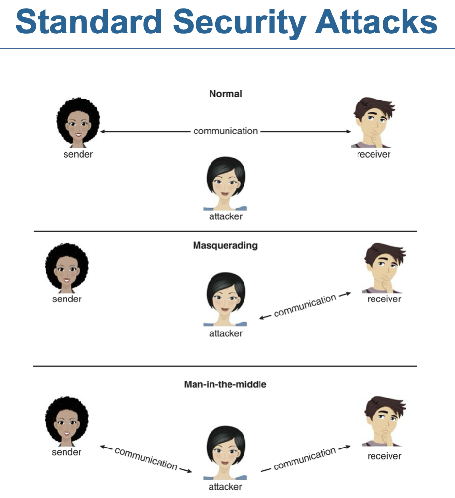
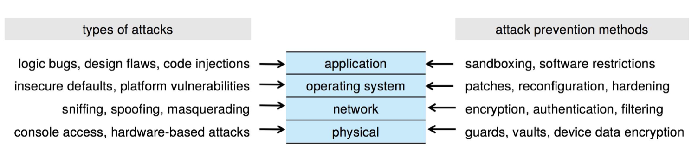
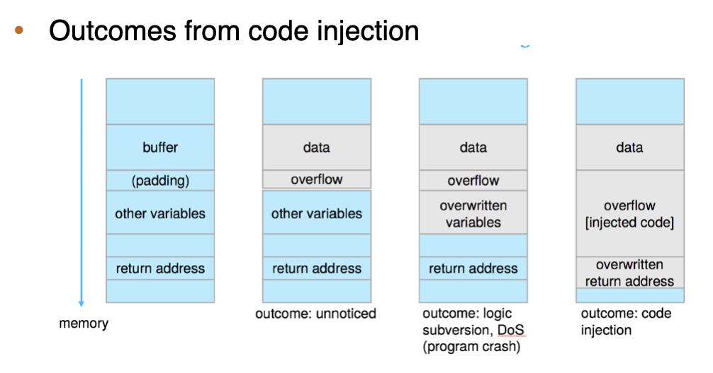
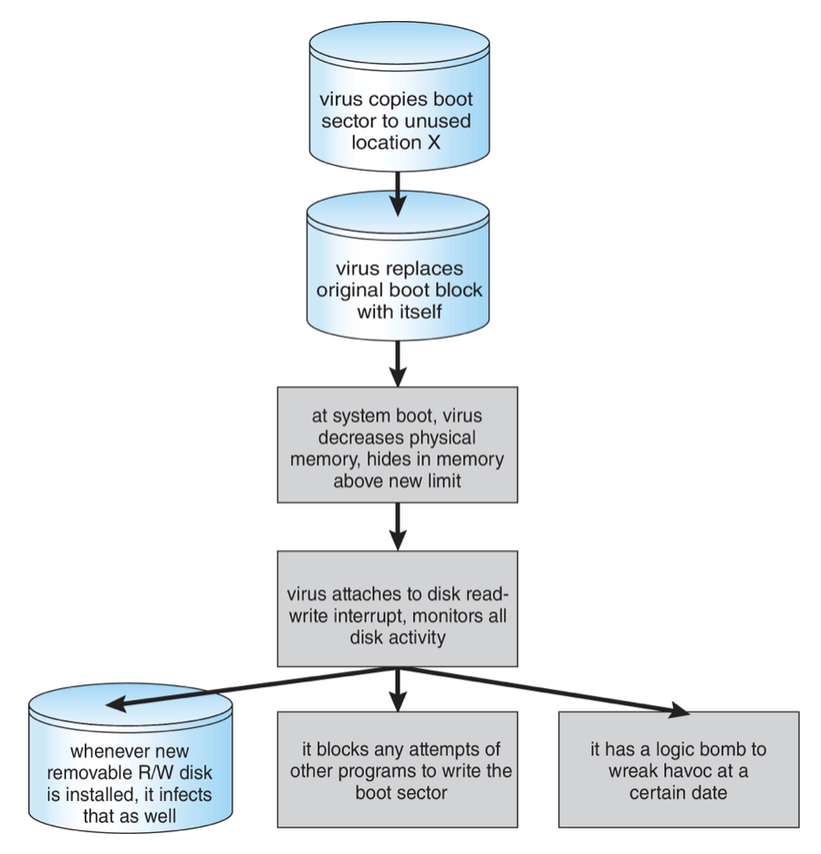
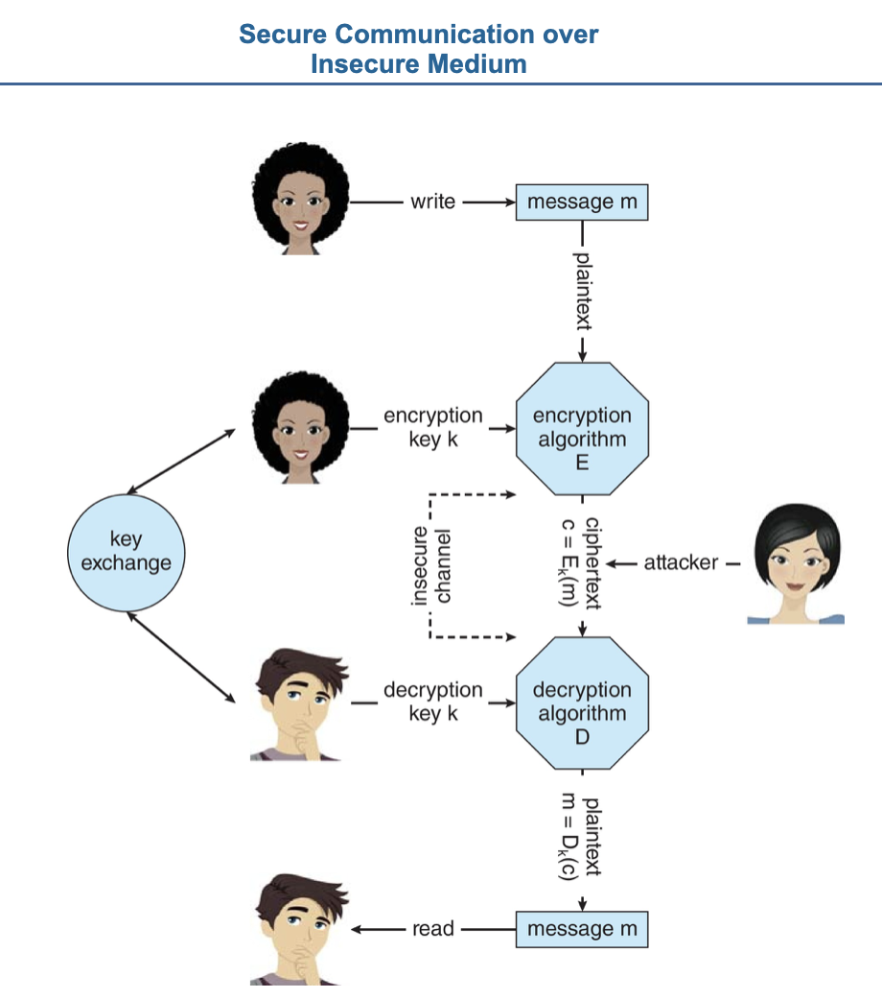
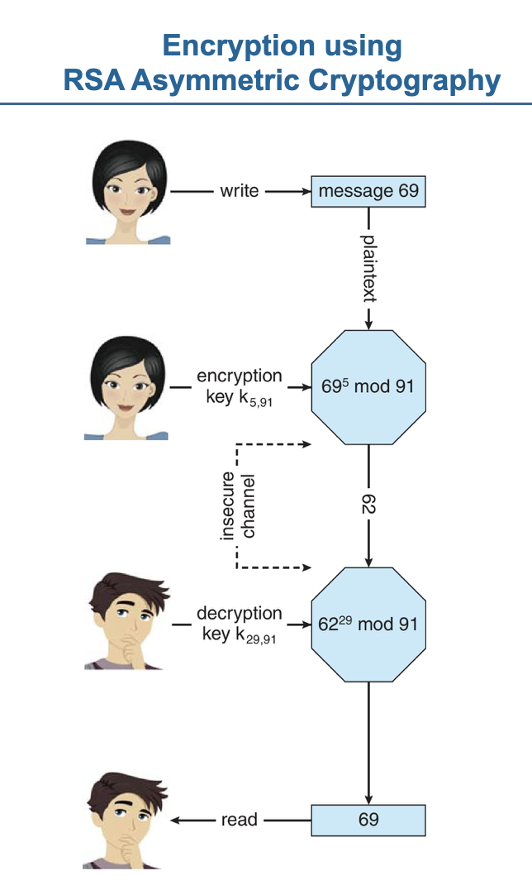

# Part 7. 보안과 보호(Security and Protection)

- 보안은

  - 시스템에 저장된 정보(자료와 코드 모두)의 `무결성`뿐만 아니라,
  - 컴퓨터 시스템의 물리 자원을 보호하기 위하여 시스템 사용자의 `인증`을 보장한다

- 보안 시스템은

  - 시스템에 대한 인가 되지 않은 접근,
  - 그리고 접근한 다음 악의의 파괴 또는 자료 변경과
  - 비일관성의 우연한 도입도 막는다

- 보호 기법은

  - 사용자의 파일 접근 유형을 제한함으로써 `제어된 접근`을 제공한다
  - 더욱이, 보호는 운영체제로부터 적절한 `권한`을 얻은 프로세스만 메모리 세그먼트, CPU와 그 외 자원들을 대상으로 작업을 할 수 있도록 보장하는 것이다

- 보호는
  - 프로그램, 프로세스, 또는 사용자가 컴퓨터 시스템이 정의하는 `자원에 대한 접근을 제어`하는 기법에 의해 제공된다
  - 이 기법은 부과될 `제어를 지정하는 방법`과 `시행하는 방법`을 제공해야 한다

# 16. 보안(Security)

- 보호와 보안 구별

  - 보안 : 시스템과 데이터의 `무결성이 보존될 것이라는 확신의 척도` -> 16장
  - 보호 : 컴퓨터 시스템에 의해 정의된 자원에 대한 프로세스 및 사용자의 `액세스를 제어하는 일련의 기법` -> 17장

- 보안에는 무단 액세스, 악의적인 파괴 또는 변경, 실수로 인한 비일관성의 초래가 발생하지 않도록 컴퓨터 자원을 보호하는 것이 포함된다

  - 컴퓨터 지원
    - 시스템에 저장된 정보 : 데이터 및 코드
    - 컴퓨터 기능을 구성하는 것들 : CPU, 메모리, 보조저장장치, 3차 저장장치, 네트워킹

- 이번장에서 다룰 내용들
  - 정보가 오용되거나 의도적으로 일관성을 잃게 만드는 방법들을 조사한다
  - 보안에 있어 핵심적 역할을 하는 암호 작성법(cryptography)에 대해 살펴본다
  - 공격을 막아 내거나 탐지하는 기법을 살펴본다

#### 이 장의 목표

- 보안상의 문제점들(threats)과 공격에 대해 논의한다
- 암호화, 인증, 해싱의 근본 원리를 설명한다
- 연산에 있어서 암호 작성법의 사용을 검토한다
- 보안상의 공격에 대한 다양한 대응책을 논의한다

## 참고

- RSA 암호화
  - https://youtu.be/joYFr6y9uXE

## 16.1 보안 문제(The Security Problem)

- 보안을 의도적으로 위반하려는 사람들 : 침입자(intruder), 해커(hacker), 크래커(cracker)
- 위협(threat) : 취약성의 발견과 같은 보안에 대한 잠재적 가능성
- 공격(attack) : 보안을 깨뜨리기 위한 시도
- 의도적(악의적) 및 우연한 보안 위반의 형태 리스트
  - 기밀성 침해(breach of confidentiality) : 인증 받지 않고 자료를 읽는 것(정보의 절도)
    - e.g. 시스템에서 비밀 데이터나 신용 카드 정보
  - 무결성 침해(breach of integrity) : 인증받지 않고 자료를 변경하는 것
    - e.g. 중요한 상업용 소스 코드 변경
  - 가용성 침해(breach of availability) : 인증받지 않고 자료를 파괴하는 것
    - 경제적 이익을 얻기보다 시스템을 크게 망가뜨리고 권한을 얻거나 그것을 과시한다
    - e.g. 웹 사이트를 나쁜 모습으로 바꾸어 버리는 것
  - 서비스 가로채기(theft of service) : 인증받지 않고 자료를 사용하는 것
    - e.g. 침입자(또는 침입 프로그램)는 파일 서버로 동작하는 시스템에 디먼(daemon)을 설치할 수도 있다
      - 데몬: 사용자가 직접적으로 제어하지 않고, 백그라운드에서 돌면서 여러 작업을 하는 프로그램을 말한다.
        - https://ko.wikipedia.org/wiki/%EB%8D%B0%EB%AA%AC_%28%EC%BB%B4%ED%93%A8%ED%8C%85%29
  - 서비스 거부(denial of service, DOS) : 시스템의 적법한 사용을 막는 것을 포함한다
    - 16.3.2절에서 더 논의

#### 표준 공격



- 그림 16.6 표준 보안 공격

- 공격자는 보안을 침해하기 위해 여러 표준적인 방법들을 사용한다

  - `가장(masquerading)` : 한 참여자가 다른 사람인 것 처럼(다른 host나 사람으로) 가장하는 것
    - 가장 일반적인 것
    - 인증과정을 침해 -> 정상적으로 허락되지 않는 권한을 얻는다
  - `주고 받는 데이터를 가로채기`
  - `되풀이 공격(replay attack)`
    - 정상적인 데이터를 악의적인 의도나 부정한 방식으로 다시 보내는 행위들로 구성
    - 때론 단순히 되풀이 하는 것이 공격이 되기도 한다
  - `메시지 변조`
    - 통신 데이터를 변조하는 것
  - `중간자 공격(man-in-the-middle)`
    - 공격자가 통신상의 데이터 흐름 중앙에 자리 잡고 수신자에게는 송신자인 것으로 가장하고 송신자에게는 반대로 수신자 인 것 처럼 가장한다
  - `세션 하이재킹(session hijacking)`
    - 활성화된 통신 `세션을 가로채는 것`
    - 중간자 공격은 세션 하이재킹이 선행된다

#### 보안 대책

- 악의적 오용으로부터 시스템을 `온전히 보호하는 것은 불가능`하지만,

  - 침입자 대부분을 `단념`시킬 만큼 침입자가 지불해야 할 `비용이 충분히 커지도록` 만들 수 있다



- 그림 16-1. 4계층 보안 모델

- 시스템을 보호하기 위하여 `네 가지 수준에서 보안 대책을 수립`해야 한다

- 1. `물리적`
  - 컴퓨터 시스템을 포함하는 사이트는 침입자가 침입하지 않도록 물리적으로 보호해야 한다
  - 기계실과 표적 기기에 대한 액세스 권한이 있는 터미널 또는 컴퓨터는 안전하게 보호되어야 한다
  - 보호 방법 예
    - 표적 컴퓨터가 상주하는 건물에 대한 접근 제한
    - 컴퓨터가 놓여있는 책상에 고정 등
- 2. `네트워크`
  - 대부분의 최신 컴퓨터 시스템은 네트워크로 연결되어 있다
  - 현대 시스템의 컴퓨터 데이터는 종종 전용 임대회선, 인터넷과 같은 공유 회선, 무선 연결 및 전화 접속회선을 통해 이동한다
  - 이러한 데이터를 가로채는 것은 컴퓨터 침입과 마찬가지로 해로울 수 있으며, 통신 중단은 원격 서비스 거부 공격을 구성하여 사용자의 시스템 사용 및 신뢰도를 떨어뜨릴 수 있다
- 3. `운영체제`
  - 안전하지 않은 디폴트 설정, 잘못된 설정 및 보안 버그는 몇 가지 잠재적인 문제를 야기한다
  - 따라서 운영체제는 지속적 패치를 통해 최신 상태로 유지되고 공격 영역을 줄이고 침입을 피하도록 구성 및 수정되어서 강화되어야 한다
  - 공격 영역은 공격자가 시스템에 침입하려고 시도할 수 있는 지점들의 집합이다
- 4. `응용 프로그램`

  - 타사 응용프로그램이 내 시스템에서 중요한 권한을 가지고 있는 경우 위험을 초래할 수 있다
  - 일부 응용프로그램은 보안 버그가 포함되어 있을 수 있다
  - 모든 응용 프로그램이 안전하다는 것을 보장하는 것은 사실상 불가능한다

- 4계층 보안 모델은 연결고리로 연결된 체인과 유사하다

  - 어느 한 계층의 취약점으로 시스템 전체가 손상될 수 있다

- 이 책의 나머지 부분에서는 `네트워크 및 운영체제 수준의 보안 문제를 설명`한다
  - 응용 프로그램, 물리적 및 인적 수준의 보안은 중요하지만, 이 책의 범위를 벗어난다

## 16.2 프로그램 위협(Program Threats)

- 공격자들의 일반적인 목표
  - `보안 침해 유발` 프로그램
  - 정상적인 프로세스가 자신의 행동을 바꾸어 보안 침해를 유발
- 예
  - `백도어 디먼(back-door demon)`
    - 원래의 침입 기법이 차단당하더라도 `쉬운 접근을 허용`하도록 하는 프로그램
  - 원격 접근 도구(Remote Access Tool, RAT)
- 이 절에서는 프로그램이 `보안 침해를 유발할 때 사용하는 일반적인 방법`을 기술한다

### 16.2.1 악성 코드(Malware)

- 악성 코드는 컴퓨터 시스템을 악용, 비활성화 또는 `손상하도록 설계된 소프트웨어`이다

#### 악성 코드의 종류

- `트로이 목마(Trojan horse)`

  - 명시된 기능을 수행하는 대신, 비밀스럽거나 악의적인 방식으로 작동하는 프로그램
  - e.g.
    - 손전등 앱이 은밀하게 사용자의 연락처나 메시지에 접근하여 원격 서버로 밀반출하는 경우

- `트로이 노새(Trojan mule)`

  - (터미널, 컴퓨터, 혹은 웹페이지 에서) 외관상으로 자신의 패스워드를 잘못 입력했다고하고, 사용자는 다시 시도 후 성공
    - 실제 발생한 일은 로그인 에뮬레이터에게 사용자의 인증키와 패스워드를 도둑맞은 것

- `스파이웨어`

  - 트로이 목마의 변형
  - 시스템에 광고를 다운로드해서 보여주거나, 특정 사이트를 방문했을 때 팝업 윈도우를 띄우거나 사용자 시스템의 정보를 빼내서 어떤 중앙의 사이트로 넘겨줄 수 있다
  - 해가 없어 보이는 프로그램을 설치하는 것이 스파이웨어 디먼을 로딩하는 결과를 가져올 수도 있다

- `랜섬웨어`

  - 대상 컴퓨터의 일부 또는 `모든 정보를 암호화`하여 소유자가 액세스할 수 없게 한다
    - 사용못하게 만든 정보는 공격자에게는 가치가 없지만 소유자에게는 가치가 큰 정보이다
  - 데이터를 해독하는 데 필요한 암호 `해독 키를 얻기 위해 소유자가 몸값을 치르도록 하는 것`
  - 몸값을 치룬다고 해서 다시 접근할 수 있게 된다고 보장되는 것은 아니다

- 트로이 목마 및 기타 악성코드는 특히 `최소 권한의 원칙을 위반하는 경우에 번성`한다

  - `최소 권한 원칙` : 시스템의 모든 프로그램 및 권한있는 모든 사용자는 작업을 완료하는 데 `필요한 최소한의 권한을 사용`하여 작동해야 한다
  - 운영체제가 디폴트로 사용자가 필요한 것보다 더 많은 권한을 허용하거나 사용자가 디폴트로 관리자로 실행하는 경우에 발생한다

- `트랩 도어(또는 백도어)`
  - 프로그램이나 시스템의 설계자는 소프트웨어에 `자신만이 사용할 수 있는 약점을 남긴다`
  - 특정 논리적인 조건에서만 작동하도록 설정될 수 있으며, 이 경우 논리 폭탄이라고 한다
  - 이 유형의 백도어는 특히 탐지가 어려운데, 이미 피해를 받은 후 탐지되기 전까지 오랫동안(아마도 수년 동안) 활동하지 않을 수 있기 때문이다

### 16.2.2 코드 주입(Code Injection)

- 대부분의 소프트웨어는 악성이 아니지만 코드 인젝션 공격으로 인하여 보안에 심각한 위협을 제기할 수 있다
- 코드 주입 공격은 거의 항상 `포인터`를 통한 직접 메모리 액세스를 허용하는 열악하거나 안전하지않은 프로그래밍 패러다임의 결과이다
  - 이러한 특징은 `C 또는 C++와 같은 저수준 언어에서 발견`된다
  - 직접 메모리 액세스는 메모리 버퍼의 크기를 신중하게 결정하고 이를 초과하지 않도록 주의해야 하는 요구사항과 결합하여 메모리 버퍼가 올바르게 처리되지 않을 때 메모리 손상을 초래할 수 있다
  - 가장 간단한 코드 주입 벡터(버퍼 오버플로)를 생각해보자(그림 16.2)

```c
// 그림 16.2 버퍼 오버플로 조건을 가지는 C 프로그램
#include <stdio.h>
#define BUFFER SIZE 256
int main(int argc, char *argv[])
{
	char buffer[BUFFER SIZE];
	if (argc < 2)
		return -1;
	else {
		strcpy(buffer,argv[1]);
		return 0;
	}
}
```



- `버퍼 오버플로`의 가능한 결과
  - (1) 오버플로가 매우 작은 경우
    - 아무런 영향을 미치지 않는다
  - (2) 오버플로가 패딩을 넘어서면 스택의 자동 변수가 오버플로 된 내용으로 덮어쓰이게 된다
    - 제어되지 않은 변수가 예상치 않은 값을 가지고 있으면 수정할 수 없는 오류가 발생할 수 있으므로 이 오버플로는 프로그램 크래시를 일으킬 수 있다
  - (3) 오버플로가 패딩을 크게 초과하면
    - 모든 스택 프레임이 덮어쓰인다
    - 프로그램 흐름은 전복되어, 공격자에 의해 공격자가 제어하는 메모리 영역으로 흐름이 바뀔 수 있다
    - `주입된 코드가 실행`되어 공격자가 프로세스의 유효 ID 자격으로 임의 코드를 실행할 수 있다
      - 셸 코드

### 16.2.3 바이러스와 웜(Viruses and Worms)

- 바이러스 : 자신을 복제하고 다른 프로그램을 감염시키도록 고안된 프로그램
- 바이러스는 파일을 변경하거나 파괴하고 시스템 크래시를 유발하며, 프로그램 오동작 등을 일으키는 일 등으로, 시스템을 망칠 수 있다
- 바이러슨느 PC 사용자들에게는 중대한 문제이다
  - 일반적으로, UNIX나 다른 `다중 사용자 컴퓨터는 바이러스에 잘 걸리지 않는데`, 그 이유는 바이러스에 감염되었다 하더라도, `시스템의 다른 면들이 보호되기 때문에`, 그 영향은 제한적이다
- 바이러스가 생기는 원인
  - 바이러스는 일반적으로 스팸 이메일과 피싱 공격을 통해 생겨난다
  - 사용자가 인터넷 파일 공유 서비스에서 바이러스성 프로그램을 다운로드하거나 감염된 디스크를 교환할 때 확산될 수 있다
- `바이러스 vs. 웜`
  - 인간활동이 필요한 바이러스
  - 네트워크를 사용하여 인간의 도움 없이 복제하는 웜
- `바이러스`가 호스트를 감염시키는 방법 `예`
  - Microsoft Office 파일이 자동으로 실행하는 매크로를 포함할 수 있다
  - 이러한 프로그램은 `사용자 자신의 계정으로 실행`되기 때문에 매크로가 큰 `제약 없이 실행`될 수 있다
    - 예를 들어, 사용자 파일을 마음대로 삭제할 수 있음

#### 바이러스의 종류(범주)



- 그림 16.5 부트 섹터 컴퓨터 바이러스

- 바이러스가 목표 장비에 도착하면 바이러스 투하기(dropper)라고 알려진 프로그램이 바이러스를 시스템에 집어넣는다
- 바이러스 투하기는 보통 트로이 목마이고 다른 이유를 통해서 처음 실행되지만 바이러스를 설치하는 것을 자신의 핵심 활동으로 한다
- 한번 설치되면 바이러스는 여러 일들 중 한 가지를 한다
- 수천 가지의 `바이러스`가 존재하지만, 몇몇 `범주`로 분류된다
  - 파일
    - 파일 바이러스는 자기 자신을 파일에 덧붙임으로서 시스템을 감염시킨다
    - 파일 바이러스는 기생하는 바이러스로 불린다
    - 자신의 완전한 파일을 남기지 않을 뿐더러 호스트 프로그램이 여전히 작동할 수 있도록 하기 때문이다
  - 부트
    - 부트 바이러스는 시스템의 부트 섹터를 감염시키고 시스템이 부트될 때 운영체제가 읽히기 전에 언제나 실행된다
    - 부트 바이러스는 부팅 가능한 미디어(플로피 디스크)를 찾고 그것을 감염시킨다
    - 이 바이러스는 메모리 바이러스라고도 알려져있는데 그들은 파일 시스템에 나타나지 않기 때문이다(그림 16.5)
    - 또한 부트 바이러스는 네트워크 카드 PXE 및 EFI(Extensible Firmware Interface)환경과 같은 펌웨어를 감염시키기 위해 채택되었다
  - 루트킷
    - 손쉬운 루트 접근을 제공하기 위한 UNIX 시스템의 백도어를 설명하기 위해 만들어진 용어에서
    - 운영체제 자체에 침투하는 바이러스 및 악성 코드를 가리키는 말로 확장되었다
    - 결과적으로 시스템이 완전히 손상된다
    - 시스템의 어떤 부분도 신뢰할 수 없는 것으로 간주할 수 있다
    - 악성 코드가 운영체제를 감염시키면 자기자신을 탐지하는 데 사용되는 기능을 포함하여 모든 시스템 기능을 장악할 수 있다
  - `매크로(macro)`
    - 대부분의 바이러스는 어셈블리나 C같은 저수준 언어로 작성되어 있다
    - 매크로 바이러스는 `Visual Basic 같은 고급 언어로 작성된다`
    - 이 바이러스들은 매크로를 실행할 수 있는 프로그램이 수행되면 촉발된다
    - 예를 들어 스프레드시트 파일에 포함되어 있을 수 있다
  - 소스 코드
    - 소스 코드 바이러스는 소스를 찾고 바이러스를 포함하도록 그것을 수정하고 퍼지도록 도와준다
  - 다형태(polymorphic)
    - 이 바이러스는 안티바이러스 소프트웨어에 `발견되는 것을 피하고자` 설치될 때마다 변한다
    - 변화는 바이러스의 기능에는 영향을 주지 않고 바이러스의 시그니처만 바꾼다
    - 바이러스 시그니처는 바이러스를 식별하는 패턴으로 보통 바이러스 코드를 구성하는 일련의 연속된 바이트를 말한다
  - 암호화(encrypted)
    - 암호화된 바이러스는 `탐지를 피하고자` 암호화된 바이러스와 복호화 코드를 가지고 있다
    - 바이러스는 먼저 복호화된 다음 실행된다
  - 스텔스(stealth)
    - 바이러스를 감지하는 데 사용되는 시스템의 일부를 변경함으로써 감지를 피하려고 시도한다
    - 예를 들어, read 시스템 콜을 변경해서 만약 자신이 변경한 파일이 읽히면 감염된 코드가 아니라 원래 형태의 코드를 돌려준다
  - 다부분(multipartite)
    - 이 유형의 바이러스는 부트 섹터, 메모리, 파일을 포함한 시스템의 여러 부분을 감염시킬 수 있다
    - 이것은 탐지하고 방지하는 것을 어렵게 만든다
  - 무장(armored)
    - 무장된 바이러스는 난독화 되어 있다
    - 즉, 안티바이러스 연구자가 밝혀내고 이해하는 것이 어렵게 작성된다
    - 또한 감지와 치료를 피하고자 압출될 수도 있다
    - 바이러스 투하기(dropper)와 바이러스 감염을 위한 전체 파일들은 파일 속성을 통하거나 볼 수 없는 파일 이름을 통해 숨겨진다

## 16.3 시스템과 네트워크 위협(System and Network Threats)

- 네트워크에 의한 범세계적 연결은 시스템을 전 세계의 공격에 취약하게 만든다
- 운영체제가 더 개방적일수록, 더 많은 서비스를 활성화하고, 더 많은 기능을 허용할 수록 악용할 버그가 많아질 가능성이 높아진다
- 점차 운영체제는 디폴트로 안전해지려고(secure by default) 노력하고 있다
- 모든 해커는 네트워크 트래픽 패턴, 비상상적인 패킷 유형 또는 기타 수단이든 흔적을 남긴다
  - 이러한 이유로 해커는 좀비 시스템에서 공격을 시작한다
    - `좀비시스템` : 해커에 의해 손상된 독립적 시스템 또는 장치
      - 소유주가 모르게 악의적인 목적으로 사용되는 중에도 원래 할 일을 계속하게 된다
    - 좀비를 통해서 행하는 공격에는 `서비스-거부(denial-of-service)`와 `스팸 중계기` 등이 있다
  - 좀비가 되는 것을 방지하기 위해 중요한 시스템 뿐만 아니라 하찮은 `시스템도 보안을 유지`해야 하는 많은 이유 중 하나이다
    - `그렇지 않으면 해커의 요새`로 바뀌기 때문이다
- WarDriving
  - 보호되지 않은 사유 네트워크를 찾아서 공격하는 것
  - 이러한 네트워크에 연결하면 해커에게 유용한 시스템이 될 수 있다

### 16.3.1 네트워크 트래픽 공격


- 그림 16.6 표준 보안 공격

- 해커는 네트워크 공격을 탑재하기 위한 많은 옵션을 가지고 있다(그림16.6)

  - 스니핑(sniffing): 네트워크 트래픽을 `가로채는 것`
    - 시스템 사이에 일어나는 세션의 종류에 관한 유용한 정보 또는 세션의 내용을 획득할 수 있다
  - 스푸핑(spoofing): 공격자가 더 활동적인 역할을 수행하여 당사자 중 하나로 `위장`하거나 전적으로 활동적인 `중간자(man-in-the-middle)`가 되어 두 피어간 트랜잭션을 `가로채거나 수정`할 수 있다

- 서비스 거부(DoS) 공격은 암호화 및 인증과 같은 수단을 통해 보호할 수 있다
  - 그러나 인터넷 프로토콜은 디폴트로 암호화 또는 인증을 지원하지 않는다

### 16.3.2 서비스 거부(Denial of Service)

- 서비스 거부는 정보를 획득하거나 자원을 훔치는 것이 아니라, `시스템의 정당한 사용을 불가능하게` 한다
- 대부분의 서비스 거부 공격은 해커가 아직 침입하지 못한 시스템 또는 시설을 대상으로 한다
- 정당한 `사용을 막는 공격이` 시스템 또는 시설을 뚫고 들어가기보다 `쉽다`
- 서비스 거부 침입은 주로 네트워크 기반으로 이루어진다
- 이런 종류의 공격은 `네트워크 레벨에서 막아야 한다`
- 더욱 어려운 것은 분산 `서비스 거부 공격(DDoS, distributed denial-of-service)`이다
  - 여러 사이트에서 동시에 구동되어 하나의 목표를 향해서 전형적으로 좀비들에 의해 수행된다
  - DDoS 공격은 점점 보편화되고 있으며, 때때로 공갈 메일과 함께 사용되기도 한다
  - `사이트가 공격`받게 되고 공격자는 공격을 `중지하는 대가로 돈을 요구`한다
- 가끔 사이트는 자신이 공격당하는 중인지조차 알 수 없다
  - 시스템이 느려지는 것이 일시적 `과사용(surge)인지 혹은 해커의 침입 공격인지 알아내기 힘들다`
- 한 사이트에 대한 트래픽을 많이 증가시키는 성공적인 광고 캠페인이 DDoS로 여겨질 수도 있음을 고려하라
- 트래픽을 자동으로 막는 방화벽은 막지 말아야 할 트래픽을 막을 수도 있다

### 16.3.3 포트 스캐닝(Port Scanning)

- 포트 스캐닝 자체는 공격이 아니라 해커가 시스템의 `취약성을 탐지하기 위한 수단`이다
- 보안 담당자도 실행 중이 아닌 서비스를 감지하기 위해 포트 스캐닝을 사용한다
- 일반적으로 TCP/IP 연결을 만들거나 특정 포트 또는 범위로 UDP 패킷을 보내려는 도구를 포함하여 포트 검색은 자동화 된다
- 포트 검색은 지문(fingerprinting)으로 알려진 정찰 기법의 일부이다
- 침입자는 알려진 취약점을 식별하기 위해 사용 중인 운영체제의 유형과 서비스 집합을 추론하려고 시도한다
- 많은 서버와 클라이언트는 `네트워크 프로토콜 헤더`(예를 들어, `HTTP의 "Server:" 및 "User-Agent:" 헤더`)의 일부로 정확한 버전 정보를 공개하여 이를 쉽게 수행할 수 있다
- 프로토콜 핸들러에 의한 특유의 행동을 자세히 분석하면 공격자는 `대상이 어떤 운영체제를 사용하는지 파악`하는 데 도움이 될 수 있다
  - `성공적인 악용을 위해서는 필요한 절차`이다

## 16.4 보안 도구로서 암호 기법(Cryptography as a Security Tool)

- 컴퓨터 공격을 막는 다양한 기법과 기술의 방어법들이 있다
- 시스템 디자이너에서 사용자까지 가장 넓은 유용한 도구는 `암호 기법`이다
- 여기서 논의되는 암호 기법은 교육목적으로 단순화하였으므로 실제로 사용하지 않도록 유의해야 한다
  - 좋은 암호 기법 라이브러리가 널리 이용가능하며 현실적 응용을 위한 좋은 기반이 될 것이다
- 네트워크 주소가 네트워크 메시지의 잠재적인 송신자와 수신자를 추정하는 데 사용된다
  - 네트워크 패킷은 IP주소와 같은 소스 주소를 가지고 목적지에 도착한다
- 보안이 문제가 되는 응용의 경우, 사악한 컴퓨터가 위조된 소스 주소를 가지고 악의적으로 메세지를 보낼 수 있고, 또한 종착지 주소로 지정되지 않은 많은 컴퓨터가 패킷을 받을 수 있다
- 종착지로 가는 도중의 모든 라우터 역시 이 패킷을 받을 것이기 때문이다
- 어떻게 운영체제가 파일 쓰기를 요구하는 소스를 신뢰할 수 없는데, 그 요구를 허락할지 결정할 수 있을까?
- 그리고 네트워크를 통해 송신하는 파일 콘텐츠의 수신자를 결정할 수 없는데, 어떻게 한 요구나 데이터에 대한 보호를 제공할 것인가?
- 이러한 문제를 해결하기 위해 암호 기법을 사용한다
  - 암호 기법은 `메시지의 송신자와 수신자를 제한`하는 데 사용된다

### 16.4.1 암호화(Encryption)

- 암호화 알고리즘은 메시지의 발신자가 특정 키를 소유한 컴퓨터만이 메시지를 읽는 것을 보장할 수 있도록 해주거나 데이터를 기록한 사람만이 데이터를 읽을 수 있다는 것을 보장해준다
- 많은 암호화 알고리즘이 있다
- 이 절에서 현대 암호화 원리와 알고리즘을 살펴본다
- `암호화 알고리즘`의 구성

  - 키의 집합 K
  - 메시지의 집합 M
  - 암호문의 집합 C : cipher texts
  - 함수 E: K -> (M -> C)
    - 모든 k ∈ K에 대해 E(k)는 메시지로부터 암호문을 생성하는 함수이다
    - E와 임의의 k 에 대해 E(k) 모두 효율적으로 계산 가능한 함수이어야 한다
    - 일반적으로 E(k)는 `메시지로부터 암호문으로` 무작위 매핑이다
  - 함수 D: K -> (C -> M)
    - 모든 k ∈ K에 대해 D(k)는 `암호문으로부터 메시지를 복원`하는 함수이다
    - D와 임의의 k 에 대해 D(k) 모두 효율적으로 계산 가능한 함수이어야 한다

- 암호화 알고리즘이 반드시 제공해야 할 필수적인 성질은 다음과 같다

  - 암호문이 주어졌을 때, 컴퓨터는 `키를 가지고 있을 때만 메시지를 구할 수 있다`
  - `키는 암호문으로부터 도출하는 것이 불가능하다`는 것이 중요하다

- 두 가지 유형의 암호화 알고리즘
  - 대칭
  - 비대칭

#### 16.4.1.1 대칭 암호화(Symmetric Encryption)



- 그림 16.7 안전하지 않은 매채를 통한 안전한 통신

- 대칭 암호화 알고리즘은 `암호화 및 복호화에` `같은 키`가 사용된다
- 키 교환은 양자 사이에 직접 일어나거나 믿을 수 있는 3자(확인서 발급기관, certificate authority)를 통해 이루어진다

##### DES

- 지난 수십 년 동안 사용된 대칭 암호화 알고리즘은 국립표준기술연구소(NIST, national institute of standards and technology)에 의해 채택된 데이터 암호화 표준(data encryption standard, DES)이다.
- DES는 64비트의 값과 56비트의 키를 가지고 일련의 변환을 수행함으로써 이 변환들은 대칭 암호화 알고리즘에서 일반적인 대입(substitution)과 치환(permutation) 작업에 기초를 두고 있다
- DES는 한번에 한 블록의 비트들에 대해 작동하기 때문에 블록 암호화(block cipher)라고 불린다
  - 블록 암호화에서 긴 데이터를 암호화할 때 같은 키를 사용하면 공격에 취약하게 된다
- 이제 DES는 많은 응용을 위해 `안전하지 않은 것으로 간주`되고 있다
- 왜냐하면 그리 많지 않은 계산자원으로 키를 찾기 위해 모든 경우를 시험해 볼 수 있기 때문이다(그렇지만 아직 자주 사용되고 있다)
- NIST는 DES를 포기하기 보단 `triple DES`라는 수정안을 만들었는데, 이는 같은 평문에 대하여 두 개 또는 세 개의 키를 사용하여 DES 알고리즘을 세번(두번의 암호화와 한번의 복호화) 반복하는 것이다
  - 세 개의 키가 사용될 때, 유효한 키 길이는 168비트이다

##### AES

- 2001년에 NIST는 DES를 대체하기 위해 `고급 암호화 표준(Advanced Encryption Standard, AES)`이라 불리는 새로운 알고리즘을 채택하였다
- AES(Rijndael이라고도 함)는 FIPS-197에서 표준화로 채택되었다
- 128, 192, 256비트의 키를 가질 수 있으며 128비트 블록에 대해 작동한다
- 일반적으로 알고리즘은 간결하고 효율적이다
- 블록 암호화 기법은 완전히 안전한 암호화 기법은 아니다
- 이들은 자신이 요구하는 브록 크기보다 긴 메시지를 직접 처리하지 못한다
- 대안은 스트림 암호 기법으로 긴 메시지를 안전히 암호화하는 데 사용될 수 있다

- 스트림 암호 기법
  - 블록이 아니라 바이트나 비트의 스트림에 대하여 암호화 및 복호화를 수행하도록 설계되었다
  - 이것은 통신 길이가 길어 블록 암호 기법을 사용하면 너무 느려질 경우에 유용하다
  - 키는 유사 난수 비트(pseudo random bits)를 만들어내는 유사 난수 비트 생성기의 입력이 된다
  - 키를 생성기의 입력으로 하여 만들어지는 출력이 키스트림이다
    - 키스트림은 입력 평문 스트림에 대해 사용될 수 있는 무한한 키들의 집합으로, 평문을 이들 키스트림으로 XOR 연산을 통하여 암호화한다
  - `AES기반 암호 제품군에는 스트림 암호가 포함`되며, 오늘날 가장 일반적이다

#### 16.4.1.2 비대칭 암호화(Asymmetric Encryption)



- 그림 16.8 RSA 비대칭 암호화를 사용한 암호화와 복호화

- 비대칭 암호화에서는 `암호화`와 `복호화`의 `키가 다르다`
- 암호화된 통신을 받고자 하는 주체가 두 개의 키를 생성하여 그중 하나(공개 키)를 누구든지 원하는 사람에게 공개한다
- 송신자는 누구든 그 키를 이용하여 통신 내용을 암호화한다
- 그 내용은 키 생성자만이 복호화할 수 있다
- 이 기법은 공개 키 암호화(public-key encryption)라 알려진 이 기법은 암호 기법에 돌파구가 되었다
  - 이제 더 이상 키의 비밀 유지나 비밀 전달이 필요 없게 되었다
  - 대신 누구나 수신자에게 메시지를 암호화하여 보낼 수 있고, 다른 사람이 볼 수는 있지만 수신자만이 그 메시지를 복호화할 수 있다
- 공개 키 암호화가 어떻게 동작하는지 보이기 위해 `발명자 Rivest, Shamir, Adleman의 이름`을 따서 `RSA`라고 알려진 알고리즘을 살펴보자

  - RSA 암호기법은 가장 널리 사용되는 비대칭 알고리즘이다
    - 타원 곡선에 기초하는 비대칭 알고리즘도 있고 확산되고 있다(같은 암호강도에 비해 알고리즘의 키 길이가 짧기 때문)
  - RSA에서는 k_e가 공개 키이고 k_d가 개인 키이다
  - N은 임의로 선택된 두 개의 큰 소수 p와 q(예를 들면 p와 q는 각 2048비트이다)의 곱이다
  - k_e,N으로부터 K_d,N을 도출하는 것이 계산상으로 불가능하다
  - 암호화 알고리즘은 E_k_e,N(m) = m^k_e mod N이다
    - k_e x k_d = 1 mod (p-1)(q-1)
  - 복호화 알고리즘은 D_k_d,N(c) = c^k_d mod N이다

- 그림 16.8에 `작은 숫자를 이용한 예`가 나와 있다

  - p=7, q=13
  - N = p x q = 7 x 13 = 91
  - (p-1)(q-1) = 6 x 12 = 72
  - k_e를 72에 대해 상대적 소수(relatively prime)로 선택한다
    - 1 < k_e < 72
    - 1과 72의 상대적 소수는 5, 7, 11, 13, 17, 19, 23, 25, 29, 31, 35, 37, 41, 43, 47, 49, 53, 55, 59, 61, 65, 67, 71이다
    - k_e = 5를 선택
    - 마지막으로 k_d를 5 x k_d = 1 mod 72를 만족하는 k_d를 선택한다
      - k_d = 29를 선택
    - 이렇게 해서 `공개 키인 k_e,N = 5, 91`과 `개인 키인 k_d,N = 29, 91`을 얻는다
    - 메시지인 69를 공개키로 암호화하면 메시지 62가 되고 이는 수신자에 의해 개인 키를 통해 복호화된다

- 비대칭 암호화의 사용은 목적지의 공개 키를 공표함에 의해 시작된다
  - 양방향 통신을 위해 발신지도 자신의 공개 키를 공표해야 한다
  - 공표(publication)는 키의 전자적 사본을 넘기는 것으로 쉬울 수도 있고 더 복잡할 수도 있다
- 개인 키(또는 private key)는 반드시 매우 빈틈없이 방어되어야 하는데 그 키를 가진 누구나 상응하는 공개 키로 만들어진 메시지를 복호화할 수 있기 때문이다

- 겉으로 보기에는 비대칭, 대칭 암호화 사이의 키 사용이 작은 차이를 가지는 것 같지만 실제에선 매우 큰 차이임을 주목해야 한다
  - `비대칭 암호화는 계산하기에 훨씬 더 많은 비용이 든다`
  - 비대칭 알고리즘을 사용하는 것 보다 대칭 알고리즘을 사용하는 것이 컴퓨터가 암호화 및 복호화를 계산하기에 훨씬 빠르다
- 그렇다면 왜 비대칭 알고리즘을 사용하는가?
  - 많은 양의 데이터를 암호화하는 목적으로는 사용되지 않는다
  - 그러나 이들은 `작은 분량의 데이터 암호화에 사용`될 뿐만 아니라 다음 절에서 보일 것 처럼 `인증, 기밀, 키 분배에 사용`된다

#### 16.4.1.3 인증(Authentication)

- 암호화 : 메시지의 수신자의 집합을 제한
- 인증 : 메시지의 송신자의 집합을 제한
- 인증은 암호화를 보완한다

  - 또한 `메시지가 변경되지 않았다는 것을 증명`하는데 유용하다

##### 해시 함수

- 인증의 주요 알고리즘에 들어가기 전에 해시에 대해 알아보자
- 해시 함수(H)는 메시지(m)로 부터 작고 고정된 크기의 메시지 요약이나 해시 값이라 불리는 데이터 블록을 만들어 낸다
- 해시 함수는 한 메시지를 받아들여 이를 여러 블록으로 나눈 후 이들 블록을 처리하여 n-비트해시를 생성해 낸다
- H(m) == H(m') 이면서 m' != m 인 m'을 찾는 것이 불가능해야 한다
- 만약 H(m) == H(m') 이면 m = m' 임을 알 수 있다
- 일반적인 메시지 요약 함수는 128비트 해시를 생성하는 MD5와 160비트해시를 만들어내는 SHA-1을 포함한다

  - SHA-256?
    - SHA-256은 SHA(Secure Hash Algorithm) 알고리즘의 한 종류로서 256비트로 구성되며 64자리 문자열을 반환한다.
    - 해시 알고리즘인 SHA-2 계열 중 하나이며 블록체인에서 가장 많이 채택하여 사용하고 있다. 이름에 내포되어 있듯 2^256만큼 경우의 수를 만들수 있다. 개인용 컴퓨터로 무차별 대입을 수행해 해시 충돌 사례를 찾으려고 할 때 많은 시간이 소요될 정도로 큰 숫자이므로 충돌로부터 비교적 안전하다고 평가된다
    - 참고
      - http://wiki.hash.kr/index.php/SHA256

- 두 가지 종류의 주요한 인증 알고리즘

##### (1) 메시지 인증 코드(Message Authentication Code, MAC)

- 대칭 암호화
- 메시지 인증 코드에 : 비밀키를 이용하여 메시지의 암호화된 체크섬이 생성
  - 체크섬 : 중복 검사의 한 형태로, 오류 정정을 통해, 공간(전자 통신)이나 시간(기억 장치) 속에서 송신된 자료의 무결성을 보호하는 단순한 방법이다.
    - https://ko.wikipedia.org/wiki/%EC%B2%B4%ED%81%AC%EC%84%AC
- MAC은 짧은 값들을 안전하게 인증하는 기법이다
  - 만일 긴 메시지를 먼저 해싱한다면 먼저 해싱함으로써 이들을 안전하게 인증할 수 있다

##### (2) 디지털 서명 알고리즘

- 생성된 인증자는 디지털 서명이라 불린다
- 디지털 서명 알고리즘은 아무나 메시지의 신빙성을 확인할 수 있게 하므로 대단히 유용하다
- RSA 암호화 알고리즘과 비슷하지만 키가 거꾸로 사용된다
- 디지털 서명은 메시지가 아닌 다른 개체에 대해서도 사용될 수 있다
  - 예를들어, 프로그램 제작자는 디지털 서명을 통해 코드에 서명하여 출간과 설치 사이에 코드가 수정되지 않았는지 확인할 수 있다
  - 코드 서명은 많은 시스템에서 매우 일반적인 보안 개선 방법이 되었다

#### 16.4.1.4 키 분배(Key Distribution)

- 대칭 키의 전달은 매우 어려운 문제이다
  - 종종 그것은 통신 채널을 벗어나서 행해진다
  - 종이 문서나 대화를 통해 키를 교환한 다음 전자적으로 통신할 수 있다
    - 그러나 이러한 방법은 큰 규모로는 실행하기 어렵다
- 이것이 `비대칭키 알고리즘`을 만들기 위해 노력했던 이유이다 => 키 분배가 쉬움
  - 키를 공개적으로 교환할 뿐만 아니라 사용자가 얼마나 많은 사람과 통신하기를 원하든지 간에 단지 하나의 비밀 키를 갖게 하는 것이다
  - 통신하는 상대방당 하나의 공개 키를 관리해야 하는 문제가 있지만 공개 키는 보안을 유지할 필요가 없으므로 단순한 저장소가 열쇠고리로 이용될 수 있다
- `전자 서명`은 믿을 수 있는 집단에 의해 전자적으로 서명된 `공개 키`이다
- 보증자(certifier)는 어떻게 믿을 수 있는가?
  - 이러한 보증기관(certificate authorities)은 웹 브라우저에 자신들의 공개 키를 브라우저가 배포되기 전에 포함해 놓는다

### 16.4.2 암호의 구현

- 네트워크 프로토콜은 계층으로 조직되며, 각 계층은 바로 아래 계층의 클라이언트 처럼 행동한다
- 즉, 한 프로토콜이 다른 시스템의 같은 프로토콜로 메시지를 보낼 때, 자신의 네트워크 프로토콜 스택의 바로 아래 계층을 통해서 전달한다
  - 예를 들어, IP 네트워크에서 TCP는 IP의 클라이언트처럼 동작한다
  - OSI 모델에는 7개의 이러한 계층이 포함되어 있으며 19.3.2절에 자세히 설명되어 있다
- 암호 기법은 네트워크 프로토콜의 어느 계층에서나 사용될 수 있다
  - 예를 들어, TLS(16.4.3절)는 트랜스포트 계층에서 보안을 제공한다
  - 네트워크 계층 보안은 일반적으로 IPSec으로 표준화되었고
    - IPSec은 인증자(authenticator)의 삽입과 패킷 콘텐츠의 암호화를 허용하는 IP 패킷 포맷을 정의한다
    - IPSec은 대칭 암호화 기법을 사용하며, 키 교환으르 위해 IKE 프로토콜을 사용한다
      - IKE는 공개 키 암호화에 기반하고 있다

### 16.4.3 예: TLS

- Transport Layer Security(TLS)는 `두 컴퓨터 간에 안전하게 통신`을 할 수 있게 하는 `암호 프로토콜`로 각 컴퓨터는 상대 컴퓨터에 대한 `메시지 송신자 및 수신자를 제한`할 수 있게 한다
- 이 프로토콜은 웹 서버와 웹 브라우저가 안전하게 통신하는 표준 프로토콜이기 때문에 오늘날 인터넷에서 가장 널리 사용되는 암호 프로토콜일 것이다
- TLS는 Netscape에서 설계한 SSL(Secure Sockets Layer)에서 발전하였다
- TLS는 많은 옵션을 가지는 복잡한 프로토콜이다
  - 추상적으로 하나만 알아보자
  - 클라이언트와 서버 둘 사이에 안전한 세션 키를 생성하기 위해 비대칭 암호 기법을 사용
    - 세션 키는 둘 사이의 대칭형 암호화에 사용되며, 이러한 절차는 중간자 공격과 재생 공격을 피하면서 진행되어야 한다
  - 암호화 강도를 얻기 위해 세션 키는 세션이 종료되면 폐기되어야 한다
  - 둘 사이에 다른 통신을 하려면 새로운 세션 키를 생성해야 한다
- TLS 프로토콜은 서버와 안전하게 통신을 원하는 클라이언트에 의해 시작된다

  - 프로토콜 사용 이전에 서버는 보증 기관(certification authority , CA)이라 불리는 제 3자로부터 cert라고 불리는 증명서(certificate)를 얻은 것으로 간주한다
  - 이 증명서는 다음 요소들을 포함해야 한다
    - 유일하게 식별되는 이름과 공통(DNS) 이름 등과 같은 서버의 여러 속성 값, attrs.
    - 서버를 위한 공용 암호 알고리즘 E()
    - 이 서버의 공개 키 k_e
    - 증명서의 유효 기간 간격, interval
    - 위의 정보에 대한 CA의 디지털 서명 a, 즉 a = S_kca(attrs, E_ke, interval)

- 프로토콜 수행
  - 프로토콜 수행에 앞서, 클라이언트는 CA를 위한 공용 검증 알고리즘 V_kCA를 획득한 것으로 가정한다
  - 웹의 경우, 업체가 판매할 때 브라우저에 보증 기관의 검증 알고리즘과 공개 키를 수록해 둔다
  - 사용자는 이들을 제거하고 다른 것을 추가할 수 있다
  - 클라이언트가 c가 s에 연결할 때, c는 서버에 28바이트의 무작위 값 n_c를 보낸다
  - s가 무작위 값 n_s와 자신의 인증서 cert을 가지고 이에 응답한다
  - 클라이언트는 V_kCA({attrs, E_ke, interval}, a) = true 인지 그리고 현재 시각인 유효 시간 간격 interval 내에 있는지 검증한다
  - 이 두 가지가 만족되면 서버의 신원이 증명된 것이다
  - 클라이언트는 임의의 46바이트 프리마스터 시크리트(premaster secret), pms를 생성하고, 서버에 cpms = E_ks(pms)를 보낸다
  - 서버는 pms = D_kd(cpms)를 복원한다
  - 이제 양측 모두 n_c, n_s, pms를 가지고 있으며, 클라이언트와 서버가 각각 공유된 48바이트의 마스터 시크리트(master secret) ms = H(n_c, n_s, pms)를 계산한다
  - 오직 서버와 클라이언트만이 pms를 알기 때문에 이들만이 ms를 계산할 수 있다
  - 더욱이 n_c와 n_s에 대한 ms의 의존성이 ms가 이전 프로토콜 수행에서 사용되지 않은 새로운 값이라는 것을 보장한다
  - 클라이언트와 서버 둘다 마스터 시크리트 ms로부터 다음의 키들을 계산한다
    - 클라이언트에서 서버로 가는 메시지의 암호를 위한 대칭 암호화 키
    - 서버에서 클라이언트로 가는 메시지의 암호를 위한 대칭 암호화 키
    - 클라이언트에서 서버로 가는 메시지에 대한 인증 값(authenticators)을 생성하기 위한 MAC 생성 키
    - 서버에서 클라이언트로 가는 메시지에 대한 인증 값(authenticators)을 생성하기 위한 MAC 생성 키
- 이 프로토콜은 서버가 pms를 생성한 클라이언트만이 메시지를 받을 수 있도록 제한할 수 있으며, 자신이 받아들이는 메시지의 송신자를 그 클라이언트로 제한할 수 있다
- 유사하게 클라이언트는 자신이 송신하는 메시지의 수신자를 제한할 수 있으며, 자신이 받아들이는 메시지의 송신자를 k_d를 알고 있는자로 제한할 수 있다
- 웹 트랜잭션과 같은 여러 응용에서, 클라이언트는 k_d를 알고 있는 자가 누구인지 검증할 필요가 있다
  - 이것이 cert의 목적이다
  - 특히 attrs 필드는 클라이언트가 자신이 통신하고 있는 서버의 신원, 예를들면, 영역 이름을 결정하는 데 사용할 수 있는 정보를 가지고 있다
- 또한 서버가 클라이언트에 대한 정보가 있어야 하는 응용을 위해 TLS는 클라이언트가 서버로 확인서를 보낼 수 있는 옵션을 지원한다

## 16.5 사용자 인증(User Authentication)

- 지금까지 메시지와 세션에 대한 인증에 대해 논의했다
- 이번 절에서는 사용자 인증에 대해 알아보자
- 우리는 사용자의 신원이 확실한가를 어떻게 결정하는가?
  - 일반적으로 세 가지 사항 중 하나 이상에 기반을 둔다
    - 사용자 소유물(키 혹은, 카드)
    - 사용자의 지식(사용자 식별자와 패스워드)
    - 사용자 속성(지문, 홍채 패턴, 서명 등) 이다

## 16.8 요약(Summary)

- 보호는 내부적인 문제이다
  - 보안은 컴퓨터 시스템과 그 시스템이 사용되는 환경(사람, 건물, 업무, 귀중한 물건, 그리고 위협)을 반드시 고려해야 한다
- 컴퓨터 시스템 내에 저장된 데이터는 인가되지 않은 접근, 악의적인 파괴나 변경, 또는 컴퓨터 실수로 인한 비일관성으로 부터 반드시 보호되어야 한다
  - 실수로 인해 데이터 일관성을 잃어버리는 것을 보호하는 것이 악의적 자료 접근에 대해 보호하는 것보다 쉽다
  - 컴퓨터 시스템에 저장된 정보를 악의적인 오용으로부터 절대적으로 보호하는 것은 불가능하지만, 적절한 인가 없이 정보에 접근하려는 모든 시도를, 전부는 아니더라도 대부분을 단념시킬 수 있도록, 침입자에 대한 비용이 충분히 커지게 할 수 있다
- 개인 컴퓨터나 대용량 시스템을 공격하는 침입에는 여러 유형이 있다
  - 바이러스와 웜은 인간의 개입이 필요하지만 웜은 자생이 가능하며 수천의 컴퓨터를 감염시킬 수 있다
  - 스택과 버퍼 오버플로는 성공적인 해커에게 그들의 시스템 접근 수준을 변경할 수 있게 한다
  - 서비스 거부 공격은 정당한 시스템 사용을 불가능하게 한다
- 암호화는 데이터를 받는 사람들의 도메인을 제한하는 반면, 인증은 보내는 사람의 도메인을 제한한다
  - 암호화는 저장되거나 전송되는 데이터의 기밀성을 제공하는데 사용된다
  - 대칭 암호화 기법은 공유키를 요구하는 반면
  - 비대칭 암호화는 공개 키와 비밀키를 요구한다
  - 인증은 해싱과 연관되어 자료가 변하지 않았음을 증명할 수 있다
- 한 시스템의 적법한 사용자를 확인하기 위해 사용자 인증 기법이 사용된다
  - 표준적인 사용자 이름과 패스워드 이외에도 여러 인증 메소드가 있다
  - 일회용 패스워드는 리플레이 침입을 막기 위해 세션마다 변경된다
  - 두 요소(two factor) 인증 방법은 활성화 PIN을 가진 하드웨어 계산기 또는 시간에 따라 다른 응답을 제시하는 장치 같은 두 가지의 인증 방법을 요구한다
  - 다중 요소 인증 세 개 이상의 형태를 사용한다
  - 이들 메소드는 인증 위조의 가능성을 대폭 감소시킨다
