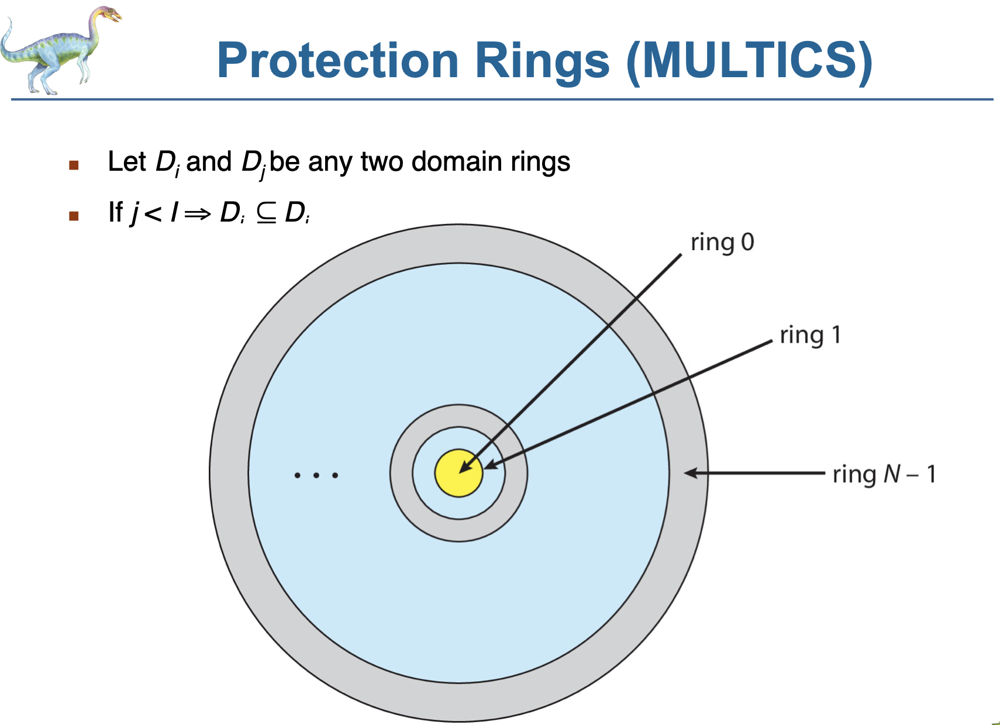
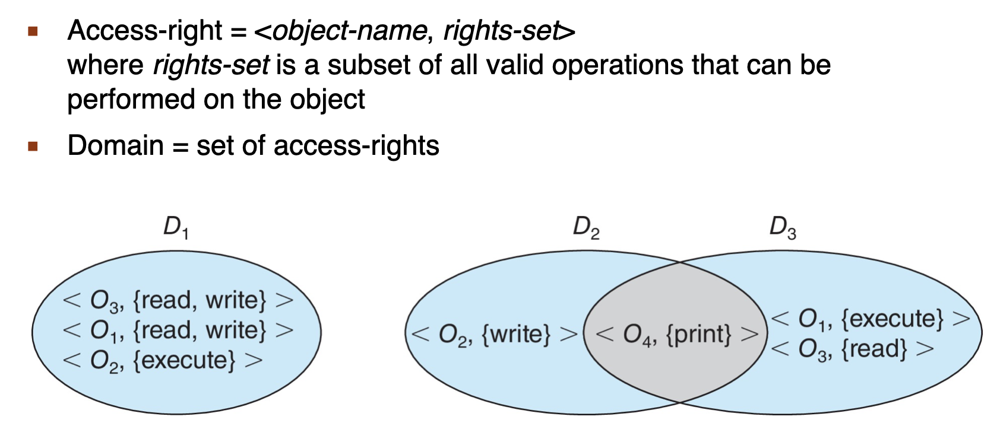
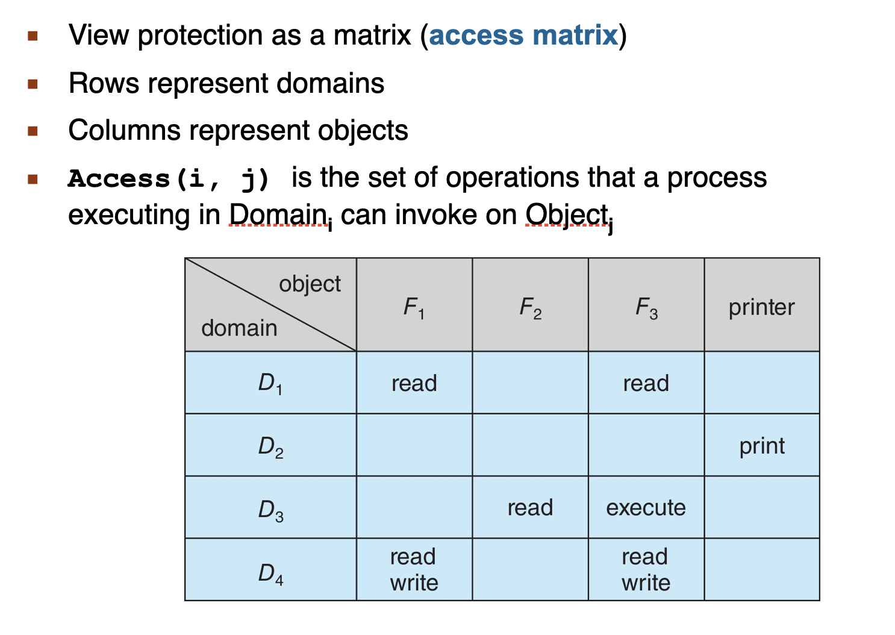
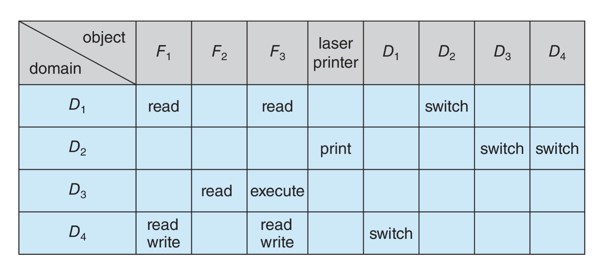
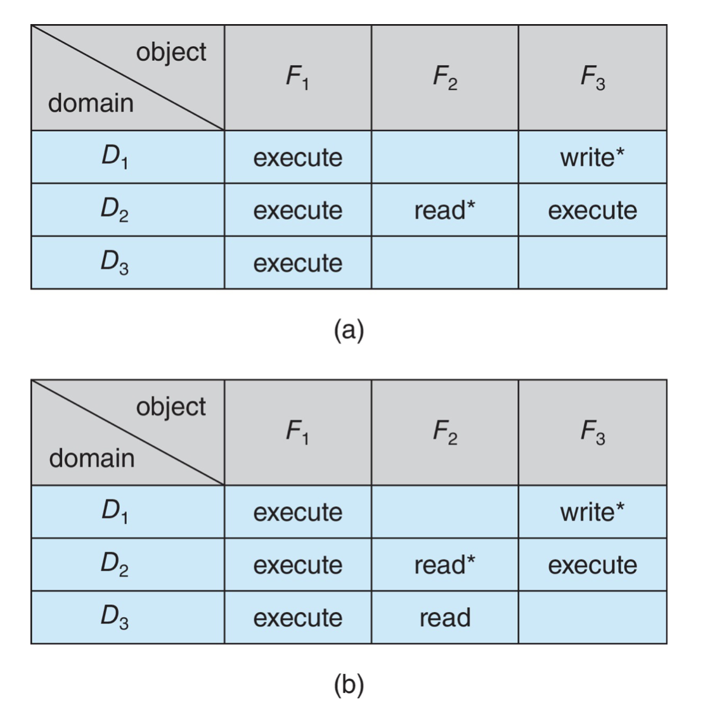
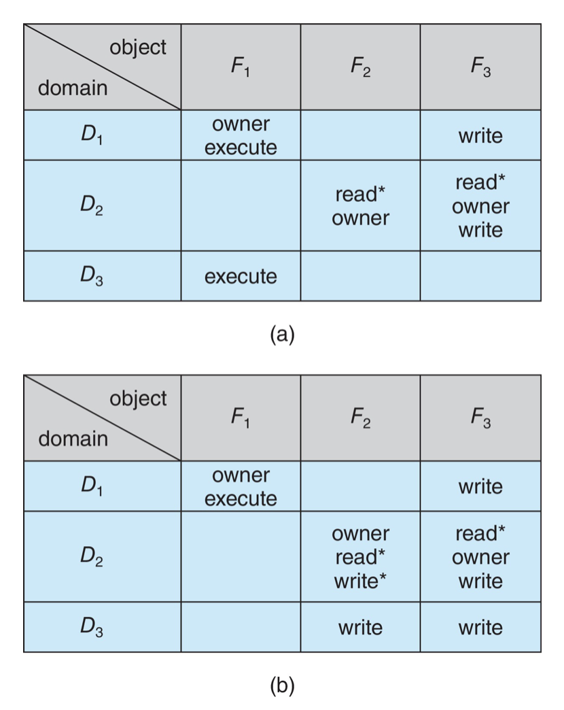

# 17. 보호(Protection)

- 16장에서는 무단 접근, 악의적인 파괴 또는 변경 및 우발적인 비일관성 도입으로부터 컴퓨터 자원을 보호하는 것과 관련된 보안을 다루었다
- 이번 장(17장)에서는 컴퓨터 시스템에 의해 정의된 자원에 대한 프로세스와 사용자의 `접근을 제어`하는 보호에 주목한다
- 운영체제 내의 프로세스들은 다른 프로세스들에 의한 활동으로부터 보호되어야 한다
- 이를 실현하는 방법은 `운영체제로 부터 적절한 권한을 부여`받은 프로세스만 파일, 메모리 세그먼트, CPU, 네트워킹, 그 외 자원들을 대상으로 작업할 수 있도록 보장하는 것이다

#### 이 장의 목표

- 현대 컴퓨터 시스템에서 보호의 목적과 원칙에 대해 논의한다
- `접근 행렬`과 결합한 `보호 도메인`이 `프로세스가 접근할 수 있는 자원을 지정`하는 데 어떻게 사용되는지 설명한다
  - 접근 행렬?
  - 보호 도메인?
- `자격 및 언어 기반의 보호 시스템`을 설명한다
- `보호 기법`이 시스템 공격을 완화할 방법을 설명한다

## 17.1 보호의 목표(Goals of Protection)

- 현대 보호의 개념 : 자원을 공유하는 인터넷과 같은 불안정한 통신 플랫폼에 연결되어 있는 복합적 시스템의 신뢰성 증가
- 보호를 제공하는 몇 가지 이유
  - 사용자가 접근 제한을 악의적, 의도적으로 위반하는 것을 방지
  - 시스템 내의 각 프로세스가 시스템 자원들을 정해진 사용 정책대로 사용하도록 보장
- 컴퓨터 시스템에서 보호의 역할
  - 자원 사용을 지배하는 정책을 시행하기 위한 기법을 제공하는 것
- 보호는 응용 서브시스템이 만들거나 지원하는 자원들의 오용을 방지할 수 있도록, 응용 프로그래머를 위한 도구로서 활용 가능해야 한다
- 중요한 원칙 : `기법(mechanism)`과 `정책(policy)`을 분리하는 것
  - 기법 : `어떤 일을 어떻게 할지를 결정`
  - 정책 : `무엇을 할지를 결정`
  - 정책은 장소와 시간에 따라 변할 가능성이 있다
    - 최악의 경우, 정책의 변경이 기법의 변경을 필요로 할 수 있다
    - 일반적 기법을 사용함으로써 이러한 최악의 상황을 방지할 수 있다

## 17.2 보호의 원칙

- 지배 원칙 : 한 프로젝트 전체에 걸쳐 따라야 할 원칙
- 보호를 위해 핵심적이며 오랜 시간에 걸쳐 확인된 지배 원칙으로 `최소 권한의 원칙(principle of least privilege)`이 있다
- 최소 권한의 원칙 : 프로그램, 사용자, 시스템이 태스크를 수행하는 데 `필요한 만큼의 권한을 부여`하는 법칙

  - e.g.
    - UNIX에서 사용자가 루트권한이 아닌 것
      - 우발적 삭제 작업과 같은 인적 오류가 발생할 수 있기 때문
  - 악의적인 공격으로 인한 피해를 최소화하기 위해 사용자에게 최소한의 권한만 부여하는 것이 중요
    - 바이러스
    - 버퍼 오버플로 또는 코드 주입 공격

- 구획화(compartmentalization)

  - 특정 권한과 접근 제한을 통해 개별 시스템 구성요소를 보호하는 과정

- 접근 제한을 신중하게 사용하면 시스템을 더욱 안전하게 만들 수 있다
- 허용된 접근과의 차이를 추적하는 감사 추적(audit trail)을 생성하는 데 도움이 될 수 있다

- 어떤 하나의 원칙이 만병통치약은 아니다
  - `심층 방어(defense in depth)`가 사용되어야 한다
    - `여러 층의 방어를 다른 층 위에 하나씩 적용`하는 것

## 17.3 보호 링(Protection Rings)

- 최신 운영체제의 주요 구성요소
  - 시스템 자원
  - 하드웨어에 대한 액세스를 관리하는 커널
- 커널은 사용자 프로세스보다 더 높은 수준의 권한을 가지고 실행해야 한다
- 이러한 `권한 분리`를 수행하려면 `하드웨어 지원이 필요`하다

  - 최신 하드웨어는 별도의 실행 수준이라는 개념을 지원한다

- _권한 분리의 일반적인 모델은 보호 링 모델이다_

- 그림 17.1 보호-링 구조

- 보호링 모델에서 실행은 동신원 링 집합으로 정의되며, 링 i는 (j < i) 링 j의 기능 부분집합을 제공한다

  - 가장 안쪽 링인 링0은 전체 권한 집합을 제공한다

- `시스템이 부팅`되면 `가장 높은 권한 수준으로 부팅`된다
  - 해당 수준의 코드는 권한이 `낮은 수준으로 떨어지기 전`에 `필요한 초기화를 수행`한다
  - 더 높은 권한 수준으로 돌아가기 위해 코드는 보통 링 사이의 포털을 제공하는 게이트라 불리는 특수 명령을 호출한다
    - Intel의 syscall 명령이 한 예이다
      - 실행이 사용자에서 커널 모드로 전환된다
    - 시스템 콜
    - 트랩 또는 인터럽트
  - 더 높은 권한 링에서의 실행은 미리 정의되어 있으며, 잘 보호된 코드 경로로 제한된다
- Intel 아키텍처의 가상머진 관리자 : 하이퍼 바이저

  - 링 -1 : 게스트 운영체제의 커널보다 더 많은 기능을 가지고 있다

- ARM 프로세서의 아키텍처
  - 처음에 사용자와 커널(슈퍼바이저) 모드 각각에 대해 USR과 SVC 모드만 허용하였다
  - ARMv7 프로세서에서 ARM은 추가 링을 제공하는 TrustZone(TZ)를 도입하였다
    - 이 가장 특권이 있는 실행 환경은 또한 NFC 보안 요소 및 온칩 암호화 키와 같은 하드웨어 기반 암호화 기능에 독점적으로 액세스하여 비밀번호와 민감한 정보를 보다 안전하게 처리할 수 있다
    - 커널 자체도 온칩 키에 액세스 할 수 없으며, TrustZone 환경으로부터 암호화와 복호화 서비스를 요청할 수 있다
      - 요청은 특별한 명령인 Secure Monitor Call(SMC)를 사용하여 이루어지며, 커널 모드에서만 사용할 수 있다
  - 신뢰할 수 있는 실행 환경을 사용한다는 것은 커널이 손상되면 공격자가 단순히 커널 메모리에서 키를 검색할 수 없다는 것을 의미한다
  - 64비트 ARMv8 아키텍처에서 ARM은 더 많은 링을 제공한다
    - EL0 : 사용자 모드
    - EL1 : 커널 모드
    - EL2 : 하이퍼바이저 용
    - EL3 : 보안 모니터용(TrustZone 계층)
      - 커널 보다 높은 실행 수준에서 실행 -> 커널의 무결성을 검사하는 코드를 배포하기에 완벽한 장소
        - 삼성의 Android 용 Realtime Kernel Protection(RKP)
        - iOS용 Apple의 WatchTower(Kernel Patch Protection, KPP)

## 17.4 보호의 영역(Domain of Protection)

- 보호 링은 기능을 도메인으로 부터 분리하여 계층적으로 정렬한다
- 링을 일반화하면 계층 구조가 없는 도메인을 사용하게 된다
- 컴퓨터 시스템은 프로세스들과 객체들의 집합으로 취급될 수 있다
  - 객체 : 하드웨어 객체, 소프트웨어 객체
    - 하드웨어 객체 : CPU, 메모리 세그먼트, 프린터, 디스크, 테이프 드라이브 등
    - 소프트웨어 객체 : 파일, 프로그램, 세마포 등
    - 각 객체는 시스템의 다른 모든 객체와 구분되는 유일한 이름을 가지며, 각각은 잘 정의되고 의미 있는 연산을 통해서만 접근될 수 있다
    - 객체의 연산
      - CPU : 실행
      - 메모리 워드 : 읽기와 쓰기
      - DVD-ROM : 읽기
      - 테이프 드라이브 : 읽기, 쓰기, 되감기
      - 자료 파일들 : 생성, 열기, 읽기, 쓰기, 닫기, 삭제 등
      - 프로그램 파일들 : 읽기, 쓰기, 실행, 삭제
- need to know(알 필요가 있는) 원칙

  - 프로세스는 자기 일을 완료하기 위해 현재 필요로 하는 객체들만 접근할 수 있어야 한다
    - 시스템에서 잘못된 프로세스가 유발할 수 있는 피해의 양을 제한하는 데 유용하다

- 알 필요가 있는 원칙 vs. 최소 권한 원칙
  - 정책 : 알 필요가 있는 원칙
  - 기법 : 최소 권한 원칙
  - e.g. 파일 권한
    - 알 필요가 있는 정책 : 사용자에게 읽기 권한이 있지만 파일에 대해 쓰기 또는 실행 권한이 없음을 지정한다
    - 최소 권한 원칙 : 운영체제가 읽기는 허용하지만 쓰기 또는 실행 액세스는 허용하지 않는 기법을 제공하도록 요구한다

### 17.4.1 영역 구조(Domain Structure)

- 그림 17.4) 3개의 보호 영역을 갖는 시스템

- 프로세스는 하나의 `보호 영역(protection domain)` 내에서 동작한다
  - 이 영역은 프로세스가 접근할 수 있는 자원을 지정한다
  - 각 영역은 객체의 집합과 각 객체에 대해 호출될 수 있는 `연산의 유형을 정의`한다
- 객체에 대해 `연산을 실행`할 수 있는 권한 : `접근 권한(access right)`
- 하나의 `영역(domain)`은 `접근 권한의 집합`이고, 각 권한은 <객체-이름, 권한-집합>의 순서 쌍으로 되어 있다
  - e.g. <파일F, {읽기, 쓰기}>
    - 파일 F에 대한 읽고 쓸 수 있지만, 그 객체(파일F)에 대하여 다른 연산을 할 수 없다
- 영역(domain)은 접근 권한을 공유할 수 있다
  - 17.4에서 D2와 D3는 접근권한 `<O4, {인쇄}>`를 공유한다
- 프로세스와 영역 간의 연관은 정적이거나 동적이다
  - 동적 보호 영역 설정에 내재하는 문제들은 정적인 경우의 단순한 문제보다도 좀 더 주의 깊은 해결책이 필요하다
- 프로세스와 영역 간의 연관이 동적이라면, 프로세스가 한 영역에서 다른 영역으로 전환하게 하는 기법이 존재한다
  - 각 사용자가 하나의 영겨이 될 수 있다
  - 각 프로세스가 하나의 영역이 될 수 있다
  - 각 프로시저가 하나의 영역이 될 수 있다
  - 17.5절에서 영역 전환에 대해 더 자세히 논의할 것이다

### 17.4.2 예: UNIX

- 권한 분리 후 사용자가 접근할 수 없는 권한 있는 디렉터리에 액세스할 때 -> setuid
- setuid 비트 활성화 => 파일을 실행할 수 있는 권한이 있는 사람은 파일 소유자의 신분을 일시적으로 넘겨받는다
- setui 프로그램은 매우 신중하게 작성될 필요가 있다

### 17.4.3 예: Android 응용 프로그램 ID

- Android에서는 응용 프로그램별로 구별되는 사용자 ID가 제공된다
- 응용 프로그램이 설치되면
  - installd 디먼은 이 UID와 GID를 부여하고,
  - UID/GID 조합에만 소유권이 부여된 개인용 데이터 디렉터리(/data/data/'appname')가 함께 배정된다
- 이러한 방식으로 장치의 응용 프로그램은 UNIX 시스템이 사용자를 분리하기 위해 제공하는 것과 동일한 수준의 보호를 받는다
  - 격리, 보안 및 프라이버시를 제공하는 빠르고 간단한 방법이다
- 이 기법은 특정 작업(예: 네트워킹 소켓)이 특정 GID(예: AID_INET, 3003)의 구성원에게만 허용되도록 커널을 수정하여 확장된다
- Android의 또 다른 개선점은 특정 UID를 격리된으로 정의하여 최소한의 서비스를 제외하고 RPCC 요청을 개시하지 못하게 하는 것이다

## 17.5 접근 행렬(Access Matrix)

- 그림 17.5) 접근 행렬

- `일반적인 보호 모델`은 추상적으로 `접근 행렬(access matrix)`이라 불리는 하나의 행렬로 볼 수 있다
- 행은 영역(domain)을 나타내고
- 열은 객체를 나타낸다
- 행렬의 각 항(access(i,j))은 접근 권한의 집합으로 구성된다
  - 접근권한에서 객체들은 열에 의하여 명시적으로 정의되므로, 접근 권한에 객체 이름을 생략할 수 있다
- 그림 17.5에서 영역 4개(D1 ~ D4)와 3개의 파일(F1 ~ F3)과 프린터 한 대가 있다
  - 어떤 프로세스가 영역 D1에서 실행할 때, 그 프로세스는 F1, F3을 읽을 수 있다
  - 영역 D4에서 실행하는 프로세스는 영역 D1에서와 똑같은 특권 + F1와 F3에 쓰기 권한이 추가된다
  - 프린터는 단지 D2영역에서 실행하는 프로세스에 의해서만 접근될 수 있다
- 영역 D(i)에서 실행하는 프로세스는 i행에 지정된 객체들만 접근할 수 있음을 보장해야 한다

- 그림 17.6 영역을 객체로 가진 그림 17.5의 접근 행렬

- 전환 : 프로세스를 한 영역에서 다른 영역으로 이동시키는 것
- 접근 행렬 항들의 내용에 대한 통제된 변경을 허용하기 위해서 세 가지 연산이 추가로 필요
  - 복사, 소유자, 제어
- 한 영역으로 부터 다른 영역으로 접근 권한을 복사할 수 있는 권한은 별표(\*)를 덧붙여 나타낸다
- 복사 권한은 그 권한이 정의된 열(한 객체) 내에서만 접근 권한을 복사하는 것을 허락한다

- 그림 17.7 복사 권한을 갖는 접근 행렬

- 그림 17.8 owner 권한을 갖는 접근 행렬

- D2는 F2, F3의 소유자이며, 두 열 내에 유효한 임의의 권한을 추가하거나 제거할 수 있다

## 17.6 접근 행렬의 구현(Implementation of Access Matrix)

- 일반적으로 접근행렬은 대부분이 공백인 희소행렬(sparse matrix)이다
- 접근 행렬을 구현하기 위한 여러 방식을 살펴본 다음 서로 비교해보자

### 17.6.1 전역 테이블(Global Table)

- 접근 행렬의 가장 단순한 구현은 순서를 가진 세 부분(영역, 객체, 권한 집합)들의 집합으로 구성되는 전역 테이블(global table)이다

- 영역(domain)에서 객체에 대한 어떤 연산일 실행 될 때마다, 전역테이블을 탐색한다
- 권한이 있다면 연산이 허용되지만 그렇지 않으면 예외(오류) 상황이 발생한다
- 단점
  - 이러한 구현은 테이블의 크기가 매우 크기 때문에 메모리에 보관할 수 없다
    - 따라서 추가적인 입출력이 필요하다
    - 가상 메모리 기법이 이 테이블을 관리하는 데 종종 사용된다
  - 또한 어떠한 객체나 영역의 특별한 그룹핑을 이용하기가 어렵다
    - 예를 들면, 만일 특정 객체를 누구든지 읽을 수 있게 하려면, 그 객체는 모든 영역 내에 별도의 항을 가져야만 한다

### 17.6.2 객체를 위한 접근 리스트(Access Lists for Objects)

- 접근 행렬 내의 각 열은 접근 리스트로써 구현할 수 있다
  - 공백항은 버릴 수 있다
- 이러한 접근법은 하나의 리스트와 접근 권한의 디폴트 집합(default set)을 정의할 수 있도록 쉽게 확장될 수 있다
- 연산이 시도될 때, 접근 리스트를 탐색한다
- 효율을 높이기 위해, 디폴트 집합을 먼저 검사한 다음 나중에 접근 리스트를 탐색할 수도 있다

### 17.6.3 영역을 위한 자격 리스트(Capability Lists for Domains)

- 접근 리스트 -> 접근 행렬의 열과 객체를 연관
- 영역을 위한 자격 리스트 -> 각 행을 해당 영역과 연관
- 자격 리스트 : 객체와 그 객체에 허용된 연산의 리스트
- 하나의 객체는 종종 자격이라 불리는 물리적 이름이나 주소로 표현되기도 한다

### 17.6.4 락-키 기법(A Lock-key Mechanism)

- 접근 리스트와 자격리스트의 절충안
- 락이라 불리는 유일한 비트 패턴의 리스트를 가지고 있다

## 17.7 접근 권한의 취소(Revocation of Access Rights)

- 동적 보호 시스템에서 때때로 접근 권한을 취소해야할 필요가 있다
- 취소에 관한 다음과 같은 여러 가지 질문이 발생할 수 있다
  - 즉시 대 지연
    - 즉시 취소 할지 또는 지연될 것인지
    - 지연된다면, 취소를 언제 발생할 것인지
  - 선택적 대 일반적
    - 객체에 대한 접근이 취소될 때 그 객체에 대한 접근 권한을 가진 모든 사용자에게 영향을 미칠 것인지
    - 접근 권한이 취소되어야 할 사용자를 우리가 지정할 수 있는지
  - 부분적 대 전체적
    - 객체에 대한 연관된 권한의 일부분을 취소할 수 있는가
    - 또는 이 객체를 위한 모든 권한을 반드시 취소해야 하는가
  - 일시적 대 영구적
    - 접근이 영구적으로 취소될 수 있는가
    - 또는 접근이 취소되었다가 후에 다시 얻어질 수 있는가

## 17.8 역할 기반 액세스 제어(Role-Based Access Control)

- 13.4.2절에서 파일 시스템 내의 파일에 접근 제어를 사용하는 방법을 설명했다
- 역할 기반 액세스 제어(Role-Based Access Control, RBAC)를 통해 최소 권한의 원칙을 명시적으로 추가하여 운영체제에서 사용할 수 있는 보호 기능을 향상하는 아이디어이다

## 17.9 강제적 접근 제어(Mandatory Access Control, MAC)

- 운영체제에는 전통적으로 파일과 기타 시스템 개체에 대한 액세스를 제한하는 수단으로 임의 액세스 제어(Discretionary Access Control, DAC)를 사용해왔다
  - 불충분으로 판명되었다
- 강력한 보호에 대한 필요성 -> 강제적 접근 제어(MAC) 형태로 도입
  - MAC은 루트 사용자조차도 수정할 수 없는 시스템 정책으로 시행된다

## 17.10 자격-기반 시스템(Capability-Based Systems)

## 17.11 기타 보호 개선 방법

### 17.11.1 시스템 무결성 보호

### 17.11.2 시스템 콜 필터링

### 17.11.3 샌드박싱

- 할 수 있는 것을 제한하는 환경에서 프로세스를 실행하는 작업이 포함된다

### 17.11.4 코드 서명

- 시스템이 어떻게 프로그램이나 스크립트를 신뢰할 수 있는가?
  - 운영체제의 일부로 제공된 경우 신뢰해야 한다

## 17.12 언어 기반의 보호(Language-Based Protection)

### 17.12.1 컴파일러 기반 시행

### 17.12.2 런타임 기반 시행-자바의 보호

## 17.13 요약

- 시스템 보호 기능은 알 필요가 있는 원칙을 따르며, 최소 권한의 원칙을 시행하기 위한 기법을 구현한다
- 컴퓨터 시스템에는 오용으로부터 보호해야 하는 객체가 있다
  - 객체는 하드웨어(메모리, CPU 시간 및 I/O 장치 등) 또는 소프트웨어(파일, 프로그램 및 세마포)일 수 있다
- 액세스 권한은 개체에 대한 작업을 수행할 수 있는 권한이다
  - 도메인은 접근 권한의 집합이다
  - 프로세스는 도메인에서 실행되며, 도메인의 모든 액세스 권한을 사용하여 객체에 액세스 하고 조작할 수 있다
  - 프로세스는 보호 도메인에 바인딩되거나 한 도메인에서 다른 도메인으로 전환될 수 있다
- 객체 보안의 일반적인 방법은 일련의 보호 링을 제공하는 것으로서, 각 링은 이전의 링보다 많은 권한을 가진다
  - 예를 들어, ARM은 4가지 보호 수준을 제공한다
  - 가장 특권이 있는 TrustZone은 커널 모드에서만 호출할 수 있다
- 접근 행렬은 시스템 또는 사용자에게 특정 보호 정책을 적용하지 않고 보호 기법을 제공하는 일반적인 보호 모델이다
  - 정책과 메커니즘의 분리는 중요한 설계 속성이다
- 접근 행렬은 희소 행렬이다
  - 일반적으로 각 개체와 관련된 접근 목록 또는 각 도메인과 관련된 자격 목록으로 구현된다
  - 도메인과 접근 행렬 자체를 객체로 간주하여 접근행렬 모델에 동적으로 보호를 포함할 수 있다
  - 동적 보호 모델에서 접근 권한을 취소하는 것은 일반적으로 자격 목록보다 접근 목록 기법을 사용하여 구현하기가 더 쉽다
- 실제 시스템은 일반 보호 모델보다 훨씬 제한적이다
  - 이전 UNIX 배포판이 대표적으로 각 파일의 소유자, 그룹 및 일반 사용자를 위해 읽기, 쓰기 및 실행 보호에 대한 임의 액세스 제어를 제공한다
  - 더욱 현대적인 시스템은 일반 모델에 더 가깝거나 시스템 및 사용자를 보호하기 위한 다양한 보호 기능을 제공한다
- 다른 시스템 중에서 Solaris 10 이후 버전은 접근 행렬 형식인 역할 기반 액세스 제어를 통해 최소 권한의 원칙을 구현한다
  - 또 다른 보호 확장은 시스템 정책 시행의 한 형태인 강제적 접근 제어이다
- 자격 기반 시스템은 구형 모델보다 세밀한 보호 기능을 제공하여 루트의 힘을 개별 영역으로 "슬라이스"함으로써 프로세스에게 특정 기능을 제공한다
  - 보호를 개선하는 다른 방법으로는 시스템 무결성 보호, 시스템 콜 필터링, 샌드박싱 및 코드 서명이 있다
- 언어 기반 보호는 운영체제가 제공할 수 있는 것보다 세밀한 요청 및 권한 중재를 제공한다
  - 예를 들어, 하나의 Java JVM은 각각 다른 보호 클래스에 속한 여러 스레드를 실행할 수 있다
  - 정교한 스택 검사와 언어의 유형 안전성을 통해 자원 요청을 시행한다
