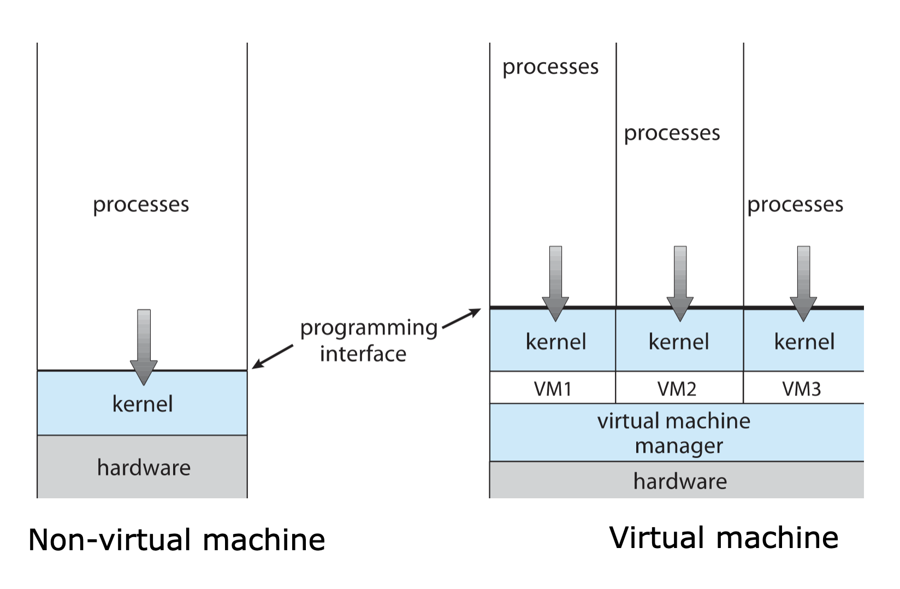
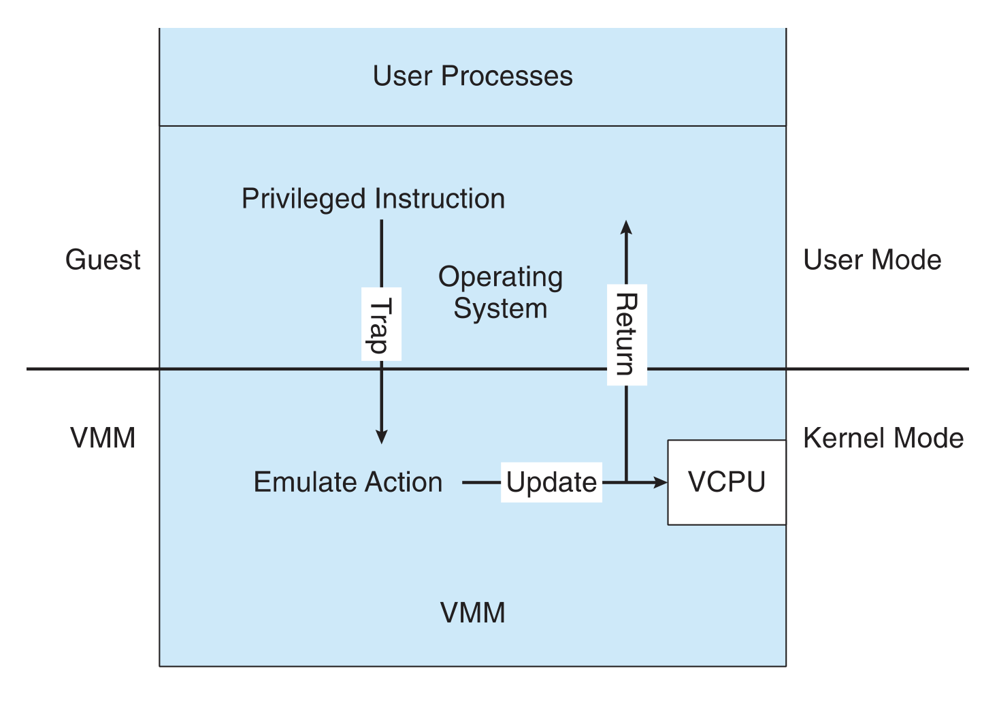
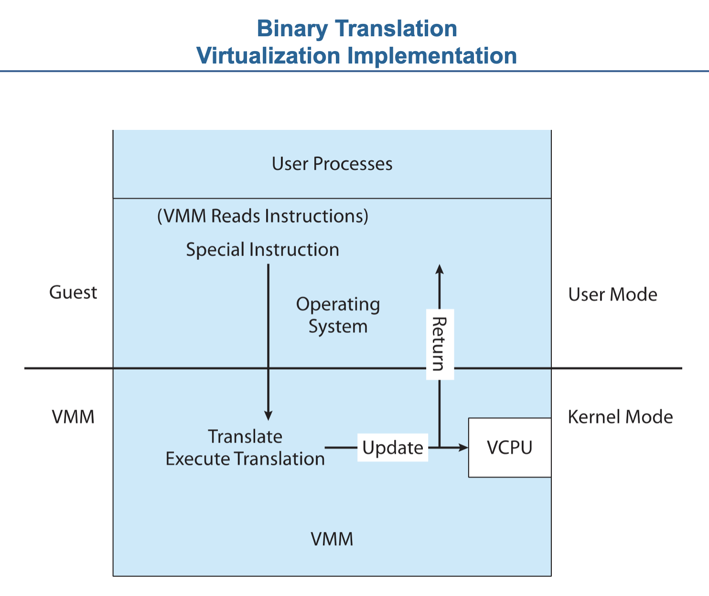
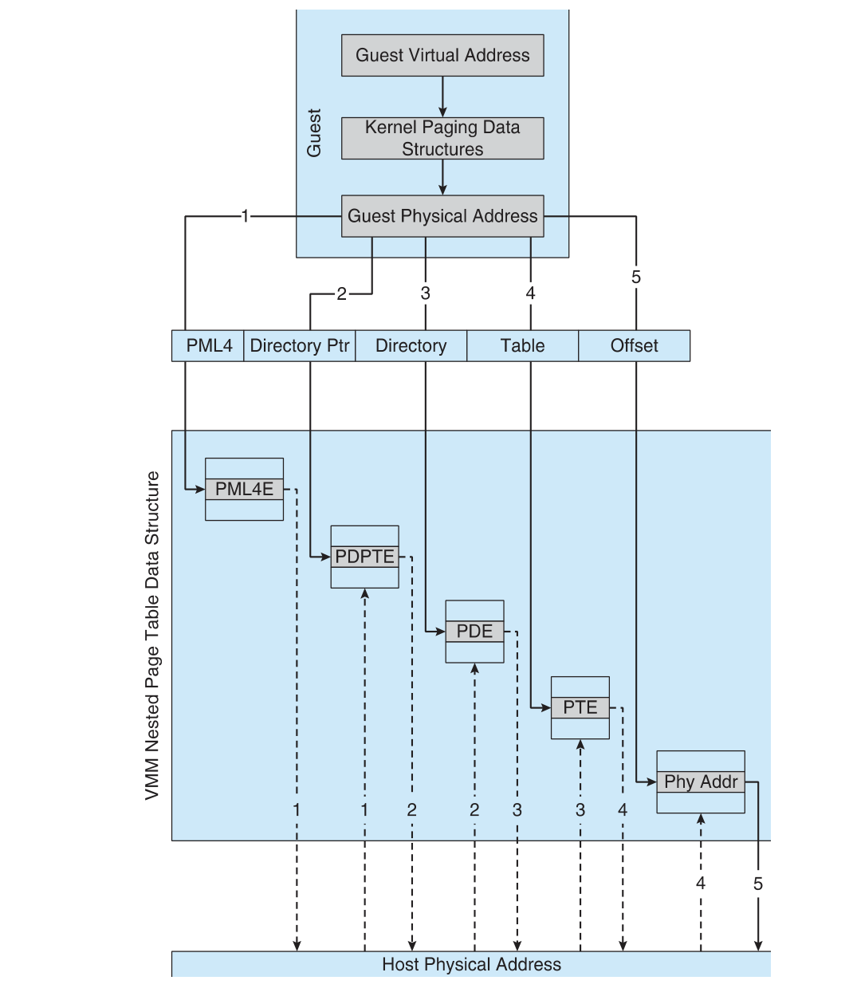

# Part 8. 진보된 주제(Advanced Topics)

- 가상화
  - 가상 시스템 사용 -> 게스트 운영체제 및 응용 프로그램이 본래의 하드웨어인 것처럼 보이는 환경에서 실행된다
  - 이 환경은 본래의 하드웨어처럼 동작하지만 운영체제와 응용 프로그램을 보호하고, 관리하고 제한한다
- 분산 시스템
  - 메모리나 클록을 공유하지 않는 프로세서의 집합이다
  - 각 프로세서는 자신의 로컬 메모리가 있으며 LAN 또는 WAN을 통해 서로 통신한다
  - 컴퓨터는 이종 컴퓨팅 장치가 표준 통신 프로토콜을 채택하여 통신할 수 있게 한다
  - 분산 시스템은 몇 가지 이점을 제공한다
    - 사용자가 시스템에서 유지 관리하는 더 많은 자원에 접근하고,
    - 계산 속도를 높이며,
    - 데이터의 가용성과 안정성을 향상한다

# 18. 가상 머신(Virtual Machines)

- 이 장에서는 `가상 머신`의 `사용`, `기능` 및 `구현`에 대해 자세히 설명한다
- 가상 머신은 여러 가지 방법으로 `구현`될 수 있으며, 이 장에서는 이러한 옵션을 설명한다
  - 한 가지 옵션은 `커널에 가상 머신 지원을 추가`하는 것이다
  - 또한 CPU 및 I/O 장치에서 제공하는 하드웨어 기능은 가상 머신 구현을 지원할 수 있으므로, 적절한 커널 모듈에서 이러한 기능을 사용하는 방법에 대해 논의한다

#### 이 장의 목표

- 가상 머신의 이력과 이점을 살펴본다
- 다양한 가상 머신 기술에 대해 논의한다
- 가상화를 구현하는 데 사용되는 방법을 설명한다
- 가상화를 지원하는 가장 일반적인 하드웨어 기능을 식별하고 운영체제 모듈에서 어떻게 사용되는지 설명한다
- 현재 가상화 연구 분야에 대해 논의한다

## 18.1 개요

- 가상 머신의 기본 개념
  - 단일 컴퓨터의 하드웨어를 여러 가지 실행 환경으로 추상화하여 개별 환경이 자신의 개인용 컴퓨터에서 실행되고 있다는 착각을 불러일으키는 것이다
- 이 개념은 운영체제 구현에 대한 계층화된 접근 방식과 어떤 면에서는 유사하다
- 가상화
  - 운영체제 또는 응용 프로그램을 실행할 수 있는 `가상 시스템을 생성하는 계층`이 있다

- 그림 18.1 시스템 모델. (a) 가상화 되지 않은 기기 (b) 가상화된 기기

- 가상 머신의 구현은 여러 구성요소를 포함한다
  - 호스트 : 가상 머신을 실행하는 기본 하드웨어 시스템
  - 가상 머신 관리자(VMM, 하이퍼바이저)는 호스트와 동일한 인터페이스를 제공하여 가상 머신을 생성하고 실행한다(반가상화는 제외)
  - 게스트 프로세스에는 호스트의 가상 복사본이 제공된다(그림 18.1)
    - 게스트 프로세스는 실제 운영체제이다
      - 따라서 단일 물리적 시스템은 각각 자체 가상 머신에서 여러 운영체제를 동시에 실행할 수 잇다
- 가상화 : 운영체제의 정의가 다시 한번 흐려진다
  - VM ware ESX같은 VMM 소프트웨어를 생각해보자
  - 이 가상화 소프트웨어는 하드웨어에 설치되고 하드웨어가 부팅될 때 실행되며, 응용 프로그램에 서비스를 제공한다
- VMM : 가상 환경을 제공하는 구성요소
- VMM의 구현은 매우 다양하다. 옵션은 다음과 같다
  - `펌웨어를 통해 가상 머신 생성 및 관리를 지원`하는 하드웨어 기반 솔루션
    - 이러한 VMM은 메인 프레임과 중대형 서버에서 일반적으로 사용되며, 일반적으로 유형 0 하이퍼바이저로 알려져 있다
    - IBM LPAR 및 Oracle LDOM이 그 예이다
  - VMware ESX, Joyent SmartOS 및 Citrix XenServer를 포함하여 `가상화를 제공하기 위해 구축된 운영체제와 유사한 소프트웨어`
    - 이러한 VMM을 유형 1 하이퍼 바이저라고 한다
  - `표준 기능` 뿐 아니라 `VMM기능`도 제공하는 범용 운영체제
    - Microsoft Windows Server With HyperV 및 Red Hat Linux KVM이 그 예이다
    - 이러한 시스템에는 유형 1 하이퍼바이저와 유사한 기능을 가지므로 유형 1로 알려져있다
  - 표준 운영체제에서 실행되지만 게스트 운영체제에 VMM기능을 제공하는 응용 프로그램
    - VMware Workstation, Fusion, Parallels Desktop, Oracle VirtualBox
    - 유형 2 하이퍼바이저
  - 반가상화
    - 게스트 운영체제를 VMM과 협력하여 성능을 최적화하도록 수정하는 기술이다
  - 프로그래밍 환경 가상화
    - VMM이 실제 하드웨어를 가상화하는 것이 아니라 최적화된 가상 시스템을 생성한다
    - Oracle Java, Microsoft.Net에서 사용된다
  - 에뮬레이터
    - 한 하드웨어 환경용으로 작성된 응용 프로그램이 다른 유형의 CPU 유형과 같이 매우 다른 하드웨어 환경에서 실행될 수 있도록 한다
  - 응용 프로그램 격리
    - 가상화는 아니지만 운영체제에서 응용 프로그램을 격리하여 가상화와 유사한 기능을 제공한다
    - Oracle Solaris Zones, BSD Jails 및 IBM AIX WPAR
    - 응용 프로그램을 포함하여 더욱 안전하고 관리할 수 있게 만든다

## 18.2 역사(History)

- 가상 머신은 1972년 IBM 메인프레임에서 처음으로 상용화되었다
  - 가상화는 IBM VM운영체제에서 제공되었다
- 가상화 요구 사항
  - 충실도(fidelity) : VMM은 원래 컴퓨터와 동일한 프로그램을 위해 환경을 제공한다
  - 성능(performance) : 해당 환경에서 실행하는 프로그램은 성능이 약간만 저하된다
  - 안전(safety) : VMM은 시스템 자원을 완벽하게 관리한다

## 18.3 장점 및 특징(Benefits and Features)

- 가상화의 매력
  - 동일한 하드웨어를 공유하면서 여러 가지 실행 환경(즉, 다른 운영체제)을 동시에 실행하는 능력과 관련이 있다
- 가상화의 이점
  - 가상머신이 서로 보호
  - 호스트 시스템이 가상 머신으로부터 보호된다
  - 게스트 운영체제 내의 바이러스는 해당 운영체제를 손상할 수 있지만 호스트나 다른 게스트에는 영향을 미치지 않는다
- 격리의 잠재적 단점 : 자원 공유를 막을 수 있다
- 가상머신 자원 공유를 제공하는 두 가지 접근 방식
  - 첫째, 파일 시스템 볼륨을 공유하여 파일을 공유할 수 있다
  - 둘째, 가상 머신 네트워크를 정의하여 각 가상 머신은 가상 통신 네트워크를 통해 정보를 전송할 수 있다
    - 네트워크는 물리적 통신 네트워크를 모델로 하지만 소프트웨어로 구현된다
- 가상화 구현에서 공통적인 기능
  - 실행 중인 가상 머신을 중단하거나 일시 중단하는 기능
  - VMM은 게스트의 사본, 스냅숏(snapshot)을 만들 수 있다
    - 복사본을 사용하여 새 VM을 만들거나 현재 상태를 그대로 유지한 상태에서 한 시스템에서 다른 시스템으로 VM을 이동하는 데 사용될 수 있다
  - `게스트 사본` : 게스트는 원래 머신에서 실행되는 것 처럼 원래 위치에서 다시 시작하여 결과적으로 클론(clone)을 생성할 수 있다
  - `스냅숏` : 특정 시점의 모든 상태를 기록하고, 필요한 경우 게스트를 그 시점의 상태로 되돌릴 수 있다
    - 종종 VMM은 많은 스냅숏을 만들 수 있도록 허용한다
    - 예를 들어, 한달 동안 매일 게스트의 스냅숏을 만들 후, 그중 `원하는 상태로 되돌아갈 수 있다`
      - 이러한 기능은 가상 환경에서 유용하게 사용된다
- 여러 대의 서버를 한두 명의 관리자가 동일한 작업을 관리할 수 있다

  - 템플릿
  - 설치 및 구성된 게스트 운영체제 및 응용 프로그램을 포함된 표준 가상 머신 이미지가 저장되어 실행 중인 여러 VM의 소스로 사용된다
  - 다른 기능으로는 모든 게시트의 패치 관리, 게스트 백업 및 복원, 자원 사용 모니터링 등이 있다

- 응용 프로그램 배포 방식에 가상화가 미칠 수 있는 영향에 대해 생각해보자
  - 시스템이 가상 머신을 쉽게 추가, 제거 및 이동할 수 있다면 왜 해당 시스템에 응용 프로그램을 직접 설치해야 하는가?
    - 가상 머신의 조정(tuning)되고 사용자 지정된 운영체제에 응용 프로그램이 사전 설치될 수 있다
    - 이 방법은 응옹 프로그램 관리가 쉬워지고 튜닝이 덜 필요하며 응용 프로그램에 대한 기술 지원이 더 간단해진다
    - 설치가 간단할 것이고 응용 프로그램을 다른 시스템에 다시 배포하는 것이 일반적인 제거 및 재설치 단계보다 훨씬 쉬울 것이다
    - 이 방법론을 널리 채택하려면 가상 머신을 표준화하여 모든 가상 머신이 모든 가상화 플랫폼에서 실행되도록 해야한다
      - 표준화를 제공하려는 시도 : Open Virtual Machine Format
- 가상화는 컴퓨터 설비 구현, 관리 및 모니터링의 다른 많은 발전을 위한 토대를 마련했다
  - 예를 들어, 클라우드 컴퓨팅은 인터넷 기술을 사용하는 고객에게 CPU, 메모리, I/O와 같은 자원을 서비스로 제공하는 가상화 때문에 가능하다
    - 프로그램은 API를 사용하여 클라우드 컴퓨팅 설비가 특정 게스트 운영체제와 응용 프로그램을 실행하는 수천개의 VM을 생성하여 다른 사용자가 인터넷을 통해 접근할 수 있게 만들 수 있다
  - 데스크톱 컴퓨팅 영역에서 가상화를 통해 데스크톱 및 랩톱 컴퓨터 사용자는 원격 데이터 센터에 있는 가상 시스템에 원격으로 연결하여, 마치 로컬인 것 처럼 응용 프로그램에 액세스 할 수 있다

## 18.4 빌딩 블록(Building Blocks)

- 기반 시스템의 정확한 클론을 제공하려면 많은 작업이 필요하다
- 이 절에서 효율적인 가상화에 필요한 빌딩 블록을 살펴본다
- VMM은 여러 가지 기술을 사용하여 가상화를 구현한다
  - 트랩-앤-에뮬레이트
  - 이진 변환
- 이 절을 읽으면서 대부분의 가상화 옵션에서 발견되는 중요한 개념은 가상 CPU(VCPU)의 구현이라는 것을 유념하기 바란다
  - VCPU는 코드를 실행하지 않는다
  - 오히려 게스트 컴퓨터가 믿고 있는 CPU의 상태를 나타낸다
  - 각 게스트에 대해 VMM은 해당 게스트의 현재 CPU 상태를 나타내는 VCPU를 유지 관리한다
  - VMM에 의해 `게스트가` `CPU로` 문맥 교환될 때, VCPU의 정보가 올바른 문맥을 적재하는 데 사용된다
    - 범용 운영체제가 PCB를 사용하는 것과 비슷하다

### 18.4.1 트랩-앤-에뮬레이트(Tap-and-Emulate)

- 그림 18.2 트랩-앤-에뮬레이트 가상화 구현
- 일반적인 이중 시스템에서 가상 시스템 게스트는 추가 하드웨어 지원이 제공되지 않는 한 사용자 모드에서만 실행할 수 있다
  - 커널은 커널모드에서 실행
- 물리적 시스템에 두 가지 모드가 있는 것 처럼 가상 시스템도 반드시 있어야 한다
  - 물리적 사용자모드에서 실행되는 가상 사용자 모드
  - 가상 커널 모드
- `실제 시스템`에서 `사용자모드에서 커널 모드로의 전환` 작업도 `가상 시스템`의 `가상 사용자 모드에서 가상 커널모드로의 전환`을 일으켜야 한다
  - 이러한 전환이 어떻게 이루어 질 수 있을까?
  - 절차 : 트랜-앤-에뮬레이션 방법(그림 18.2)
    - 게스트의 커널이 권한 있는 명령을 실행하려고 하면 오류(시스템이 사용자 모드에 있기 때문에)이며, 실제 시스템의 VMM에 트랩을 발생시킨다
    - VMM은 제어를 얻게 되고, 게스트의 입장에서 게스트 커널이 시도한 작업을 실행(에뮬레이트)한다
    - 그런 다음 제어를 가상 머신으로 반환한다
- 명령어의 종류에 따른 실행 시간 차이
  - 권한이 없는 모든 명령어
    - 하드웨어에서 기본적으로 실행
    - 네이트브 응용 프로그램과 동일한 성능을 제공
  - 특권 명령어
    - 추가 오버헤드를 발생시킴
    - 게스트가 원래보다 느리게 실행되도록 한다
    - 주로 I/O에 필요한 명령어 - 에뮬레이션 - 느림
- 또한 CPU는 많은 가상 머신 간에 다중 프로그래밍 되므로, 예측할 수 없는 방식으로 가상 머신의 속도를 더욱 느리게 만들 수 있다

### 18.4.2 이진 변환(Binary Translation)

- 그림 18.3 이진 변환 가상화 구현

- 일부 CPU는 특권 및 비 권한 명령을 완전히 분리하지 않는다
  - Intel x86은 이러한 CPU 중 하나이다
  - 설계 당시 x86은 가상화를 고려하지 않았다
- popf 명령
  - 스택의 내용을 플래그 레지스터에 적재한다.
    - CPU가 권한 모드인 경우 모든 플래그가 스택의 내용으로 교체된다
    - CPU가 사용자 모드인 경우 일부 플래그만 교체되고 다른 플래그는 무시된다
  - popf가 사용자 모드에서 실행되면 트랩이 생성되지 않으므로 트랩-앤-에뮬레이트 방식은 쓸모없게 된다
- 다른 x86 명령어도 비슷한 문제를 일으킨다
  - 이 명령어 집합을 특수 명령어라고 하자
  - 1998년 까지만 해도 x86에서 가상화를 구현하기 위해 트랩-앤-에뮬레이트 방법을 사용하는 것이 특수 명령 때문에 불가능한 것으로 여겨졌다
- 이전에 극복할 수 없었던 이 문제는 `이진 변환` 기술의 구현으로 해결되었다
- 이진 변환 기본 단계

  - 1. 게스트 VCPU가 사용자 모드인 경우 게스트는 물리적 CPU에서 명령어를 그대로 실행할 수 있다
  - 2. 게스트 VCPU가 커널 모드인 경우 게스트는 자신이 커널 모드에서 실행되고 있다고 생각한다
    - VMM은 게스트의 프로그램 카운터를 기반으로 게스트가 실행할 다음 몇 가지 명령어를 읽어 게스트가 가상 커널 모드에서 실행하는 모든 명령어를 검사한다
    - 특수 명령어 이외의 명령어는 그대로 실행된다
    - VCPU의 플래그 변경과 같은 특수 명령어는 동당한 작업을 수행하는 새로운 명령어 집합으로 변환된다

- 이진 변환은 그림 18.3에 나와 있다
  - VMM 내의 변환 코드에 의해 구현된다
  - 이 코드는 필요에 따라 게스트에서 네이티브 이진 명령어를 동적으로 읽고 원래 코드 대신 실행되는 네이티브 이진 코드를 생성한다
- 이진 변환의 기본 방법은 올바르게 실행되지만 성능이 떨어진다
  - 다행히도 대부분의 명령어는 그대로 실행된다
- 그러나 다른 명령어의 성능을 어떻게 향상할 수 있는가?
  - 성능을 향상하는 한 가지 방법을 알아보기 위해 VMware의 특정 구현으로 눈을 돌릴 수 있다
  - 캐싱 - 반환해야 하는 각 명령엉의 교체 코드가 캐시된다
- 가상화의 또 다른 문제인 메모리 관리, 특히 페이지 테이블을 고려해보자
  - VMM은 어떻게 페이지 테이블 상태를 유지할까?
  - 트랩-앤-에뮬레이트 및 이진 변환에서 모두 사용되는 일반적인 방법은 중첩 페이지 테이블(nested page tables, NPTs)를 사용하는 것이다
    - 각 게스트 운영체제는 가상 메모리에서 물리 메모리로 변환하기 위해 하나 이상의 페이지 테이블을 유지한다
  - VMM은 게스트의 CPU 상태를 나타내는 VCPU를 만드는 것 처럼 게스트의 페이지 테이블 상태를 나타내는 NPT를 유지관리한다
    - VMM은 게스트가 페이지 테이블을 변경하려고 시도하는 시점을 알고 있으며, NPT에서도 이와 동일하게 변경한다
    - 게스트가 CPU에서 실행 중 일 때 VMM은 해당 NPT에 대한 포인터를 해당 cpu 레지스터에 넣어 해당 테이블을 활성 페이지 테이블로 만든다
    - 게스트가 페이지 테이블을 수정해야 하는 경우(예를 들어, 페이지 폴트 처리) VMM은 해당 작업을 자로채어 중첩 및 시스템 페이지 테이블을 적절히 변경해야 한다
    - 불행하게도 NPT를 사용하면 TLB 미스가 증가할 수 있으며, 합리적인 성능을 달성하기 위해 다른 많은 복잡성을 해결해야 한다
- 이진 변환 방법은 많은 양의 오버헤드를 발생시키는 것 처럼 보이지만 Intel x86 기반 시스템 가상화를 목표로 하는 새로운 산업을 출범시킬 만큼 좋은 성과를 거두었다
  - Windows XP의 네이티브 실행과 비교해 각 변환은 마이크로 초가 소요되었고 총 3초 증가한 950,000개의 변환이 일어났다
  - 이 장의 끝에 있는 참고문헌을 참조하라

### 18.4.3 하드웨어 지원(Hardware Assistance)

- 일정 수준의 하드웨어 지원이 없으면 가상화가 불가능하다
  - 시스템 내에서 사용 가능한 하드웨어 지원이 많을 수록 가상 머신의 기능이 풍부하고 안정적이며 성능이 향상된다
  - Intel x86 CPU 제품군에서 Intel은 2005년부터 새로운 세대의 가상화 지원(VT-x 명령어)을 추가했다
  - 이제 이진 변환이 더는 필요 없게 되었다
- 사실, 모든 주요 범용 CPU는 이제 가상화를 위한 확장된 하드웨어 지원을 제공한다

  - 예를 들어 AMD 가상화 기술(AMDV)은 2006년부터 여러 AMD프로세서에 등장했다
  - `호스트`와 `게스트`라는 두 가지 새로운 `작동 모드`를 정의하여 이중 모드에서 `다중 모드 프로세서로 전환`한다
  - 시스템제어를 가상 머신에서 실행 중인 게스트 운영체제로 넘길 때
    - VMM은 호스트 모드를 활성화
    - 각 게스트 가상 머신의 특성을 정의
    - 시스템을 게스트 모드로 전환
  - Intel VT-x의 기능은 이와 유사하며, 호스트와 게스트 모드 그리고 동일한 루트 및 비루트 모드를 제공한다
    - 둘다 게스트 문맥 교환 중에 게스트 CPU 상태를 자동으로 적재 미 저장하기 위해 게스트 VCPU 상태 데이터 구조를 제공한다
      - 예를 들어, 사용 불가능한 메모리에 액세스 하려고 해서 발생한 중첩된 페이지 테이블 위반으로 인해 게스트가 종료될 수 있다

- AMD와 Intel은 가상환경에서 메모리 관리를 해결했다

  - AMD의 RVI와 Intel의 EPT 메모리 관리 기능이 향상됨에 따라 VMM은 더는 소프트웨어 NPT를 구현할 필요가 없게 되었다
  - 본질적으로 이러한 CPU는 하드웨어에서 중첩된 페이지 테이블을 구현하여 VMM이 페이징을 완전히 제어할 수 있도록 하며, CPU는 가상 주소에서 물리주소로의 변환을 가속화한다
  - NPT는 논리적-물리 주소 변환에 대한 게스트의 관점을 나타내는 새로운 계층을 추가한다
  - CPU 페이지 테이블 탐색 기능(원하는 데이터를 찾기 위해 자료구조를 순회함)은 필요에 따라 이 새 계층을 포함해, 원하는 물리 주소를 찾기 위해 게스트 테이블을 거쳐 VMM 테이블을 탐색한다
  - 검색을 완료하면 더 많은 테이블(게스트 및 호스트 페이지 테이블)을 순회해야 하므로 TLB 미스는 성능을 저하한다

- 그림 18.4 중첩 페이지 테이블
- 그림 18.4는 게스트 가상 주소에서 최종 물리 주소로 변환하기 위해 하드웨어가 수행하는 추가 변환 작업을 보여준다

#### I/O

- I/O는 하드웨어 지원으로 개선된 또 다른 영역이다
- 표준 DMA(direct-memory-access) 컨트롤러는 대상 메모리 주소와 소스 I/O 장치를 수용하고 운영체제 개입 없이 두 장치 간에 데이터를 전송한다는 것을 고려해보자
- 하드웨어 지원 DMA를 제공하는 CPU에서 DMA도 간접 참조 단계를 가진다
- VMM은 보호 도메인을 설정하여 각 게스트에 속하는 물리적 메모리를 CPU에 알려준다
- 다음으로 I/O 장치를 보호 도메인에 할당하여 오로지 해당 메모리 영역만 직접 액세스 할 수 있도록 한다
- 그런 다음 하드웨어는 I/O 장치가 내린 DMA 요청에 지정된 주소를 I/O와 연관된 호스트 물리 메모리 주소로 변환한다
- 이러한 방식으로 VMM 개입 없이 게스트와 장치 간에 DMA 전송이 이루어진다

#### 인터럽트

- 마찬 가지로 인터럽트는 적절한 게스트에 전달되어야 하며 다른 게스트에게는 보이지 않아야 한다
- 가상화 하드웨어 지원 기능이 있는 CPU는 인터럽트 재매핑 기능을 제공하여 게스트에 게 전달되어야 하는 인터럽트를 자동으로 그 게스트의 스레드를 현재 실행 중인 코어에 전달한다

#### 하드웨어 지원 예 - ARM 아키텍처, mac

- 특히 ARM v8(64비트)은 가상화의 하드웨어 지원에 대한 약간 다른 접근 방식을 취한다
- 커널 EL1 보다 더 높은 특권 수준인 완전한 예외 수준 EL2를 제공한다
- 이를 통해 자체 MMU 액세스 및 인터럽트 트래핑을 가진 격리된 하이퍼바이저를 실행할 수 ㅣㅇㅆ다
- 반 가상화를 허용하기 위해 특수 명령어(HVC)가 추가된다
  - 이 명령어는 게스트 커널에서 하이퍼바이저를 호출할 수 있게 한다
  - 이 명령어는 커널 모드(EL1)에서만 호출할 수 있다
- 하드웨어 가상화의 흥미로운 부작용은 얇은 하이퍼바이저의 생성을 가능하게 한다는 것이다
  - 좋은 예는 macOS의 하이퍼바이저 프레임워크이다
  - 이 프레임워크는 운영체제 제공 라이브러리로서 몇 줄의 코드로 가상 머신을 생성할 수 있게 한다
  - 실제 작업은 시스템 콜을 통해 이루어지며, 이 시스템 콜은 하이퍼바이저 프로세스를 대신하여 커널이 특권 가상화 CPU 명령을 호출하게 한다
- 이런 식으로 하이퍼바이저가 해당 호출을 실행하기 위해 자체적으로 커널 모듈을 적재할 필요 없이 가상 머신을 관리할 수 있게 한다
