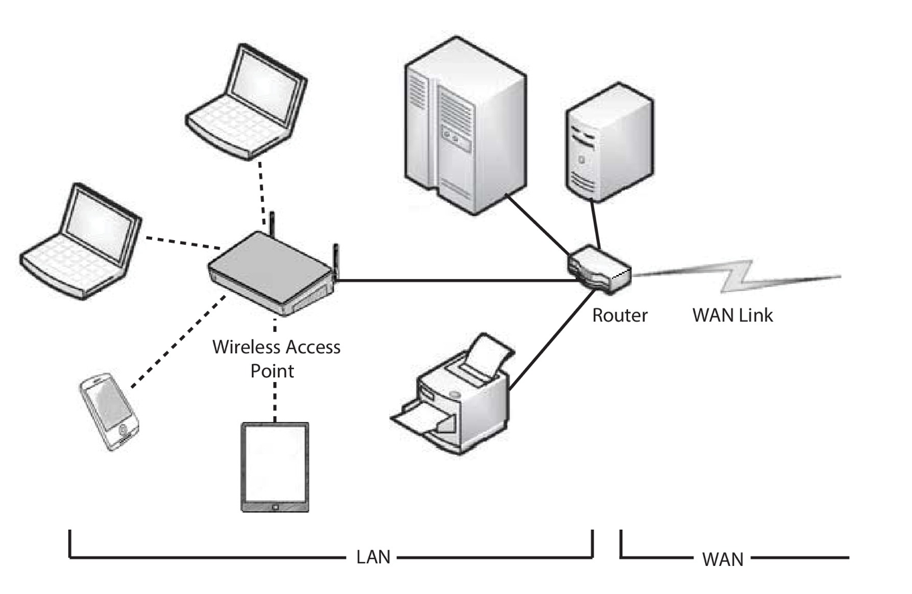
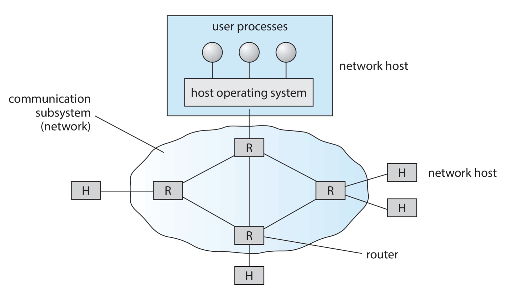
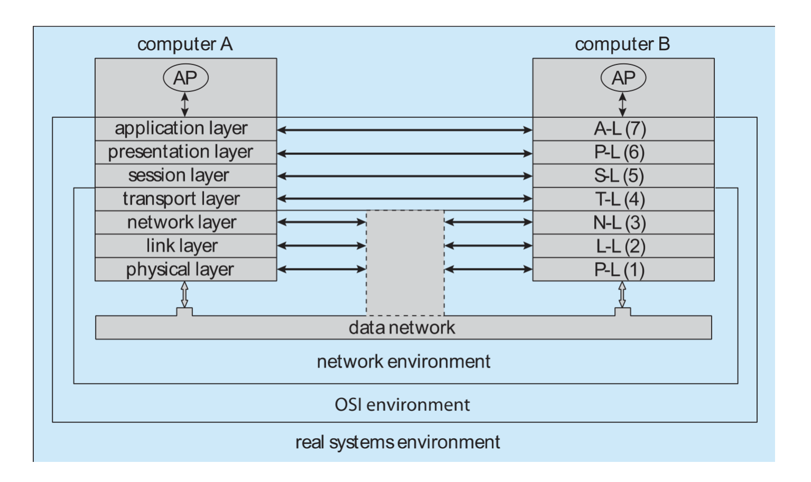
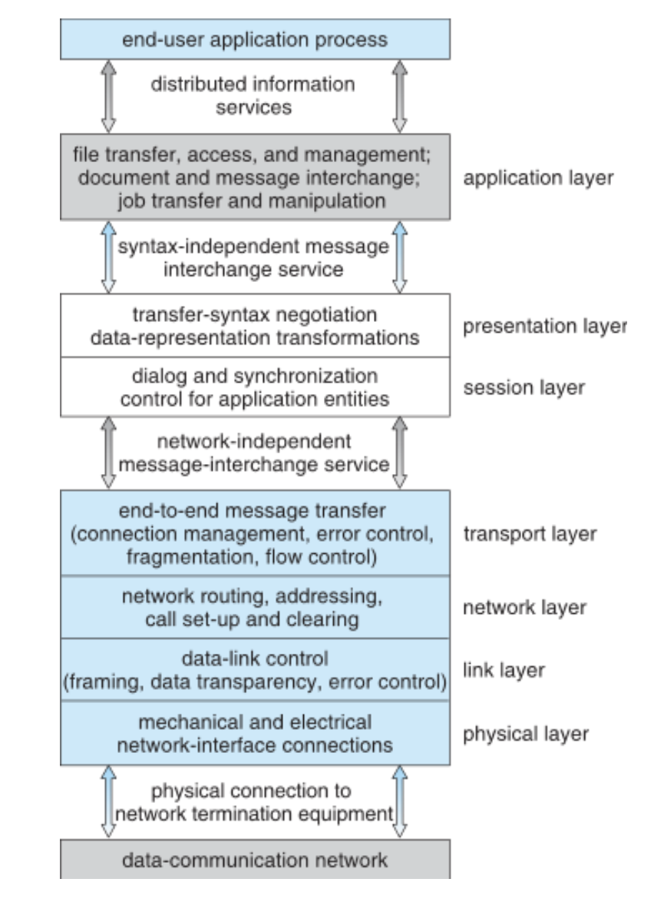
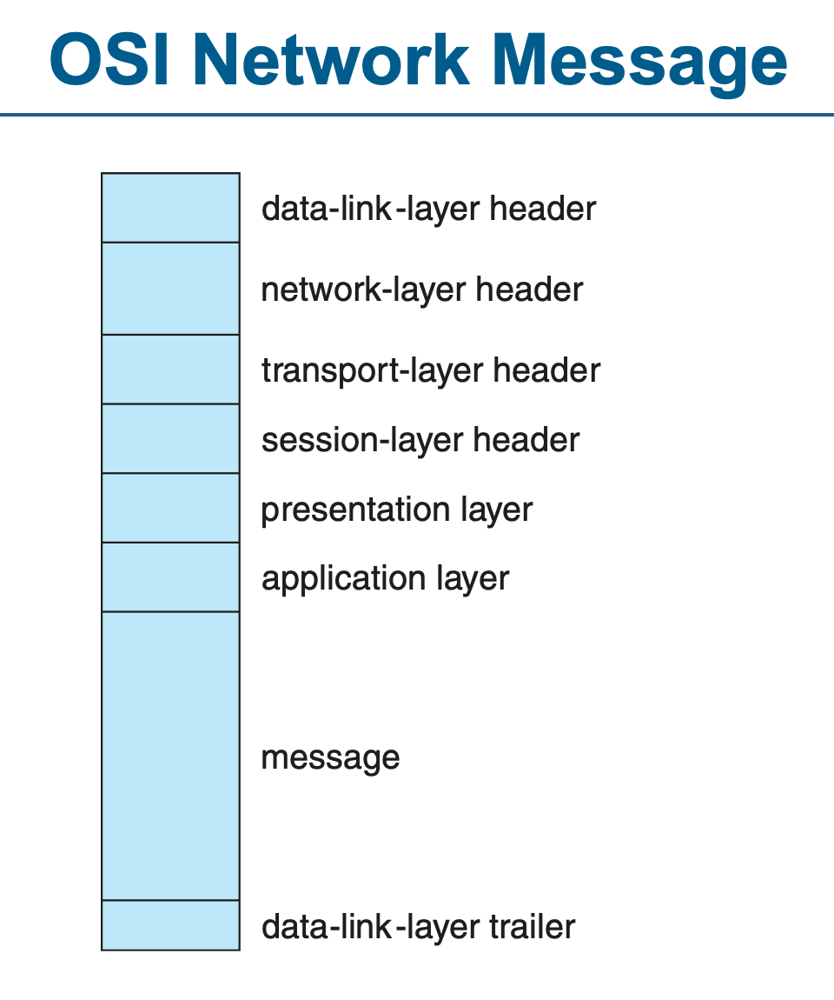
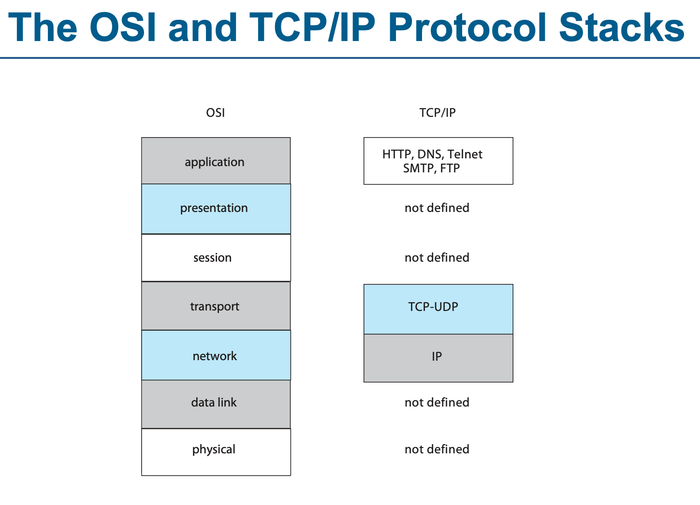
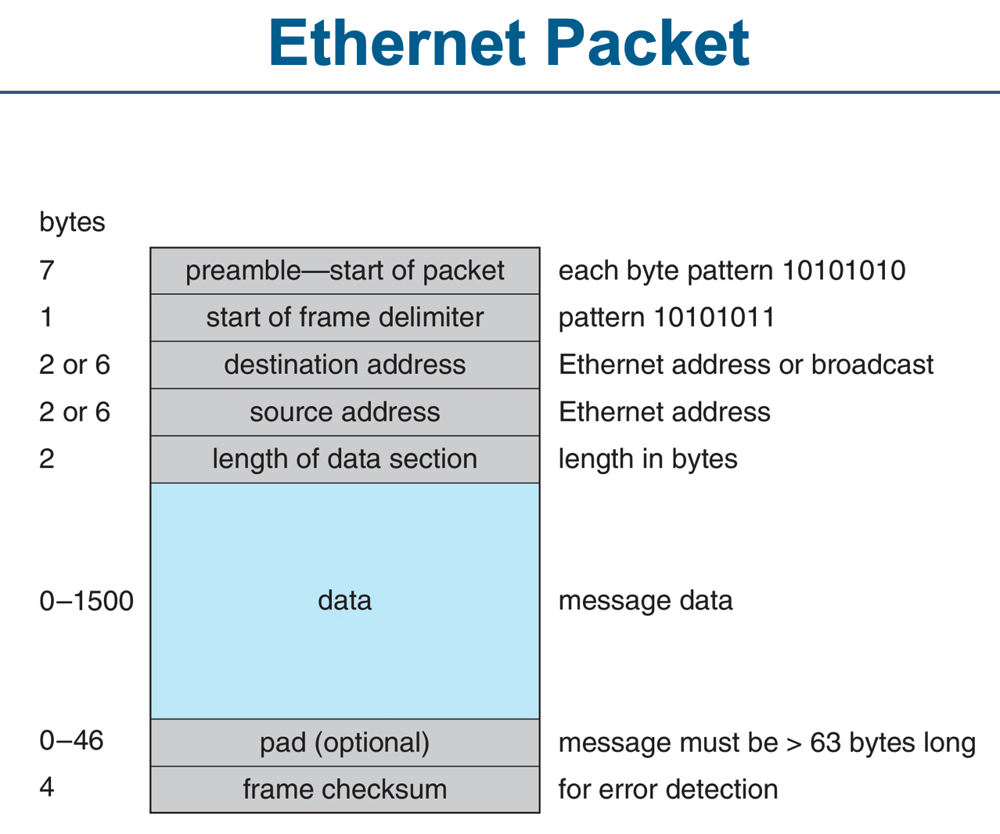
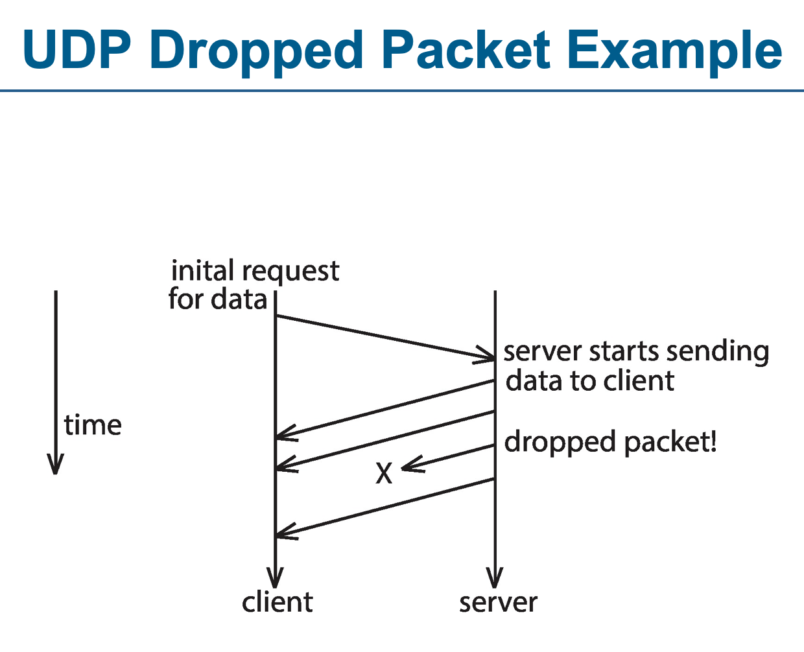
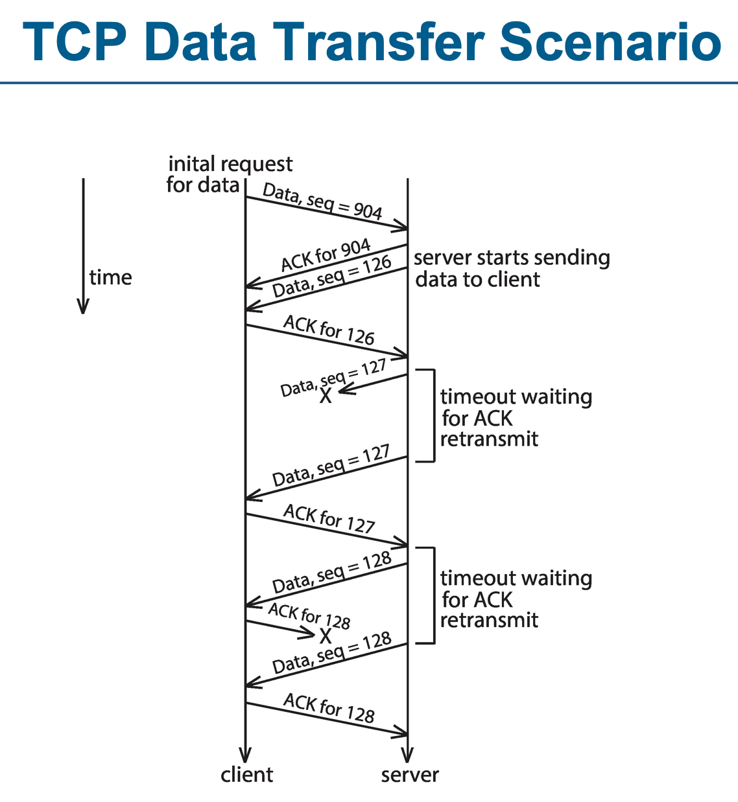

# 19. 네트워크 및 분산 시스템

- 분산 시스템 : 메모리나 시계를 공유하지 않는 프로세서 모음
  - 각 노드에는 자체 로컬 메모리가 있다
  - 노드는 고속버스와 같은 다양한 네트워크를 통해 서로 통신한다
  - 분산 시스템은 분산 서비스를 사용해왔다
  - 분산 시스템의 응용 프로그램들
    - 대규모 클라우드 파일 및 사진 저장 서비스
    - 대규모 데이터 집합의 경향에 대한 비즈니스 동향 분석
    - 과학 데이터의 병렬 처리 등
    - 인터넷
- 이 장에서는 분산 시스템의 일반적인 구조와 이들을 상호 연결하는 네트워크에 대해 설명한다
- 또한 현재 분산 시스템 설계의 `유형`과 `역할`의 주요 차이점을 대조한다
- 마지막으로 분산 파일 시스템의 일부 기본 설계 및 설계 당면과제를 조사한다

#### 이 장의 목표

- 네트워크 및 `분산 시스템의 장점`을 설명한다
- 분산 시스템을 상호 연결하는 `네트워크`에 대한 고수준의 `개요`를 제공한다
- 현재 사용 중인 `분산 시스템`의 `역할`과 `유형`을 정의한다
- `분산 파일 시스템` 설계와 관련된 문제를 논의한다

## 19.1 분산 시스템의 장점(Advantages of Distributed Systems)

- `분산 시스템`은 통신 `네트워크에 의해 상호 연결된` 느슨하게 결합한 `노드들의 집합`이다
- 특정 노드 관점에서 나머지 노드와 각 노드의 자원은 원격이지만 자체 자원은 로컬이다
- 노드는 크기와 기능이 다를 수 있다
  - 소형 마이크로 프로세서
  - 개인용 컴퓨터 및 대규모 범용 시스템
- 이러한 `맥락에 따라` 프로세서, 사이트, 시스템 및 호스트와 같은 `여러 이름으로 언급`된다
- 노드는 여러 유형으로 존재할 수 있다
  - 클라이언트 - 서버 구성
    - 클라이언트(노드) - 서버(노드) - 자원(노드)
  - 피어간 구성
    - 각 노드는 동등한 책임을 공유하며 클라이언트와 서버의 역할을 모두 수행할 수 있다
- 메시지

  - 낮은 수준에서 프로세스간 전달
  - 분산 시스템을 포함하여 확장
    - 파일 저장
    - 응용 프로그램 실행
    - 원격 프로시저 호출(RPC)

- 분산 시스템을 구축해야 하는 이유 3가지
  - 자원 공유
  - 계산 속도 향상
  - 신뢰성

### 19.1.1 자원 공유(Resource Sharing)

- 분산 시스템의 자원 공유
  - 원격 파일 공유
  - 분산 데이터 베이스에서 정보 처리
  - 원격 사이트에서 파일 인쇄
  - 슈퍼컴퓨터 또는 GPU(graphics processing unit)와 같은 원격 특수 하드웨어 장치 사용
  - 다른 작업을 할 수 있는 기법을 제공한다

### 19.1.2 계산 속도 향상(Computation Speedup)

- 특정 계산을 (동시에 실행할 수 있는) 하위 계산으로 분할할 수 있는 경우 분산 시스템을 통해 `하위 계산을 여러 사이트에 분산`시킬 수 있다
- 하위 계산을 동시에 실행할 수 있으므로 계산 속도가 향상된다
- 예시
  - 빅데이터 집합의 대규모 처리
  - 특정 사이트에 현재 요청이 과부하되어 있는 경우, 그중 일부는 부하가 적은 다른 사이트로 이동하거나 재배치할 수 있다
    - 부하 균등화(load balancing)
    - 분산 시스템 노드와 인터넷에서 제공되는 기타 서비스에서 흔히 볼 수 있다

### 19.1.3 신뢰성(Reliability)

- 분산 시스템에선 하나의 사이트가 장애가 발생해도 나머지 사이트는 정상 작동하여 시스템의 신뢰성이 향상된다
- 시스템이 여러 대의 독립 시스템으로 구성된 경우 하나의 장애가 나머지 부분에 영향을 미치지 않아야 한다
- 웹 서버 또는 파일 시스템 같은 중요한 시스템의 경우, 하나의 시스템 장애로 전체 시스템의 작동이 중단될 수 있다

  - 일반적으로 (하드웨어 및 데이터 모두에서) 충분한 중복성을 사용하면 일부 노드가 고장 나더라도 시스템이 계속 작동할 수 있다

- 한 사이트의 장애 -> 다른 시스템에서 감지
  - 시스템은 더 이상 해당 사이트의 서비스를 사용해서는 안된다
  - 고장 난 사이트의 기능을 다른 사이트가 인계할 수 있는 경우, 시스템은 기능의 전송이 올바르게 수행되는지 확인해야 한다
  - 고장난 사이트가 복구되거나 수리되었을 때 -> 사이트를 원할하게 시스템에 다시 통합할 수 있는 기법이 있어야 한다

## 19.2 네트워크 구조(Network Structure)

- 분산 시스템의 역할과 유형을 완전히 이해하려면 그것들을 상호 연결하는 네트워크를 이해할 필요가 있다
- 이 절은 분산 시스템과 관련된 네트워킹 개념과 과제를 소개하는 네트워크 입문서이다
- 이 장의 나머지 부분에서는 분산 시스템에 대해 구체적으로 설명한다

- 근거리 통신망(LAN, 로컬 영역 네트워크, Local Area Network)과 광역 통신망(WAN, Wide Area Network)의 두 가지 유형의 네트워크가 있다
  - 차이점 : 지리적 분포 방식
  - LAN은 소뮤모 건물(단일 건물 또는 인접한 여러 건물 등)에 분산된 호스트로 구성
  - WAN은 넓은 지역(미국 등)에 분산된 시스템으로 구성
  - 통신 네트워크의 속도와 신뢰성이 매우 다양하다는 것을 의미하며 분산 시스템 설계에 반영된다

### 19.2.1 LAN(Local Area Network, 로컬 영역 네트워크)

- 그림 19.2 로컬 영역 네트워크

- 로컬 영역 네트워크는 대형 메인 프레임 컴퓨터 시스템을 대체하기 위해 등장했다
- 하나의 큰 시스템을 사용하는 것 보다 각각 자체 응용 프로그램을 갖춘 여러 개의 소형 컴퓨터를 사용하는 것이 더 경제적이다
  - 소형 컴퓨터는 주변 장치(디스크, 프린터 등)로 보완되어야 할 가능성이 높고
  - 데이터 공유 발생 가능성이 높기 때문에 이러한 소형 시스템을 네트워크에 연결하는 것은 당연한 조치였다
- 작은 지리적 지역을 포괄하도록 설계
  - 사무실, 가정환경
- 가깝기 때문에 통신 링크는 광역 네트워크의 링크보다 속도가 빠르고 오류율이 낮은 경향이 있다
- 일반적인 LAN은 여러 다른 컴퓨터, 다양한 공유 주변 장치 및 다른 네트워크에 대한 `접근을 제공하는 하나 이상의 라우터(특수 네트워크 통신 프로세서)`로 구성될 수 있다
  - 다른 컴퓨터 :워크스테이션, 서버, 랩톱, 태블릿, 스마트폰
    - [워크스테이션](https://ko.wikipedia.org/wiki/%EC%9B%8C%ED%81%AC%EC%8A%A4%ED%85%8C%EC%9D%B4%EC%85%98) : 전문분야 작업을 염두에 둔 고성능 개인용 컴퓨터
  - 다양한 공유 주변 장치 : 프린터, 저장장치 배열
- 이더넷(Ethernet)과 WiFi는 일반적으로 LAN을 구성하는 데 사용된다
- 무선 액세스 포인트(wireless access point)는 장치를 LAN에 무선으로 연결하며 자체가 라우터일 수도 아닐 수도 있다

#### 이더넷(Ethernet)

- 이더넷 네트워크는 다중 액세스 버스이기 때문에 중앙 컨트롤러가 없으므로 새 호스트를 네트워크에 쉽게 추가할 수 있다
- 이더넷 프로토콜은 IEEE 802.3 표준에 따라 정의되어 있다
- 트위스트 케이블 연결을 사용하는 일반적인 이더넷 속도는 10Mbps ~ 10Gbps 이상까지 다양할 수 있으며 다른 유형의 케이블은 100Gbps 속도에 이를 수 있다

#### WiFi

- WiFi는 현재 어디에나 있으며, 기존의 이더넷 네트워크를 보완하거나 자체적으로 존재한다
- 특히 WiFi를 사용하면 물리적 케이블을 사용하지 않고도 네트워크를 구축할 수 있다
- 각 호스트(랩톱, 스마트폰 등)는 네트워크에 참여하는 데 사용하는 무선 송신기 및 수신기를 가지고 있다
- WiFi는 IEEE 802.11 표준에 따라 정의되어 있다
- 무선 네트워크는 가정, 기업뿐만 아니라 도서관, 카페, 버스 등 공공 장소에서도 사용된다
- WiFi 속도는 11Mbps ~ 400Mbps 이상까지 다양하다

### 19.2.2 WAN(Wide Area Network, 광역 네트워크)

- 역사
  - 1960년대 사이트 간 효율적 통신을 제공하여 광범위한 사용자가 편리하고 경제적으로 하드웨어와 소프트웨어를 공유할 수 있게 하기 위한 학문적 연구 프로젝트로 등장하였다
  - 최초의 WAN은 APRANET -> 4개의 사이트 실험 네트워크
  - 현재 전 세계적인 네트워크인 인터넷(World Wide Web)으로 성장했다
- 내 생각
  - 인터넷은 WAN의 한 종류라고 생각한다
  - WAN은 인터넷을 포함하는 개념이라고 생각한다
- WAN은 넓은 지리적 지역에 물리적으로 분포되어있다
- 대표적인 링크
  - 전화선, 임대(전용 데이터) 회선, 광케이블, 마이크로파 링크, 전파 및 위성 채널
- 이 통신 링크는 트래픽을 다른 라우터 및 네트워크로 보내고 다양한 사이트 간에 정보를 전송하는 라우터에 의해 제어된다

- 그림 19.3 광역 네트워크
- 인터넷 WAN을 사용하면 지리적으로 분리된 사이트의 호스트가 서로 통신할 수 있다
- `호스트`는 일반적으로 LAN에 연결되어 있으며, `지역 네트워크`를 통해 인터넷에 연결된다
- `지역 네트워크`는 `라우터`와 상호 연결되어 `전 세계 네트워크를 형성`한다
- 전문 인터넷 서비스 공급업체를 통해 인터넷에 연결
  - 전문 인터넷 서비스 공급업체 : 전화, 케이블 또는 라우터를 설치하여 인터넷에 연결하는 회사
  - 일반 가정에서 주로 사용
- 자체 사설 WAN

  - 인터넷 외 다른 WAN도 있다
  - 예를 들어 기업은 보안, 성능 또는 신뢰성 향상을 위해 자체 사설 WAN을 만들 수 있다
  - 내 생각 : 국방부 인트라넷

- 주요 도시를 연결하는 백본 WAN 연결은 광섬유 케이블을 통해 전송 속도가 매우 빠를 수 있지만 WAN은 일반적으로 LAN보다 느리다
- 실제로 많은 백본 제공 업체는 40Gbps 또는 100Gbps의 속도로 WAN을 제공한다

- 종종 WAN과 LAN은 서로 상호 연결되며, 둘 사이의 경계를 구분하는 것은 어렵다
  - 휴대 전화 데이터 네트워크를 고려해보자
    - 휴대전화는 음성 및 데이터 통신에 모두 사용된다
    - 특정 지역의 휴대전화는 송신기와 수신기가 포함된 셀타워에 연결된다
    - 네트워크의 이 부분은 휴대전화가 서로 통신하지 않는다는 점을 제외하고 LAN과 유사하다
    - 타워는 다른 타워 및 허브에 연결
      - 허브는 타워 통신을 지상선 또는 다른 통신 매체에 연결하고 패킷을 목적지로 라우팅한다
    - 네트워크의 이 부분은 WAN과 유사하다
    - 일단 적절한 타워가 패킷을 수신하면 송신기를 사용하여 올바른 수신자에게 보낸다

## 19.3 통신 구조(Communication Structure)

- 19.2에서 네트워크의 물리적 측면에 대해 살펴봤으므로 내부 작업으로 눈을 돌린다

### 19.3.1 이름 지정 및 이름 찾기(Naming and Name Resolution)

- 네트워크 통신의 첫 번째 문제는 네트워크상의 시스템 이름 지정과 관련이 있다
- 사이트 A의 프로세스가 사이트 B의 프로세스와 정보를 교환하려면 각각 서로를 지정할 수 있어야 한다
- 같은 PC 내에선 프로세스를 구분할 때 pid를 갖고 메모리를 공유하지만
  - 네트워크로 연결된 시스템은 메모리를 공유하지 않기 때문에 시스템 내의 호스트는 다른 호스트의 프로세스에 대해 알지 못한다
- 이 문제를 해결하기 위해 원격 시스템의 프로세스는 일반적으로 `<호스트 이름, 식별자>` 쌍으로 식별된다
  - 호스트 이름은 네트워크 내에서 고유한 이름이고,
  - 식별자는 해당 호스트 내에서 프로세스 식별자 또는 다른 고유 번호이다
- 호스트 이름
  - 호스트 이름은 일반적으로 사용자가 쉽게 지정할 수 있도록 숫자가 아닌 영숫자 식별자이다
    - 예를 들어, 사이트 A에는 이름이 program, student, faculty 및 cs인 호스트가 있을 수 있다
      - 호스트 이름 program은 숫자 호스트 주소(128.148.31.100) 보다 확실히 기억하기 쉽다
  - 이름은 사람이 사용하기 편리하지만 컴퓨터는 속도와 단순성을 위해 숫자를 선호한다
  - 이러한 이유로 호스트 이름을 호스트 id로 변환하는 기법이 있어야 한다
    - 호스트 id는 네트워킹 하드웨어에 대한 대상 시스템을 설명한다
  - 호스트 이름의 경우 두 가지 가능성이 있다
    - (1) 모든 호스트는 네트워크를 통해 연결할 수 있는 다른 모든 호스트의 이름과 숫자 주소를 가지고 있는 데이터 파일을 가질 수 있다
      - 컴파일 시 바인딩과 유사
      - 이 모델의 문제점은 네트워크에서 호스트를 추가하거나 제거하려면 모든 호스트에서 데이터 파일을 업데이트해야 한다는 것이다
      - 실제로 ARPANET 초기에는 모든 시스템이 정기적으로 복사되는 표준 호스트 파일이 있었다
      - 그러나 네트워크가 성장함에 따라 이 방법을 사용할 수 없게 되었다
    - (2) 대안은 네트워크상의 시스템 간에 정보를 배포하는 것이다
      - 네트워크는 프로토콜을 사용하여 정보를 배포하고 검색해야 한다
      - 이 기법은 실행 시간 바인딩과 같다
      - `인터넷은 호스트 이름 확인을 위해 DNS(domain-name system)를 사용`한다
- `DNS`는 `호스트의 이름 지정` 구조뿐만 아니라 `이름-주소 변환`을 지정한다
  - 인터넷의 호스트는 논리적으로 IP 주소라는 여러 부분으로 구성된 이름으로 주소가 표기된다
  - IP주소의 부분들은 필드를 구분하는 마침표와 함게 가장 구체적인 것에서 가장 일반적인 것으로 진행된다
  - e.g.
    - eric.cs.yale.edu 는 최상위 도메인 edu 내의 Yale 대학교의 cs(컴퓨터 과학부)에서 호스트 eric을 나타낸다
  - 다른 최상위 도메인에는 상업용 사이트의 com, 조직의 org, 조직 유형이 아닌 국가별로 지정된 시스템을 위한 네트워크에 연결된 각 국가의 도메인이 포함된다
  - 일반적으로 시스템은 호스트 이름 구성요소를 역순으로 검사하여 주소를 결정한다
    - 각 구성요소는 네임 서버(name server)를 가진다
      - 네임 서버 : 호스트 이름을 IP 주소로 변환하는 데 사용되는 서버
      - 네임 서버는 시스템상의 단순한 프로세스로서 이름을 받아들이고 해당 이름을 담당하는 네임 서버의 주소를 반환한다
  - 마지막 단계로, 해당 호스트의 네임 서버에 접속하여 호스트 id가 반환된다
- 예를 들어, 시스템 A의 프로세스가 eric.cs.yale.edu와 통신하도록 요청하면 다음 절차가 수행된다

  - 1. 시스템 라이브러리 또는 시스템 A의 커널은 edu 도메인 담당 네임 서버에 요청을 보내서 yale.edu를 담당하는 네임 서버의 주소를 물어본다
    - edu 도메인 담당 네임 서버는 자라 알려진 주소에 있어야만 질의가 가능하다
  - 2. edu 네임 서버는 yale.edu 네임 서버가 있는 호스트의 주소를 반환한다
  - 3. 그런 다음 시스템 A는 이 주소에서 네임 서버를 조회하고 cs.yale.edu에 대해 묻는다
  - 4. 주소가 반환된다. 이제 마지막으로 eric.cs.yale.edu에 대한 주소 요청은 해당 호스트의 인터넷 주소 호스트 id(e.g. 128.148.31.100)를 반환한다

- 이 프로토콜은 비효율적으로 보일 수 있지만 개별 호스트 처리 속도를 높이기 위해 이미 변환한 IP 주소를 캐시한다
  - 네임 서버가 이동하거나 주소가 변경되는 경우 이러한 캐시의 내용은 시간이 지남에 따라 새로 고쳐져야 한다
- 사실 프로토콜은 매우 중요하기 때문에 여러 번 최적화 되었으며 많은 안전장치가 추가되었다
- 기본 edu 네임 서버가 크래시된 경우 어떻게 되는지 고려하라
  - 어떤 edu 호스트도 주소를 변환할 수 없어서 모두 연결할 수 없을 가능성이 있다
  - 해결책은 기본 서버의 내용을 복제하는 보조 백업 네임 서버를 사용하는 것이다
- 도메인 네임 서비스에서 각 네임 서버 사이트는 해당 도메인의 호스트 정보를 업데이트 할 책임이 있다

  - 예를 들어, Yale 대학의 모든 호스트 변경은 yale.edu 네임 서버의 책임이며, 다른 어느 곳에도 보고할 필요가 없다
  - DNS 검색은 yale.edu에 직접 연락하기 때문에 업데이트 된 정보를 자동으로 검색한다
  - 도메인에는 호스트 이름 및 호스트 id 변경에 대한 책임을 더욱 분산시키기 위해 독립적인 하위 도메인이 포함될 수 있다

- 일반적으로 운영체제는 프로세서에서 `<호스트 이름, 식별자>`로 지정된 메시지를 수락하고 해당 메시지를 적절한 호스트로 전송할 책임이 있다
  - 그러면 목적지 호스트의 커널이 식별자에 의해 명명된 프로세스에 메시지를 전송한다
  - 이 프로세스는 19.3.4에 설명되어 있다
    - 19.3.4 전송 프로토콜 UDP 및 TCP

### 19.3.2 통신 프로토콜(Communications Protocols)

- 그림 19.5 OSI 네트워크 모델을 통해 통신하는 두 대의 컴퓨터

  - 하드웨어로 구현된 3개의 최하위 층을 사용하는 두 컴퓨터 간의 논리적 통신을 보여준다

- 통신 네트워크 설계
  - 잠재적으로 느리고 오류가 발생하기 쉬운 환경에서 통신하는 비동기 연산이 가진 내재적 복잡성을 다뤄야 한다
- 프로토콜 (집합) 합의
  - 네트워크 상의 시스템은 호스트 이름 결정, 네트워크에서 호스트 찾기, 연결 설정 등을 위한 프로토콜 또는 프로토콜 집합에 합의해야 한다
- 문제를 `여러 층으로 분할`하여 설계 문제(및 관련 구현)을 단순화할 수 있다
- 시스템간 통신
  - 한 시스템의 각 층은 다른 시스템의 해당 층과 통신한다
  - 일반적으로 각 층에는 고유의 프로토콜을 가지고 있으며 특정 프로토콜을 사용하여 동위 층 간에 통신이 이루어진다
- 프로토콜은 하드웨어 또는 소프트웨어로 구현될 수 있다
- 국제 표준기구(International Standard Organization)는 다양한 네트워킹 층을 설명하기 위해 OSI(Open Systems Interconnection) 모델을 만들었다
- 이러한 계층은 실제로 구현되지는 않지만 네트워킹이 논리적으로 어떻게 작동하는지를 이해하는 데 유용하며 아래에서 설명한다

#### 층 1: 물리층(Physical Layer)

- 물리 층은 비트 스트림의 물리 전송에 대한 기계적 및 전기적 세부 사항의 처리르 담당한다
- 물리 층에서 데이터가 전기적 신호의 스트림으로 전송될 때 수신자가 데이터를 이진 데이터로 올바르게 해석할 수 있도록 통신 시스템은 이진 0과 1의 전기적 표현에 동의해야 한다
- 이 층은 네트워킹 장치의 하드웨어에서 구현된다.
- 비트 전송을 책임진다

#### 층 2: 데이터 링크 층(Data Link Layer)

- 데이터 링크 층은 물리 층에서 발생하는 오류 감지 및 복구를 포함하여 프레임 또는 고정 길이의 패킷 처리를 담당한다
- 물리 주소 간에 프레임을 보낸다

#### 층 3: 네트워크 층(Network Layer)

- 네트워크 층은 `메시지를 패킷으로` 나누고,
  - `논리 주소 사이의 연결`을 제공하고,
  - 통신 네트워크에서의 `패킷 라우팅`을 담당한다
    - 나가는 패킷의 주소처리
    - 들어오는 패킷의 주소 해독
    - 부하 수준 변경에 대한 적절한 응답을 위한 라우팅 정보 유지
- 라우터는 이 층에서 작동한다

#### 층 4: 전송 층(Transport Layer)

- 전송 층은 노드 간 메시지 전송, 패킷 순서 유지 및 혼잡을 피하기 위해 흐름 제어 등을 담당한다

#### 층 5: 세션 층(Session Layer)

- 세션 층은 세션 또는 프로세스 간 통신 프로토콜을 구현한다

#### 층 6: 프레젠테이션 층(Presentation Layer)

- 프레젠테이션 층은 문자 변환 및 반이중-전이중 모드(문자 에코)를 포함하여 네트워크의 여러 사이트 간의 형식 차이를 해결한다

#### 층 7: 응용 층(Application Layer)

- 응용 프로그램 층은 사용자와 직접 상호작용한다
- 이 층은 파일 전송, 원격 로그인 프로토콜, 이메일, 분산 데이터베이스의 스키마 처리 등을 담당한다

#### OSI 프로토콜 스택

- 그림 19.6 OSI 프로토콜 스택
  - `데이터의 물리적 흐름`을 보여주는 OSI 프로토콜 스택(협력 프로토콜 스택의 집합)을 요약한 것이다
- 전송
  - 물리적으로 메시지는 응용 프로그램 층 또는 그 이상에서 시작해서 각 하위층을 차례로 통과한다
  - 각 층은 메시지를 수정할 수 있고 수신 측의 동위 층에 대한 메시지 헤더 데이터를 포함할 수 있다
  - 궁극적으로 메시지는 데이터 네트워크 층에 도달하여 하나 이상의 패킷으로 전송된다(그림 19.7)
  - 목적지 시스템의 데이터 링크 층은 이러한 데이터를 수신하고 메시지는 프로토콜 스택을 통해 위로 이동한다
  - 진행함에 따라 헤더를 분석, 수정 및 제거한다
  - 마지막으로 수신 프로세스에서 사용하기 위해 응용 프로그램 층에 도달한다

- 그림 19.7 OSI 네트워크 메시지

- OSI 모델은 네트워크 프로토콜에서 행해진 초기 작업 중 일부를 공식화하지만, 1970년대 후반에 개발되어 현재 널리 사용되지는 않는다
  - OSI 모델은 네트워크 프로토콜의 기본 개념을 설명하는 데 유용하지만, 실제로는 TCP/IP 프로토콜 스택이 널리 사용된다
  - 가장 널리 채택된 프로토콜 스택은 거의 모든 인터넷 사이트에 의해 채택된 TCP/IP 모델(인터넷 모델)일 것이다
  - TCP/IP 프로토콜 스택은 OSI 모델보다 더 적은 수의 층을 가진다
  - 이론적으로는 각 OSI 계층의 여러 층의 기능을 결합하기 때문에 OSI네트워킹보다 구현하기가 더 어렵지만 효율적이다

- 그림 19.8 OSI와 TCP/IP 프로토콜 스택

- TCP/IP 응용 프로그램 층은 인터넷에서 널리 사용되는 HTTP, FTP, SSH, DNS 및 SMTP를 포함한 여러 프로토콜을 식별한다

  - 전송층은 신뢰할 수 없는 무연결(User Datagram Protocol, UDP)과 안정적인 연결 지향(Transmission Control Protocol, TCP)을 식별한다
  - 인터넷 프로토콜(IP)은 인터넷을 통해 IP 데이터 그램 또는 패킷을 라우팅 하는 일을 담당한다
  - TCP/IP 모델은 링크 또는 물리적 층을 공식적으로 식별하지 않으므로 TCP/IP 트래픽이 임의의 물리적 네트워크에서 실행될 수 있다
    - 19.3.3절에서 이더넷 네트워크를 통해 실행되는 TCP/IP 모델을 고려한다

- 보안은 최신 통신 프로토콜 설계 및 구현에서 고려해야 한다

  - 안전한 통신을 위해서는 강력한 인증과 암호화가 필요하다
    - 강력한 인증은 통신의 송신자와 수신자가 누구인지 또는 어떤 사람이어야 하는지를 보장한다
    - 암호화는 통신 내용이 도청되지 않도록 보호한다
  - 그러나 여러 가지 이유로 약한 인증과 일반 텍스트 통신이 여전히 일반적이다
    - 대부분 일반 프로토콜이 설계되었을 때 보안은 성능, 단순성, 효율성 보다 덜 중요하였다
    - 기존 인프라에 보안을 추가하는 것이 어렵고 복잡하다는 것이 입증되고 있기 때문에 이러한 유산은 오늘날에도 계속되고 있다

- 강력한 인증에는 다단계 핸드셰이크 프로토콜 또는 인증 장치가 필요하므로 프로토콜이 복잡해진다
  - 암호화 요구 사항과 관련하여 최신 CPU는 암호화 가속 명령을 포함하여 암호화를 효율적으로 수행할 수 있으므로 시스템 성능이 저하되지 않는다
  - 16.4.2절에서 논의된 것 처럼 가상 사설망에서 통신 극단을 인증하고 패킷 스트림을 암호화하여 장거리 통신을 안전하게 만들 수 있다
  - LAN 통신은 대부분의 사이트에서 암호화되지 않은 상태로 유지되지만 강력한 네이티브 인증 및 암호화를 포함하는 NFS 버전 4와 같은 프로토콜은 LAN 보안 수준을 향상하는 데 도움이 된다
    - NFS
      - NFS는 네트워크 파일 시스템을 사용하여 클라이언트가 원격 서버의 파일을 로컬 파일 시스템에 마운트할 수 있도록 한다
      - https://cheershennah.tistory.com/140
      - https://www.ibm.com/docs/ko/aix/7.1?topic=performance-network-file-systems
    - NFS4
      - NFS4는 NFS 프로토콜의 최신 버전이다
      - https://www.ibm.com/docs/ko/aix/7.1?topic=nfs-version-4

### 19.3.3 TCP/IP 예(TCP/IP Example)

- 이번 절에서 다룰 내용

  - 인터넷 상의 TCP/IP 프로토콜 스택과 관련하여 이름 변환에 대해 언급하고 그것의 작동을 검토한다
  - 그런 다음 서로 다른 이더넷 네트워크의 호스트 간에 패킷을 전송하는 데 필요한 처리를 고려한다
  - 가장 많이 사용되는 유형인 IPV4 프로토콜을 기반으로 설명한다

- TCP/IP 네트워크에서 모든 호스트에는 `이름`과 연결된 `IP주소`(또는 호스트 id)가 있다
  - 이 두 문자열은 모두 유일해야 한다
  - 네임 스페이스를 관리할 수 있도록 세그먼트 단위로 관리한다
  - 앞에서 설명한 것 처럼 호스트 이름으 계층적이어서 호스트 이름을 먼저 설명하고 다음으로 호스트가 연결된 조직을 설명한다
- 호스트 id는 네트워크 번호와 호스트 번호로 나뉜다

  - 분할 비율은 네트워크 크기에 따라 다르다
  - 인터넷 관리자가 네트워크 번호를 할당하면 해당 번호의 사이트에서 호스트 id를 자유롭게 할당할 수 있다
  - IP 주소 클래스, 호스트 id, 네트워크 id
    - https://ko.ipshu.com/a-b-c-d-e

- 찾아보기) DHCP(Dynamic Host Configuration Protocol)

  - https://ko.wikipedia.org/wiki/%EB%8F%99%EC%A0%81_%ED%98%B8%EC%8A%A4%ED%8A%B8_%EC%84%A4%EC%A0%95_%ED%94%84%EB%A1%9C%ED%86%A0%EC%BD%9C
  - https://namu.wiki/w/DHCP

- 송신 시스템

  - 송신시스템은 자신의 라우팅 테이블을 점검하여 프레임을 송신할 라우터를 찾는다
  - 이 라우팅 테이블은 시스템 관리자가 수동으로 구성하거나 BGP(Border Gateway Protocol)와 같은 여러 라우팅 프로토콜 중 하나에 의해 채워진다
  - 라우터는 호스트 id의 네트워크 부분을 사용하여 소스 네트워크에서 목적지 네트워크로 패킷을 전송한다
  - 그러면 목적지 시스템은 패킷을 수신한다
  - 패킷은 완전한 메시지일 수도 있고, 메시지의 일부분일 수도 있다
    - 일부분일 경우 목적지 프로세스로 메시지를 전달할 TCP/UDP(전송) 층으로 전달되기 전에 더 많은 패킷을 모아서 재조립 후 전달해야 한다

- 네트워크에서 패킷은 송신자(호스트 또는 라우터)에서 수신자로 어떻게 이동하는가?

- 그림 19.9 이더넷 패킷

  - 모든 이더넷 장치에는 주소 지정을 위해 할당된 MAC(medium access control) 주소라는 고유한 바이트 번호가 있다
    - MAC 주소 : 인터넷을 할 수 있는 이더넷 기반 기기에는 모두 다 하나씩 할당되어 있는 고유한 ID
    - PC의 랜카드나 스마트폰의 와이파이 모듈에도 1대씩 할당되어 있다. 인터넷전화나 IPTV 역시 마찬가지. 2000년대 이후의 비디오 게임기에는 통신기능이 있으므로 당연히 MAC주소가 있다.
    - https://namu.wiki/w/MAC%EC%A3%BC%EC%86%8C
    - https://ko.wikipedia.org/wiki/MAC_%EC%A3%BC%EC%86%8C
    - https://netxhack.com/network/mac-address-trace-evidence/
  - LAN의 두 장치는 이 번호로만 서로 통신한다
  - 시스템이 다른 시스템으로 데이터를 전송해야하는 경우, 네트워킹 소프트웨어는 목적지 시스템의 IP주소를 포함하는 ARP(address resolution protocol)패킷을 생성한다
    - 이 패킷은 해당 이더넷 네트워크의 다른 모든 시스템으로 방송(broadcast)된다

- 브로드 캐스트는 특수 네트워크 주소(일반적으로 가장 큰 주소)를 사용하여 모든 호스트가 패킷을 수신하고 처리해야 한다는 신호를 보낸다

  - 브로드 캐스트는 서로 다른 네트워크 사이에 있는 라우터에 의해 재전송되지 않기 때문에 로컬 네트워크의 시스템만 브로드캐스트를 수신한다
  - IP주소가 ARP 요청의 IP주소와 일치하는 시스템만 응답하여 자신의 MAC 주소를 질의를 시작한 시스템에 다시 보낸다
  - 효율성을 위해 호스트는 내부 테이블에 IP-MAC 주소 쌍을 캐시한다

- 이더넷 장치가 호스트 ID와 주소를 공표하면 통신을 시작할 수 있다
  - 프로세스는 통신할 호스트 이름을 지정할 수 있다
  - 네트워킹 소프트웨어는 DNS 조회 또는 변환을 수동으로 저장할 수 있는 로컬 호스트 파일의 항목을 사용하여 해당 이름을 목적지의 IP 주소로 변환한다
- 메시지는 응용 프로그램 층에서 소프트웨어 층을 거쳐 하드웨어 층으로 전달된다

  - 하드웨어 층에서 패킷은 전송을 시작할 때 이더넷 주소를 가지고 있다
  - 트레일러는 패킷의 끝을 나타내며, 패킷 손상 감지를 위한 체크섬을 포함한다(그림 19.9)

- 패킷은 이더넷 장치에 의해 네트워크에 놓인다

  - 패킷의 데이터 섹션은 원본 메시지의 일부 또는 전부를 포함할 수 있지만 메시지를 구성하는 일부 상위 수준 헤더도 포함할 수 있다
  - 즉, 원본 메시지의 모든 부분이 소스에서 목적지로 전송되어야 하며 802.3층(데이터 링크 층) 위의 모든 헤더가 이더넷 패킷의 데이터로 포함된다

- 목적지가 소스와 동일한 로컬 네트워크에 있는 경우 시스템은 ARP 캐시를 보고 호스트의 이더넷 주소를 찾은 다음 패킷을 유선상에 놓을 수 있다

  - 그러면 목적지 이더넷 장치는 패킷에서 주소를 확인하고 패킷을 읽어 프로토콜 스택으로 전달한다

- 목적지 시스템이 소스와 다른 네트워크에 있는 경우 소스 시스템은 자신의 네트워크에서 적절한 라우터를 찾아 패킷을 보낸다

  - 그런 다음 라우터는 목적지 네트워크에 도달할 때까지 WAN을 따라 패킷을 전달한다
  - `목적지 네트워크를 연결`하는 `라우터`는 `ARP 캐시를 확인`하고 `목적지의 이더넷 번호를 찾은다음` `해당 호스트로 패킷을 보낸다`
  - 이러한 모든 전송 과정 동안 연결 고리의 다음 라우터의 이더넷 주소가 사용되기 때문에 데이터 링크 층 헤더는 변경될 수 있지만 패킷의 다른 헤더는 패킷이 프로토콜 스택에 의해 수신되고 처리될 때 까지, 그리고 마지막으로 커널에 의해 수신 프로세스로 전달될 때 까지 같은 값으로 유지된다
    - 내 생각) 패킷은 여러개의 헤더를 가지고 있고, 이 헤더들은 각각의 층에서 사용되는 헤더이다. 그리고 이 헤더들은 각각의 층에서 사용되는 헤더이기 때문에, 각각의 층에서 사용되는 헤더는 해당 층에서만 사용되고, 다른 층에서는 사용되지 않는다. 그래서 패킷이 다른 네트워크로 전송될 때, 패킷의 헤더는 변경될 수 있지만, 패킷의 다른 헤더는 변경되지 않는다는 것이다

- 찾아보기) 이더넷 패킷과 프레임 차이

  - 프레임
    - LAN의 2계층 스위치에서 일어난다. 부서 간 우편처럼 프레임은 LAN 바깥의 인터넷으로는 보낼 수 없다. 데이터를 다른 네트워크에 있는 디바이스로 보내려면, 프레임은 반드시 패킷으로 만들어야 한다
  - 패킷
    - 패킷은 3계층에서 만들어지며, 정보를 서로 다른 LAN 간에 보통 라우터(Router)를 통해 주고받을 수 있다. 라우터는 작은 규모의 네트워크인 LAN 간을 상호 연결해 정보를 좀 더 큰 규모로 상호 교환할 수 있도록 해주는데, MAC 주소 대신 IP 주소를 사용해 패킷을 전달한다.
  - 이더넷 테스트 장비를 선택할 때 중요하다
  - 서로 다른 종류의 네트워크 상에서 동작
  - https://www.itworld.co.kr/tags/2669/%EC%9D%B4%EB%8D%94%EB%84%B7/106484
  - [패킷의 이해, Ethernet 프레임, IP 헤더](https://blog.naver.com/sujunghan726/220315439853)
  - [ARP 패킷](https://blog.naver.com/sujunghan726/220315619029)

- 찾아보기) 라우터와 스위치
  - 네트워크 스위치와 허브, 라우터는 어떻게 다른 걸까
    - https://www.itworld.co.kr/news/167585#csidx9c6e081dfe2181e9a391c2f895c3b37
  - 라우터
    - 라우터는 네트워크 간의 통신을 담당하는 장비이다. 라우터는 네트워크 간의 경계에 위치하며, 라우터를 통해 다른 네트워크로 패킷을 전송한다. 라우터는 패킷을 전송할 때 패킷의 목적지 주소를 보고 패킷을 전송할 경로를 결정한다.
  - 스위치
    - 스위치는 네트워크 내부에서 통신을 담당하는 장비이다. 스위치는 네트워크 내부에 위치하며, 스위치를 통해 같은 네트워크 내의 다른 장비로 패킷을 전송한다. 스위치는 패킷을 전송할 때 패킷의 목적지 주소를 보고 패킷을 전송할 경로를 결정한다.
    - 물리적 기기를 식별
  - 허브
    - 허브는 네트워크 내부에서 통신을 담당하는 장비이다. 허브는 네트워크 내부에 위치하며, 허브를 통해 같은 네트워크 내의 다른 장비로 패킷을 전송한다. 허브는 패킷을 전송할 때 패킷의 목적지 주소를 보지 않고 패킷을 전송할 경로를 결정한다.
  - 스위치 vs. 허브
    - 허브 역시 리소스 공유를 목적으로 여러 기기를 하나로 연결할 수 있는데, 허브에 연결된 기기집단을 LAN 세그먼트라고 한다
    - 허브와 스위치가 다른 점은 기기 중 하나에서 전송된 패킷이 허브에 연결된 모든 기기로 브로드캐스팅된다는 점이다
    - 반면 스위치는 목적지 주소로 지정된 기기로 이어지는 포트만 패킷이 전달된다
    - 또한 스위치는 일반적으로 LAN 세그먼트와 세그먼트에 연결된 허브를 연결한다
    - 스위치는 동일한 LAN세그먼트의 기기를 향하는 트래픽을 걸러낸다
    - 이런 기능 덕분에 스위치는 자체 프로세싱 리소스와 네트워크 대역폭을 더 효율적으로 활용한다
  - 스위치 vs. 라우터
    - 라우터는 네트워크 트래픽 포워딩과 라우팅 기능을 제공하며 라우터라는 이름도 여기에 유래한다
    - 그러나 이 작업을 수행하는 목적과 위치가 스위치와 다르다
    - 라우터는 계층 3(네트워크 계층)에서 작동하며 네트워크를 다른 네트워크로 연결하는 데 사용된다
    - 스위치와 라우터 간의 차이를 쉽게 이해하려면 LAN과 WAN을 생각하면 된다
    - 기기는 스위치를 통해 로컬로 연결되고 네트워크는 라우터를 통해 다른 네트워크에 연결된다
    - 패킷이 인터넷에 이르기까지 일반적으로 거치는 경로
      - 기기 -> 허브 -> 스위치 -> 라우터 -> 인터넷
    - 스위칭 기능이 라우터 하드웨어에 내장돼 라우터가 스위치 역할까지 하는 경우도 있다
      - 대표적인 것이 가정용 무선 라우터다
      - WAN 포트를 통해 광대역 연결을 라우팅하지만 보통 컴퓨터와 텔레비전, 프린터 등을 위한 이더넷 케이블을 연결하는 데 사용되는 부가적인 이더넷 포트도 제공한다
      - 다른 노트북이나 스마트폰과 같은 네트워크의 다른 기기는 와이파이 라우터를 통해 연결되지만 여전히 LAN을 통해 스위칭 기능을 제공한다
      - 따라서 라우터는 사실상 스위치이기도 하다
      - 또한 라우터에 별도의 스위치를 연결해 부가적인 기기에 인터넷과 LAN 액세스를 동시에 제공할 수도 있다

### 19.3.4 전송 프로토콜 UDP 및 TCP(Transport Protocols UDP and TCP)

- 일단 특정 IP 주소를 가진 호스트가 패킷을 받으면 어떻게든 정확한 대기 프로세ㅅ로 전달해야 한다
- 전송 프로토콜 TCP와 UDP는 포트번호를 사용하여 수신(및 송신) 프로세스를 식별한다
  - 따라서 단일 IP 주소를 가진 각 서버 프로세스가 다른 포트 번호를 명시하는 여러 서버 프로세스가 실행되어 패킷을 기다릴 수 있다
  - 기본적으로 많은 일반적인 서비스는 잘 알려진 포트를 사용해야 한다
    - FTP(21), SSH(22), SMTP(25), HTTP(80)
  - e.g. 웹 브라우저를 통해 http 웹 사이트에 연결하려는 경우 브라우저는 TCP 전송 헤더에 포트 번호로 80을 사용하여 서버의 포트 80에 자동으로 연결을 시도한다
  - 잘 알려진 광범위한 포트 목록을 보려면 UNIX 시스템에서 /etc/services 파일을 참조하면 된다
- 전송 층은 네트워크 패킷을 실행 중인 프로세스에 연결하는 것 이상을 수행할 수 있다
  - 이 층은 필요한 경우 네트워크 패킷 스트림에 신뢰성을 더할 수도 있다

#### 19.3.4.1 UDP(User Datagram Protocol)

- UDP는 IP에 포트 번호를 추가한 정도의 기본적인 확장이라는 점에서 신뢰할 수 없다
- 실제로 UDP 헤더는 매우 단순하여 `소스 포트 번호`, `목적지 포트 번호`, `길이` 및 `체크 섬`의 네가지 필드만 포함한다
- UDP를 사용하여 패킷을 목적지로 빠르게 보낼 수 있다
  - 그러나 네트워크 스택의 하위 층에는 배달이 보장되지 않으므로 패킷이 유실될 수 있다
  - 또한 패킷은 순서가 뒤죽박죽되어 수신기에 도착할 수도 있다
  - 이러한 오류 사례를 파악하고 조정(또는 조정하지 않음)하는 것은 응용 프로그램의 책임이다

- 그림 19.10 유실된 패킷이 존재하는 UDP 데이터 전송의 예

  - UDP 프로토콜을 사용하는 클라이언트와 서버 간 패킷 유실을 포함하는 일반적인 시나리오를 보여준다
  - 전송을 시작할 때 상태를 설정하기 위한 연결 설정이 없기 때문에 이 프로토콜은 연결없는(connectionless) 프로토콜이라고 한다
  - 클라이언트는 바로 데이터 전송을 시작한다. 마찬가지로 연결 해제도 없다

- 그림 19.10에 대한 설명

  - 클라이언트는 일종의 정보 요청을 서버에 전송하여 시작한다
  - 그런 다음 서버는 4개의 데이터그램 또는 패킷을 클라이언트에 전송하여 응답한다
  - 불행히, 패킷 중 하나는 과부하에 걸린 라우터에 의해 폐기된다
  - 클라이언트는 3개의 패킷만 사용하거나 없어진 패킷을 요청하는 프로그램 로직을 응용 프로그램에 코딩해야 한다
  - 따라서 네트워크에 의해 처리되는 신뢰성 보장을 부가적으로 원한다면 다른 전송 프로토콜을 사용해야 한다

- 궁금한 점
  - HTTP3와 속도가 중요한 게임에선 UDP를 사용한다고 한다
    - 이러한 문제를 어떻게 해결했을까?
    - UDP를 사용하면서도 신뢰성을 보장하는 방법은 무엇일까?

#### 19.3.4.2 TCP(Transmission Control Protocol)

- TCP는 신뢰할 수 있고 연결 지향적인 전송 프로토콜이다

  - TCP는 서로 다른 호스트의 `송수신 프로세스를 식별하기 위해 포트 번호를 명시`하는 것 외에도 한 호스트의 `송신 프로세스가 네트워크를 통해 다른 호스트의 수신 프로세스로 순서가 지켜지고`, 끊긴 없는 `바이트 스트림`을 전송할 수 있는 추상화를 제공한다

- 다음 같은 기법을 통해 이러한 목적을 달성한다

  - 호스트가 패킷을 보낼 때 마다 수신자는 패킷이 수신되었음을 송신자에게 알리기 위해 접수 통지 패킷(acknowledgment packet, ACK)를 보내야 한다
    - 타이머가 만료되기 전에 `ACK가 수신되지 않으면 송신자는 해당 패킷을 다시 보낸다`
  - TCP는 모든 패킷의 TCP 헤더에 시퀀스 번호를 도입한다
    - 이 숫자들은 수신자가
      - (1) 요청 프로세스에 데이터를 보내기 전에 패킷을 순서대로 배치하고
      - (2) 바이트 스트림에서 누락된 패킷을 인지할 수 있게 한다
  - `TCP 연결`은 송신자와 수신자 사이에 일련의 `제어 패킷(종종 three-way handshake)으로 시작`되며 연결을 해제하는 일을 담당하는 제어 패킷을 사용하여 우아하게 닫힌다
    - 이 제어 패킷을 사용하여 송신자와 수신자 모두 상태를 설정하고 제거할 수 있다

- 그림 19.11 폐기된 패킷이 있는 TCP 데이터 전송의 예
- 그림 19.11는 TCP를 사용한 가능한 교환을 보여준다(연결 설정 및 해제는 생략 됨)
- 그림 19.11에 대한 설명

  - 연결이 설정 된 후 클라이언트는 시퀀스 번호 903로 설정하여 요청 패킷을 보낸다
  - UDP 예제의 서버와 달리 서버는 ACK 패킷을 클라이언트로 다시 보내야 한다
  - 클라이언트는 수신한 각 데이터 패킷에 대해 ACK 패킷을 보낸다
  - 불행하게도, 중간에 시퀀스 번호 127인 데이터 패킷은 유실되고, 클라이너트로부터 ACK 패킷이 보내지지 않는다
  - 송신자는 ACK 패킷 대기 시간을 초과하였으므로 데이터 패킷 127을 다시 보내야 한다
  - 나중에 연결에서 서버는 시퀀스 번호 128의 데이터 패킷을 보내지만 이번에는 ACK가 유실된다
  - 서버는 ACK를 수신하지 않았기 때문에 데이터 패킷(128)을 재전송 해야한다
  - 그러면 클라이언트는 패킷을 이중으로 수신한다
  - 클라이언트는 이전에 해당 시퀀스 번호를 가진 패킷을 수신했음을 알고 있기 때문에 복제본을 버린다
  - 그러나 서버가 계속 진행할 수 있도록 또 하나의 ACK를 서버로 다시 보내야 한다

- 실제 TCP 명세에서는 패킷마다 모든 패킷에 대해서 ACK가 필요하지는 않다
  - 대신, 수신자는 일련의 패킷을 ACK하기 위해 누적 ACK(cumulative ACK)를 전송할 수 있다
  - 또한 서버는 네트워크 처리량을 활용하기 위해 ACK를 기다리기 전에 많은 데이터 패킷을 순차적으로 보낼 수 있다
- TCP는 또한 `흐름 제어`와 `혼잡 제어`라는 기법을 통해 패킷의 흐름을 조절하는 것을 돕는다

  - 흐름 제어는 발신자가 수신자의 용량을 초과하는 것을 방지한다
    - 예를 들어 수신자의 연결 속도가 느리거나 하드웨어 구성요소가 느릴 수 있다(예: 느린 네트워크 카드 또는 프로세서)
    - 흐름 제어 상태는 수신자의 ACK 패킷으로 반환되어 발신자에게 속도 저하 또는 속도 증가를 경고할 수 있다
  - 혼잡 제어는 송신자와 수신자 사이의 네트워크(및 일반적으로 라우터)의 상태를 어림 계산하려고 시도한다
    - 라우터가 패킷에 치이면 패킷을 생략하는 경향이 있다
    - 패킷을 생략하면 ACK 시간 초과가 발생하여 더 많은 패킷이 네트워크를 포화 상태로 만든다
    - 이 상태를 방지하기 위해 송신자는 ACK를 받지 않은 패킷 수를 확인하여 연결에서 생략된 패킷을 모니터링 한다
    - 생략된 패킷이 너무 많으면 송신자는 패킷을 보내는 속도를 늦춘다
    - 이것은 TCP 연결이 동시에 발생하는 다른 연결에 대해 공정하게 되도록 하는 데 도움이 된다

- TCP와 같은 신뢰할 수 있는 전송 프로토콜을 활용하면 분산 시스템은 유실되거나 순서가 잘못된 패킷을 처리하기 위해 추가적인 로직이 필요하지 않다
  - 그러나 TCP는 UDP보다 느리다

## 19.4 네트워크 및 분산 운영체제(Network and Distributed Operating Systems)

- 이 절에서는 네트워크 운영체제의 두 가지 일반 범주인 네트워크 운영체제와 분산 운영체제에 관해 설명한다
  - 네트워크 운영체제는 분산 운영체제보다 구현하기가 더 간단하지만 일반적으로 사용자가 액세스 및 사용하기가 더 어렵다
    - 분산 운영체제가 더 많은 기능을 제공한다

### 19.4.1 네트워크 운영체제(Network Operating Systems)

- 네트워크 운영체제는 사용자가 적절한 원격 시스템에 로그인하거나 원격 시스템에서 자신의 시스템으로 데이터를 전송하여 원격 자원에 액세스(자원 공유 구현)할 수 있는 환경을 제공한다
  - 현재 모든 범용 운영체제 및 Android 및 iOS와 같은 임베디드 운영체제는 네트워크 운영체제다

#### 19.4.1.1 원격 로그인(Remote Login)

- 네트워크 운영체제의 중요한 기능은 사용자가 원격으로 로그인 할 수 있도록 하는 것이다
  - 인터넷은 이를 위해 ssh 기능을 제공한다
  - e.g. kristen.cs.yale.edu에 원격 로그인
    - `ssh kristen.cs.yale.edu`
      - 암호화된 소켓 연결을 형성한다
      - 이 연결이 설정되면 네트워킹 소프트웨어는 투명한 양방향 링크를 생성하여 사용자가 입력한 모든 문자가 kristen.cs.yale.edu의 프로세스로 전송되고
        - 해당 프로세스의 모든 출력이 사용자에게 다시 전송되도록 한다
      - 원격 시스템의 프로세스는 사용자에게 로그인 이름과 비밀번호를 묻는다
        - 올바른 정보가 수신되면 프로세스는 사용자의 프락시 역할을 하며 사용자는 로컬 컴퓨터에서 하는 것처럼 원격 컴퓨터에서 계산할 수 있다

#### 19.4.1.2 원격 파일 전송(Remote File Transfer)

- 네트워크 운영체제의 또 다른 주요 기능은 한 시스템에서 다른 시스템으로 `원격 파일 전송 기법을 제공`하는 것이다
- 이러한 환경에서 각 컴퓨터가 자체 로컬 파일 시스템을 유지 관리한다
- e.g. albion.edu의 Kurt <-> colby.edu의 Becca
- 인터넷은 이러한 파일 전송을 위해 FTP(file transfer protocol)와 더 더 사적인 안전한 파일 전송 프로토콜(SFTP, private secure file transfer protocol)을 제공한다
- wesleyan.edu의 사용자 Carla가 kzoo.edu의 Owen이 소유한 파일을 복사하려고 한다고 가정하다
  - 사용자는 먼저 다음을 실행하여 sftp 프로그램을 호출해야 한다
    - `sftp owen@kzoo.edu`
  - 그러면 프로그램은 사용자에게 로그인 이름과 암호를 묻는다
    - 올바른 정보가 수신되면 사용자는 일련의 명령을 사용하여 파일을 업로드하고 파일을 다운로드하며 원격 파일 시스템 구조를 탐색할 수 있다
- ftp의 이러한 명령 중 일부는 다음과 같다

  - get : 원격 시스템에서 로컬 시스템으로 파일을 전송한다
  - put : 로컬 컴퓨터에서 원격 컴퓨터로 파일을 전송한다
  - ls 또는 dir : 원격 시스템의 현재 디렉터리에 있는 파일을 나열한다
  - cd : 원격 시스템의 현재 디렉터리를 변경한다

- 전송모드(이진 또는 ASCII 파일)를 변경하고 연결 상태를 결정하는 다양한 명령도 있다

#### 19.4.1.3 클라우드 저장장치(Cloud Storage)

- 기본 클라우드 기반 저장장치 응용 프로그램은 사용자가 FTP와 마찬가지로 파일을 전송할 수 있도록 한다
- 사용자는 GUI를 통해 클라우드 서버에 파일을 업로드하고 로컬 컴퓨터에 파일을 다운로드할 수 있다
- e.g. Google Drive, Dropbox, Microsoft OneDrive, Apple iCloud
- 사용자는 다른 명령 집합을 사용하지 않아도 되는 것이 더 편리하다
  - 분산 운영체제는 이 문제를 해결하도록 설계되었다

### 19.4.2 분산 운영체제(Distributed Operating Systems)

- `분산 운영체제`에서 사용자는 `로컬 자원에 액세스 하는 것과 동일한 방식`으로 원격 자원에 액세스 한다
- 한 사이트에서 다른 사이트로의 `데이터 및 프로세스 마이그레이션`은 분산 운영체제의 제어하에 있다
- `시스템의 목표에 따라`
  - 데이터 마이그레이션
  - 계산 마이그레이션
  - 프로세스 마이그레이션
  - 또는 이들의 조합을 구현할 수 있다

#### 19.4.2.1 데이터 마이그레이션(Data Migration)

- 사이트 A의 사용자가 사이트 B에 있는 데이터(예, 파일)에 액세스 하려고 한다고 가정
  - 시스템은 두 가지 기본 방법의 하나로 데이터를 전송할 수 있다
    - 1. 전체 파일을 사이트 A로 전송
      - 그 시점부터 파일에 대한 모든 액세스는 로컬이다
      - 사용자가 더는 파일에 액세스할 필요가 없으면 파일 사본(수정된 경우) 이 사이트 B로 다시 전송된다
      - 비록 큰 파일이 약간만 변경되더라도 모든 파일을 전송해야 한다
      - 이 기법은 자동화된 FTP 시스템으로 생각할 수 있다
      - 너무 비효율적이다
    - 2. 실제 즉각적으로 필요한 파일의 일부만 사이트 A로 전송하는 것이다
      - 나중에 다른 부분이 필요한 경우 다시 전송이 발생한다
      - 사용자가 더는 파일에 액세스 하지 않을 경우 파일 부분을 사이트 B로 다시 보내야 한다
        - 요구 페이징과 유사함에 주목하라
      - 대부분의 최신 분산 시스템은 이 접근 방식을 사용한다
- 어떤 방법을 사용하든 데이터 마이그레이션은 단순 전송 이상의 것이 포함된다
  - 시스템은 관련된 두 사이트가 직접 호환되지 않는 경우 다양한 데이터 변환을 수행해야 한다
  - e.g. 다른 문자 코드 표현을 사용하거나 다른 정수형 데이터의 비트 수 또는 비트 순서가 다른 경우

#### 19.4.2.2 계산 마이그레이션(Computation Migration)

- 데이터 대신 계산을 시스템 전체에 걸쳐 전송하려고 할 수 있다
- 이 과정을 계산 마이그레이션이라고 한다
- e.g. 다른 사이트에 있는 다양한 대형 파일에 액세스 하여 해당 파일의 요약을 가져와야 하는 작업

  - 파일이 있는 사이트에서 파일에 액세스하고 원하는 결과를
    - 계산을 시작한 사이트로 반환하는 것이 더 효율적이다
  - 일반적으로 데이터 전송 시간이 원격 명령을 실행하는 시간보다 길면 원격 명령을 사용해야 한다

- 이러한 계산은 다른 방식으로 수행될 수 있다
  - 프로세스 P가 `사이트 A의 파일`에 엑세스하려고 한다고 가정하자
    - 파일에 대한 액세스는 사이트 A에서 수행되며 RPC에 의해 시작될 수 있다
    - RPC는 네트워크 프로토콜을 사용하여 원격 시스템에서 루틴을 실행한다(3.8.2절 참조)
    - 프로세스 P는 사이트 A에서 미리 정의된 프로시저를 호출한다
    - 프로시저는 적절히 실행된 다음 결과를 P에 반환한다
  - 대안으로 프로세스 P는 사이트 A에 메시지를 보낼 수 있다
    - 내 생각) 익숙한 API 방식인 것 같다
    - 사이트 A의 운영체제는 지정된 작업을 수행하는 새 프로세스 Q를 만든다
    - 프로세스 Q가 실행을 완료하면 메시지 시스템을 통해 필요한 결과를 다시 P로 보낸다
    - 이 방식에서 프로세스 P는 프로세스 Q와 동시에 실행될 수 있다
    - 실제로 여러 사이트에서 여러 프로세스가 동시에 실행될 수 있다
  - 두 방법 모두 다양한 사이트에 있는 여러 파일(또는 파일의 청크)에 액세스 하는 데 사용될 수 있다
    - 하나의 RPC는 다른 RPC를 호출하거나 심지어 다른 사이트로 메시지를 전송하게 만들 수 있다
    - 마찬가지로 프로세스 Q는 실행 과정에서 다른 사이트로 메시지를 보낼 수 있으며, 이는 다른 프로세스를 생성하게 한다
    - 이 프로세스는 메시지를 Q로 다시 보내주거나 주기를 반복할 수 있다

#### 19.4.2.3 프로세스 마이그레이션(Process Migration)

- 계산 마이그레이션의 논리적 확장은 프로세스 마이그레이션이다
- 프로세스가 실행을 위해 제출될 경우 프로세스가 시작된 사이트에서 항상 실행되는 것은 아니다
  - 전체 프로세스 또는 그 일부는 다른 사이트에서 실행될 수 있다
- 이 기법을 사용하는 이유는 몇 가지가 있다

  - 부하 균등화
    - 프로세스(또는 서브프로세스)는 사이트 전체에 걸쳐 작업 부하까지 분산될 수 있다
  - 계산 속도 향상
    - 단일 프로세스를 여러 사이트 또는 노드에서 동시에 실행할 수 있는 여러 서브프로세스로 나눌 수 있으면 총 프로세스 처리 시간을 줄일 수 있다
  - 하드웨어 선호도
    - 프로세스는 마이크로프로세서보다 일부 특수 프로세서(e.g. GPU에서 역행렬 구하기)에서 실행하기에 더 적합한 특성을 가질 수 있다
  - 소프트웨어 선호도
    - 프로세스는 특정 사이트에서만 사용 가능한 소프트웨어를 필요로 할 수 있으며, 소프트웨어를 이동할 수 없거나 프로세스를 이동하는 뎅 비용이 적게 들 수 있다
  - 데이터 접근
    - 계산 마이그레이션에서와 마찬가지로 계산에 사용되는 데이터가 많으면 모든 데이터를 전송하고 로컬에서 프로세스를 실행하는 것보다 프로세스를 원격으로 실행하는 것이 더 효율적일 수 있다
      - e.g., 큰 데이터베이스를 호스팅하는 서버

- 우리는 컴퓨터 네트워크에서 `프로세스를 이동`시키기 위해 `2가지 보완적 기술`을 사용하려 한다.

  - 첫째, 시스템은 `프로세스가 클라이언트에서 마이그레이션되었다는 사실을 숨기`려고 시도할 수 있다

    - 그러면 클라이언트는 마이그레이션을 수행하기 위해 프로그램을 명시적으로 코딩할 필요가 없다
    - 이 방법은 원격으로 프로그램을 실행하는 데 도움이 되는 사용자 입력이 필요하지 않기 때문에 동종 시스템 간의 부하 균등화 및 계산 속도를 향상하는 데 주로 사용된다

  - 다른 방법은 `프로세스를 어떻게 마이그레이션 해야 하는지 사용자가 명식적으로 지정`할 수 있게 허용(또는 요구)하는 것이다
    - 이 방법은 일반적으로 하드웨어 또는 소프트웨어 선호도를 충족시키기 위해 프로세스를 이동해야 할 때 사용된다

- 여러분은 아마도 월드 와이드 웹이 분산 컴퓨팅 환경의 여러 측면을 가지고 있다는 것을 깨달았을 것이다
  - 확실히, 웹 서버와 웹 클라이언트 간에 데이터 마이그레이션을 제공한다
  - 또한 계산 마이그레이션도 제공한다
    - 예를 들어, 웹 클라이언트는 웹 서버에서 데이터베이스 작업을 촉발할 수 있다
  - 마지막으로 Java, Javascript 및 이와 유사한 언어를 사용하여 프로세스 마이그레이션 형태를 제공한다
    - Java 애플릿 및 javascript 스크립트는 서버에서 클라이언트로 전송되어 실행된다
  - 네트워크 운영체제는 이러한 기능의 대부분을 제공하지만 분산 운영체제를 통해 원활하고 쉽게 접근할 수 있다
  - 그 결과는 강력하고 사용하기 쉬운 시설이 탄생했다
    - 월드 와이드 웹이 크게 성장한 이유 중 하나이다

## 19.5 분산 시스템의 설계 문제(Design Issues in Distributed Systems)

- 분산 시스템의 설계자는 `여러가지 설계문제를 고려`해야 한다
  - 시스템은 `고장`을 견딜 수 있도록 `견고`해야 한다
  - 시스템은 `파일 위치`와 `사용자 이동성` 측면에서 사용자에게 `투명`해야 한다
  - 마지막으로 `더 많은 계산 능력`, `더 많은 저장장치` 또는 `더 많은 사용자를 추가`할 수 있도록 시스템은 `확장할 수 있어야 한다`

### 19.5.1 견고성(Robustness)

- 분산 시스템은 다양한 유형의 하드웨어 장애가 발생할 수 있다
  - 링크, 호스트, 사이트 장애 => 메시지 유실이 가장 일반적인 유형이다
- 시스템이 견고하게 작동하려면 이러한 장애를 감지하고 계산을 계속할 수 있도록 시스템을 재구성하고, 장애가 해결되면 복원되어야 한다

- 결함 허용성 : 일정 수준의 장애를 허용하고 계속 정상적으로 작동할 수 있다는 점
- 결함 허용성은 구현하기 어렵고 비용이 많이 들 수 있다
  - 네트워크 층 : 스위치 및 라우터와 같은 장치가 중복되어야 한다
  - 저장장치 : 서로를 자동으로 인계하는 중복 하드웨어 구성요소가 포함될 수 있다
    - 또한 RAID 시스템은 하나 이상의 저장장치 장애가 발생한 경우에도 데이터에 대한 지속적인 액세스를 보장할 수 있다(11.8절)

#### 19.5.1.1 장애 감지(Failure Detection)

- 공유 메모리가 없는 환경에서는 장애를 구분할 수 없다(장애가 발생했다는 사실만 감지)
- 장애가 감지되면 적절한 조치를 해야 한다
  - 어떤 조치가 적절한지는 특정 응용 프로그램에 따라 달라진다
- 링크 및 사이트 장애를 감지 : 심장 박동 절차 - 일정한 간격으로 메시지를 보냄
  - 타임아웃으로 추측할 수 있는 상황(이벤트)들
    - 사이트 B가 다운
    - A에서 B로의 직접 링크(있는 경우)가 다운
    - A에서 B로의 대체 경로가 다운
    - 메시지가 유실(TCP와 같은 신뢰할 수 있는 전송 프로토콜을 사용하면 이 우련느 제거할 수 있다)
  - 그러나 사이트 A는 이러한 이벤트 중 어떤 이벤트가 발생했는지 결정할 수 없다

#### 19.5.1.2 재구성(Reconfiguration)

- 사이트 A가 방금 설명한 기법(심장 박동)을 통해 장애를 발견했다고 가정하자
- 시스템이 재구성하고 정상 작동 모드를 계속할 수 있게 하는 절차를 시작해야 한다
  - A와 B의 직접 링크가 실패한 경우, 다양한 라우팅 테이블이 이에 맞게 업데이트 될 수 있도록 이 정보가 시스템의 모든 사이트에 브로드캐스트 되어야 한다
  - 시스템이 사이트에 장애가 발생했다고 믿는 경우, 더는 장애가 발생한 시이트의 서비스를 사용하려고 시도하지 않도록 시스템의 모든 사이트에 통보해야 한다
    - 교착 상태 감지와 같은 일부 활동의 중앙 조정자 역할을 하는 사이트가 장애를 일으키면 새 조정자를 선출해야 한다
  - 사이트에 장애가 발생하지 않은 경우(즉, 사이트는 실행 중이지만 도달할 수 없는 경우) 두 사이트가 조정자 역할을 하는 바람직하지 않은 상황이 될 수 있다
    - 이 경우 네트워크가 분할되었을 때, 두 조정자(자신이 속한 파티션에 대해 각각)가 상충하는 작동을 개시할 수 있다
    - e.g. 조정자가 상호 배제를 구현할 책임이 있다면, 두 프로세스가 동시에 임계구역에서 실행하는 상황이 생길 수 있다

#### 19.5.1.3 장애 복구(Recovery from Failure)

- 장애가 발생한 링크나 사이트가 수리될 때, 시스템에 단계적이며 부드럽게 통합되어야 한다
  - A와 B 사이의 링크에 장애가 발생했다고 가정하자
    - 링크가 수리될 때 A와 B에 모두 통보되어야 한다
    - 19.5.1.1절에 설명된 심장박동 절차를 지속해서 이를 수행할 수 있다
  - 사이트 B에 장애가 발생했다고 가정하자
    - 복구될 때 다른 모든 사이트에 다시 작동중임을 알려야 한다
    - 그런 다음 사이트 B는 다른 사이트로부터 정보를 받아 로컬 테이블을 업데이트 해야 할 수 있다
    - 예를 들어, 라우팅 테이블 정보, 다운된 사이트 목록, 배달되지 않은 메시지, 실행되지 않은 트랜잭션의 트랜잭션 로그 및 메일이 필요할 수 있다
    - 만약 사이트가 고장나지 않고 단순히 도달할 수 없는 경우에도 여전히 이런 정보가 필요하다

### 19.5.2 투명성(Transparency)

- 분산 시스템의 여러 프로세서와 저장장치를 사용자에게 투명하게 만드는 것은 많은 설계자에게 주요 과제였다
- 이상적으로, 분산 시스템은 사용자에게 기존의 중앙 집중형 시스템처럼 보여야 한다
  - 투명한 분산 시스템의 사용자 인터페이스는 로컬 자원과 원격 자원을 구별하지 않아야 한다
  - 즉, 사용자는 자원이 로컬인 것 처럼 원격 자원에 액세스할 수 있어야 하며, 분산 시스템은 자원을 찾아 적절한 상호 작용을 위해 준비할 책임이 있다
- 투명성의 또 다른 측면은 사용자 이동성이다
  - 사용자가 특정 기기를 사용하도록 강요하는 것보다 시스템의 어떤 기기라도 로그인할 수 있도록 하는 것이 편리하다
  - LDAP와 같은 프로토콜은 로컬, 원격, 모바일 사용자를 위한 인증 시스템을 제공한다
    - LDAP란? => 찾아보기

### 19.5.3 확장성(Scalability)

- 확장성, 증가하는 서비스 부하에 적응할 수 있는 시스템의 능력
- 시스템이 한정된 자원을 가지고 있고 부하가 증가하면 완전히 포화될 수 있다
  - 예를 들어, 파일 시스템의 경우, 서버의 CPU가 높은 이용률로 실행되거나 디스크의 I/O요청이 I/O 서브시스템을 압도할 때 포화가 발생한다

## 19.6 분산 파일 시스템(Distributed File Systems, DFS)

- 월드 와이드 웹이 오늘날 널리 사용되는 주요한 분산 시스템이지만 이것이 유일한 분산 시스템은 아니다
- 분산 컴퓨팅의 또 다른 중요하고 대중적인 사용은 분산 파일 시스템 또는 DFS이다
- DFS 구조를 설명하려면 DFS 문맥에서 `서비스`, `서버`, `클라이언트`라는 용어를 정의해야 한다
  - 서비스 : 하나 이상의 시스템에서 실행되고 클라이언트에 특정 유형의 기능을 제공하는 소프트웨어 개체
  - 서버 : 단일 시스템에서 실행되는 서비스 소프트웨어
  - 클라이언트 : 클라이언트 인터페이스를 구성하는 일련의 작업을 사용하여 서비스를 호출할 수 있는 프로세스
- 때로는 실제 기계간 상호 작용을 위해 하위 수준의 인터페이스가 정의되기도 한다(기기 간 인터페이스)
- 이 용어를 사용하여 `파일 시스템이` `클라이언트에게` `파일 서비스를 제공`한다고 한다

## 19.10 요약(Summary)

- 분산 시스템은 메모리나 시계를 공유하지 않는 프로세서 모음이다
  - 대신, 각 프로세서는 자체 로컬 메모리를 가지며 고속버스와 인터넷과 같은 다양한 통신 회선을 통해 서로 통신한다
  - 분산 시스템의 프로세서는 크기와 기능이 다양하다
- 분산 시스템은 사용자에게 모든 시스템 자원에 대한 액세스를 제공한다
  - 공유 자원에 대한 접근은 데이터 마이그레이션, 계산 마이그레이션 또는 프로세스 마이그레이션을 통해 제공될 수 있다
  - 액세스는 사용자에 의해 명시되거나 운영체제 및 응용 프로그램에서 암무적으로 제공될 수 있다
- 프로토콜 스택은 네트워크 계층화 모델에 의해 지정된 대로 메시지에 정보를 추가하여 메시지가 목적지에 도착하는 것을 보장한다
