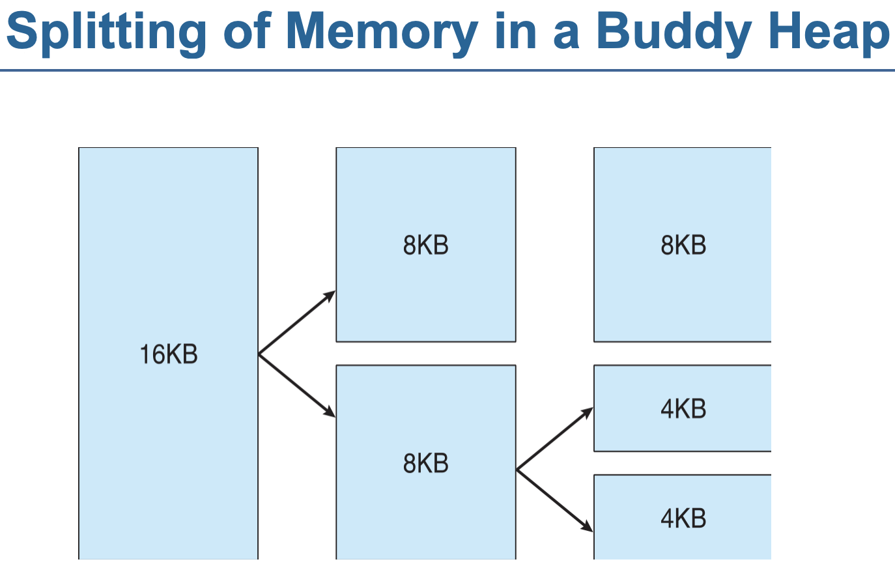

# Part 9. 사례 검토

- Linux와 Windows 10의 두 가지 시스템에 대해 자세히 다룬다
- Linux
  - 널리 사용되며 무료로 사용할 수 있으며 완전한 기능을 갖춘 UNIX 시스템을 나타낸다
- Windows 10
  - UNIX의 설계 및 구현과 확연히 다른 최신 운영체제를 검토할 수 있다
  - Microsoft의 이 운영체제는 모바일 기기의 운영체제로도 사용될 수 있다
  - Windows 10은 현대적으로 설계되었으며 Microsoft에서 제작한 이전 운영체제와는 매우 다른 모양과 느낌이 있다

# 20. Linux 시스템

- 실제 시스템을 고찰함으로써 우리가 논의했던 개념들이 서로 어떻게 연관되는지를 알 수 있다
- Linux는 UNIX의 한 버전으로 휴대전화붜 슈퍼컴퓨터까지 사용되고 있다
- Linux의 역사와 발전 과정을 살펴보고
  - 사용자 측면과 프로그래머 측면에서의 인터페이스에 대해 알아보기로 한다
    - 또한 Linux가 이 인터페이스를 어떻게 설계하고 구현하는지 살펴본다
- 이 장에서는 2017년에 배포된 Linux 4.12 커널까지의 발전에 관해 설명한다

#### 이 장의 목표

- Linux가 파생된 UNIX 운영체제의 역사를 탐구하고 Linux가 설계된 원칙을 탐구한다
- Linux `프로세스와 스레드 모델`을 조사하고 Linux가 어떻게 `스레드를 스케줄`하고 `프로세스 간 통신`을 제공하는지 조사한다
- Linux에서의 메모리 관리를 살펴본다
- Linux가 파일 시스템을 어떻게 구현하고 입출력 장치를 관리하는지 탐구한다

## 20.1 Linux의 역사(Linux History)

- 1991년 Linus Tovalds라는 핀란드 학생이 80386 프로세서를 위해 만든 커널로서 크기는 작지만 완전한 기능을 가지고 있었다
- 초기부터 무료로 공개
- 초기 시스템에는 Unix 시스템의 일부만을 구현했지만 이제는 Unix의 대부분 기능을 포함하도록 발전하였다
- 완벽한 운영체제를 만들어내기 위해서는 커널 이상의 많은 것들이 필요하다
  - Linux 커널과 Linux 시스템을 구분하는 것이 필요하다
    - 커널은 Linux 공동체에 의해서 완전히 새로이 개발된 독창적인 소프트웨어이지만
    - Linux 시스템은 새로 개발된 소프트웨어 뿐만 아니라 다른 개발 프로젝트에서 가져온 소프트웨어나 다른 팀과의 협조를 통해 만들어진 것들을 포함하고 있다
- Linux가 발전해 감에 따라 Linux 시스템 위에 또 다른 계층이 필요하게 되었다 => Linux 배포본
- Linux 배포본은 Linux의 표준요소와 함게 몇 가지 관리 툴(administration tool)들의 집합을 포함한다
  - 관리 툴
    - 초기 설치와 이후의 시스템 업데이트를 간단하게 하기 위한 것들
    - 시스템 내 다른 패키지들의 설치와 삭제를 다루는 것들
    - 배포본들은 전형적으로 아래 툴들을 포함한다
      - 파일 시스템을 다루는 툴
      - 사용자 계정의 생성과 관리를 다루는 툴
      - 네트워크 관리를 위한 툴
      - 웹 브라우저
      - 워드 프로세서 등

### 20.1.1 Linux 커널(The Linux Kernel)

- 1991년 Linux 0.01 버전의 커널은 네트워킹 기능을 포함하지 않았다
- 1994년 3월 14일 Linux 1.0 버전이 발표되었고 이 버전은 네트워킹 기능을 포함하고 있었다
  - 네트워킹 프로그래밍을 위한 BSD 호환 소켓 인터페이스 뿐만 아니라
  - UNIX의 표준 TCP/IP 네트워킹 프로토콜에 대한 지원도 포함하고 있었다
  - 이더넷(Ethernet)이나 직렬 회선(serial line)이나 모뎀을 통하여 IP를 실행하는 장치 드라이버에 대한 지원도 추가되었다
- 1.0 커널은 초기의 Minix 파일 시스템의 제한이 없는 개선된 파일 시스템을 포함하였으며,
  - 고성능 디스크 접근을 위해 일군의 SCSI(Small Computer System Interface) 컨트롤러를 포함하였다
    - SCSI : 컴퓨터와 주변기기 사이의 데이터 전송을 위한 인터페이스 표준
      - https://namu.wiki/w/SCSI
      - https://ko.wikipedia.org/wiki/SCSI
      - https://docs.vmware.com/kr/VMware-vSphere/7.0/com.vmware.vsphere.vm_admin.doc/GUID-5872D173-A076-42FE-8D0B-9DB0EB0E7362.html
  - 이 버전에서는 몇몇 하드웨어에 대한 지원이 추가되었다(인텔 PC 플랫폼 한정)
    - 사운드 카드와 다수의 마우스, 다국어 지원 키보드, 플로피 디스크, CD-ROM
  - 부동 소수점 연산 에뮬레이션이 커널에 포함
  - V Unix 스타일의 공유 메모리
  - 세마포
  - 메시지큐와 같은 프로세스 간 통신(IPC)도 구현되었다
- 1.1 부터 커널의 번호를 부여하는 표준적 관습
  - 마이너 버전이 홀수이면 개발 버전, 짝수이면 안정 버전
  - 안정된 버전에서 수정은 오직 버전의 개선을 위해서만 가능했던 것에 비해
  - 개발 중인 버전의 커널은 좀 더 새로우면서도 상대적으로 테스트가 덜 된 기능들을 포함할 수 있었다
  - 이 패턴은 3.0까지 지속되었다
- 1995년 1.2버전

  - PCI 하드웨어 버스 아키텍처를 포함한 보다 넓은 범위의 하드웨어를 지원하고 있었다
    - PCI(Peripheral Component Interconnect) : 컴퓨터의 주변기기를 연결하는 표준 버스
      - https://namu.wiki/w/PCI
      - https://ko.wikipedia.org/wiki/PCI_%EB%B2%84%EC%8A%A4
  - DOS 운영체제 에뮬레이션을 위한 것을 포함
  - 어카운팅(accounting)과 방화벽(firewalling) 기능을 포함함으로써 IP 구현을 갱신
    - 어카운팅 : 사용자의 사용량을 기록하는 것
      - https://kimtaekju-study.tistory.com/57

- 1996년 2.0
  - 여러 개의 아키텍처 지원(완벽한 64비트 native Alpha 포트 포함)
  - 다중 처리기(multiprocessor) 아키텍처 지원
  - 메모리 관리를 다루는 코드 개선
    - 블록 장치(block device)의 캐싱(caching)과는 독립적으로 파일 시스템 데이터의 단일화된 캐시를 제공하였다
  - 이러한 변화로 커널은 매우 강화된 성능의 파일 시스템과 가상 메모리를 제공할 수 있게 되었다
  - 처음으로 파일 시스템의 캐싱이 네트워크 파일 시스템으로까지 확장되었고
  - 쓰기 가능한 메모리 맵드 영역(memory-mapped region) 역시 처음으로 제공되었다
  - 내부 커널 스레드 추가
- 1999년 2.2

  - 네트워킹 향상
  - 새로운 커널 모드 NFS 디먼의 추가로 NFS 개선
  - SMP 성능 향상하기 위해 시그널 처리, 인터럽트, 다수의 입출력에 대한 락을 보다 미세한 수준에서 행해지도록 변경
    - SMP(Symmetric Multi-Processing) : 대칭형 다중 처리
      - 두 개 또는 그 이상의 프로세서가 한 개의 공유된 메모리를 사용하는 다중 프로세서 컴퓨터 아키텍처이다. 현재 사용되는 대부분의 다중 프로세서 시스템은 SMP 아키텍처를 따르고 있다.
      - https://ko.wikipedia.org/wiki/%EB%8C%80%EC%B9%AD%ED%98%95_%EB%8B%A4%EC%A4%91_%EC%B2%98%EB%A6%AC

- 2011년 3.0

  - 리눅스 탄생 20주년을 기념하기 위해 2에서 3으로 main 버전이 변경되었다
  - 새로운 기능
    - 가상화 지원
    - 새로운 페이지 되쓰기(write-back) 설비
    - 메모리 관리 시스템 개선
    - 새로운 스레드 스케줄러인 완전 공평 스케줄러(Completely Fair Scheduler, CFS)가 포함

- 2015년 4.0
  - Linux 커널 관리자는 부 버전ㅁ나 계속되는 승급에 질리게 되었다
  - 현재 Linux 커널 버전은 배포 순서 이외의 다른 의미는 없다
  - 4.0 커널 시리즈
    - 새로운 아키텍처
    - 향상된 모바일 기능
    - 여러 가지 반복적인 개선을 지원
  - 이 장의 나머지 부분에서 이 최신 커널에 초점을 맞춘다

### 20.1.2 Linux 시스템(Linux System)

- 운영체제 구성 요소
  - Linux 커널
  - Linux 시스템
- Linux 시스템을 구성하는 많은 소프트웨어 요소들은 Linux에 한정되지 않고 다른 UNIX운영체제와 같이 쓰는 것들이다
  - 버클리의 BSD 시스템
  - MIT의 X윈도 시스템
  - Free Software Foundation의 GNU 프로젝트의 일부분으로서 개발된 많은 툴
    - GNU 프로젝트에서 만들어진 C 컴파일러인 gcc

### 20.1.3 Linux 배포본(Linux Distributions)

- 누구나 ftp 사이트로부터 자신이 필요로 하는 시스템 컴포넌트의 최신 개정판을 가져와서 컴파일함으로써 Linux 시스템을 설치할 수 있다
- 초기에는 이런 일을 개인이 수행했지만
  - 이를 간편하게 수행하려는 시도가 이루어져왔다
    - 간편한 설치를 위해서 표준화된 그리고 미리 컴파일 된 패키지의 집합을 제공
- Linux 배포본은 시스템 이상의 것을 포함하고 있었다
  - 뉴스 서버, 웹브라우저, 텍스트 처리와 같은 편집을 위한 툴 => 미리 컴파일 => 설치가능 상태로 만든 패키지
  - 시스템 설치와 관리를 위한 패키지도 포함
- 오늘날의 Linux 배포본은 패키지를 더욱 쉽고 간판하게 설치하고 업그레이드하며 삭제할 수 있도록 패키지 트래킹 데이터베이스를 제공한다
- 많은 배포본들이 등장
  - Red Hat, Debian
    - Red Hat : 상업적인 Linux 지원회사로 부터 나온 배포본
    - Debian : 가용 소프트웨어(free-software) Linux 공동체에서 나온 것
- 많은 배포본의 등장으로 이들 간에 호환성을 보장하기 위한 방법이 필요해졌다
  - 많은 배포본이 RPM 패키지 파일 포맷을 사용하거나 인식한다
  - RPM : Red Hat Package Manager
    - 리눅스 배포판에서 사용되는 소프트웨어 패키지 관리 시스템
    - https://dololak.tistory.com/312

### 20.1.4 Linux 저작권(Linux Licensing)

- Linux 커널은 Free Software Foundation에서 시작된 개념인 GNU General Public License(GPL)하에서 배포된다
- Linux는 퍼블릭-도메인(public-domain) 소프트웨어가 아니다
  - 퍼블릭-도메인 : 프로그램의 저자가 소프트웨어에 대한 저작권은 포기하지만 소스 코드에 대한 저작권은 여전히 가지고 있음을 의미
- 대신 free 소프트웨어이다
  - 누구나 아무런 제한 없이 Linux 코드를 복사하고 변경하고 원하는 방법으로 사용할 수 있으며, 복사본을 무료 제공(또는 판매)할 수 있음을 뜻한다
- Linux 저작권 개념에서 중요한 것은 Linux를 사용하는자나 일부 변경하여 변종을 만들어낸 누구든지 소스 코드 없이 배포할 수 없다는 것이다
  - GPL하에서 배포되는 소프트웨어는 실행 파일만을 포함한 형태로는 재배포될 수 없다
  - 소스 코드를 포함한 형태로만 재배포될 수 있다
- 판매도 가능한데 합리적인 배포 가격에 해당 소스 코드를 받을 수 있어야 한다

## 20.2 설계 원칙(Design Principles)

- Linux는 다중 사용자, 다중 태스킹 시스템이며, Unix와 호환되는 툴들 전부를 가지고 있다
- Linux의 파일 시스템은 전통적인 Unix 시맨틱에 충실하며, 표준적인 Unix 네트워킹 모델도 Linux에서 완벽히 구현되고 있/다
- Linux는 다양한 플랫폼에서 작동하지만 초기에는 PC 아키텍처에서만 개발되었다
- Linux는 기관이 아닌 개인들에 의해 발전해왔기 때문에, 제한된 자원으로부터 가능한 많은 기능을 뽑아내려는 시도가 행해졌다
- 오늘날 Linux는 몇백 GB 단위의 메모리와 몇 TB단위의 디스크 공간을 지닌 다중 처리기 기계에서도 작동하지만
  - 여전히 16MB 이하의 메모리에서도 유용하게 사용할 수 있다
- 최근에 진행되고 있는 작업은 `표준화`라는 목표에 초점을 맞추어 가고 있다
  - UNIX는 다양한 시스템에서 수행되는 대신 한 시스템에서 작성된 소스코드가 다른 시스템에서 제대로 컴파일 되지 않거나 작동하지 않을 수 있다는 점이 문제가 될 수 있다
  - UNIX의 경우 시스템이 다르면 시스템 콜이 완전히 동일하게 동작하지 않을 수 있다
  - `POSIX` 표준은 운영체제의 여러 측면에 관한 명세의 집합으로 구성된다
    - 운영체제의 기능들에 관한 것
    - 프로세스, 스레드, 실시간 동작(real-time operations)과 같은 확장된 기능들에 관한 것들이 있다
    - Linux는 POSIX 표준을 준수하도록 디자인되며, 최소한 두 개의 Linux 배포본이 공식적인 POSIX 인증을 획득했다
- Linux는 사용자와 프로그래머 양쪽에게 표준 인터페이스를 제공
  - UNIX와 친숙한 사람에게는 Linux의 인터페이스가 낯설지 않을 것이다
  - 인터페이스 -> C.3절, C.4절 참고

### 20.2.1 Linux 시스템의 구성요소(Components of a Linux System)

- Linux 커널 코드는 세 개의 주요 부분으로 구성되어 있다(UNIX 구현과 일치)
  - 1. 커널
    - 가상 메모리, 프로세스 등을 포함하는 운영체제의 핵심을 다루는 부분
  - 2. 시스템 라이브러리
    - 응용 프로그램이 커널과 소통하는 함수들을 정의
    - 커널 코드의 특권이 필요하지 않은 기능들을 구현한 함수들도 정의
    - 가장 중요한 시스템 라이브러리는 C 라이브러리로 libc로 알려져있다
    - 표준 C 라이브러리를 제공하는 외에도 libc는 Linux 시스템 콜 인터페이스의 `사용자 모드 측`과 또한 다른 중요한 `시스템 수준` 인터페이스를 구현한다
  - 3. 시스템 유틸리티
    - 개별적이고 특수한 관리 기능을 수행하는 프로그램
    - 몇몇 시스템 유틸리티들은 초기화할 때와 시스템 구성을 위해 한번만 불리고 끝나지만,
    - 다른 시스템 유틸리티들은 시스템 내에서 계속 돌아가면서 네트워크 연결 요청에 대한 응답, 터미널로부터의 로그인 요청처리, 로그 파일들을 업데이트하는 일 등을 수행한다(Unix 용어로 디먼(daemon)이라 불린다)

- 그림 20.1 Linux 시스템의 구성요소

- 그림 20.1은 Linux 시스템 전체를 구성하는 요소를 도시한 것이다
- 커널과 그 외 다른 요소들 사이에 중요한 차이점
  - 모든 커널 코드는 프로세서에서 특권 모드(privileged mode ~ `커널 모드`)로 수행 -> 컴퓨터의 모든 자원에 대한 접근 권한을 갖는다
- Linux에서 사용자 모드의 코드가 커널에 포함될 수 없다
  - 운영체제 자체에서 지원하는 코드라 해도 커널 모드에서 반드시 동작해야 할 필요가 없는 코드들은 `커널 밖`의 시스템 라이브러리에 위치하여 `사용자 모드`로 수행된다
  - 사용자 모드에서는 시스템 자원 중 통제된 일부분만 접근할 수 있다
- 오늘날 많은 운영체제는 커널 내부가 메시지 전달 아키텍처를 채택하고 있지만
- Linux는 Unix의 전통적인 모델인 `커널이 단일화된 실행 파일로 생성`되는 형태를 그대로 유지하고 있다
  - 이런 형탤를 유지하는 이유는 성능향상을 위한 것이다
    - 모든 커널 코드와 자료구조를 하나의 주소 공간에 유지함으로써 시스템 콜을 호출하거나 하드웨어 인터럽트 발생 시 `문맥 교환(context switch)이 필요하지 않다`
  - 커널은 더욱 복잡한 프로세스 간 통신(IPC)가 아니라 비교적 싼 C 함수 호출을 통해 여러 서브 시스템 간에 데이터를 전달하거나 요구를 할 수 있다
  - 스케줄링이나 가상 메모리 관리와 같은 커널의 핵심적인 부분뿐만 아니라, 장치 드라이버나 파일 시스템, 네트워킹과 같은 `모든 커널 코드가 하나의 주소 공간 내에 유지`된다
- 모든 커널 코드가 하나의 주소 공간을 공유한다고 해서 모듈화에 대한 배려가 없다는 것을 뜻하지는 않는다
  - Linux 커널도 필요한 모듈을 실행 중에 동적으로 적재하고 메모리에서 제거(unload)할 수 있다
- Linux 커널은 운영체제의 핵심이다
  - 커널은 `프로세스를 관리`하고 `스레드를 수행`하는 데 필요한 모든 지원 기능들을 `제공`한다
  - `하드웨어 자원`들에 대한 중재되고 보호된 `액세스를 대행`해주는 서비스를 제공한다
  - 커널은 운영체제로 동작하기 위해 필요한 모든 기능들을 구현한다
- 커널은 완전한 Unix 시스템이 아니다
  - `응용`은 `시스템 라이브러리를 호출`하고, 시스템 라이브러리가 필요에 따라 운영체제 서비스를 호출한다
- 시스템 라이브러리는 응용 프로그램이 커널에 대한 시스템 콜을 할 수 있게 한다

  - 시스템 라이브러리는 또한 기본 시스템 콜보다 복잡한 형태의 서비스를 제공한다
    - 예를 들어, C 언어의 버퍼링(buffering)을 하는 관련 함수들은 모두 시스템 라이브러리에 의해 구현되며
      - 이는 기본적인 시스템 콜이 제공하는 것보다 훨씬 다양한 파일 입/출력 기능을 제공한다
  - 또한 시스템 콜과는 무관한 루틴들도 구현되어 있는데
    - 정렬 알고리즘과 관련된 것, 수학 관련 함수들, 스트링(string) 처리 루틴 같은 것들
    - Unix나 POSIX 응용 프로그램 작동을 위해 필요한 모든 함수도 시스템 라이브러리에 구현되어 있다

- Linux 시스템은 매우 `많은 종류의 사용자 모드의 프로그램을 제공`
  - `시스템 유틸리티(utility)와 사용자 유틸리티`가 이에 포함된다
  - `시스템 유틸리티`
    - `네트워크 인터페이스의 설정`, `시스템에 사용자를 추가하거나 제거`하는 일 등 `시스템을 초기화하고 관리`하는 데 필요한 모든 프로그램을 포함한다
    - 내 생각) Windows의 제어판에 해당하는 것 같다
  - `사용자 유틸리티`
    - 파일을 복사, 디렉터리를 생성, 텍스트 파일을 편집 등
    - 가장 중요한 사용자 유틸리니 중 하나는 `셸(shell)`로 UNIX 시스템의 표준 명령 라인 인터페이스(CLI)이다
    - Linux는 많은 셸을 지원하며 가장 일반적인 것은 본-어게인 셸(bourne-again shell, bash)이다

## 20.3 커널 모듈(Kernel Modules)

- Linux 커널은 `요구가 발생할 때 마다`(on demand) 커널 코드의 임의이 부분을 `모듈 단위로 적재하고 메모리에서 제거`할 수 있다
- 이러한 `적재 가능 커널 모듈(loadable kernel modules)`은 특권을 지닌 커널 모드에서 수행되고, 그 기계(machine)의 모든 하드웨어에 대한 권한을 갖게 된다
- 이론적으로 커널 모듈은 할 수 있는 일에 제한이 없지만
  - 일반적으로는 `장치 드라이버`, `파일 시스템`, `네트워킹 프로토콜 등을 다루는 부분`으로 구성된다
- 커널 모듈을 사용하는 것이 편리한 이유
  - Linux 소스 코드는 공개되어 있다
    - 커널 코드를 작업하고자 하는 사람이라면 누구나 커널을 수정해서 재컴파일 할 수 있으며, 새로운 기능을 적재하기 위해서는 컴퓨터를 재부팅 시키는 일이 필요하다
    - 그러나 새로운 드라이버(즉, 장치 드라이버)를 개발하려 할 때 커널 전체를 재컴파일하고 새로 링크(link)하고 새로 적재하는 작업을 반복하는 것은 너무 번거롭다
    - 커널 모듈을 사용한다면 커널 개발 시 이러한 번거로움을 피할 수 있다
- 커널 모듈 덕택에 Linux에서는 필요치 않은 장치 드라이버는 제외하고 표준적인 최소 커널의 Linux 시스템을 설치할 수 있다

  - 사용자가 필요한 장치 드라이버는 시스템이 시작할 때 적재, 아니면 나중에 필요할 때 시스템에 의해서 자동으로 적재
  - 필요하지 않을 때는 메모리에서 제거
  - e.g. 마우스 드라이버는 USB 마우스가 꽂혀 있을 때는 적재되고 뽑혀 있을 때는 메모리에서 제거되도록 할 수 있다

- Linux는 모듈을 지원하는 네 개의 컴포넌트가 있다
  - 1. 모듈 관리(module management) 시스템
    - 모듈이 메모리에 적재되고 커널의 나머지 부분과 소통할 수 있도록 하는 부분
  - 2. 모듈 로더와 언로더(unloader)
    - 사용자 모드 유틸리티로 모듈 관리 시스템과 협력하여 모듈을 메모리에 적재한다
  - 3. 장치 드라이버 등록(driver registration) 시스템
    - 새로운 장치 드라이버의 존재를 커널의 다른 부분에 알리게 한다
  - 4. 충돌 해결 기법(conflict-resolution mechanism)
    - 서로 다른 장치 드라이버들이 하드웨어 자원을 예약하는 것을 도와주고 이들 자원을 다른 드라이버가 상충하게 사용하는 것을 막아준다

### 20.3.1 모듈 관리(Module Management)

- 모듈을 적재하는 것은 단순히 실행 파일을 커널 메모리 영역에 올려놓는 것 이상을 요구한다
  - 시스템은 모듈이 참조하는 커널 심볼(symbol)이나 진입 지점(entry point)이 커널 주소 영역의 정확한 위치를 가리킬 수 있도록 모듈을 확실히 설정해야 한다
- Linux 모듈 적재 작업 두 부분
  - 커널 메모리 내에서 모듈 코드를 관리하는 일
  - 모듈이 참조하는 심볼을 다루는 일
- Linux 커널은 심볼 테이블(symbol table)을 가지고 있다
  - 이 심볼 테이블은 커널에 정의된 모든 심볼을 가지고 있는 것이 아닌, 이 심볼들은 커널에 의해 명시적으로 수출(export)되어야만 한다
  - 이러한 심볼들의 집합은 잘 정의된(well-defined) 인터페이스를 구성함으로써 이를 통해 모듈들은 커널과 소통할 수 있게 된다
- 커널 함수로부터 심볼을 수출(export)하려면 프로그래머가 이를 명시적으로 요구해야하지만 이들 심볼을 모듈에서 사용하는 데는 특별한 노력이 필요 없다
  - 모듈을 작성하는 사람은 C언어의 표준 외부 연결 방법(standard external linking)을 사용하기만 하면 이렇게 수출(export)된 심볼을 사용할 수 있게 된다
  - 즉, 모듈 안에서 정의되지 않은 심볼의 경우, 컴파일러가 미해결(unresolved) 심볼임을 표시해 놓고 나중에 이 모듈이 커널에 적재될 때 시스템 유틸리티가 모듈 전체를 살피면서 미해결 심볼을 찾는다
  - 모든 미해결 심볼은 커널의 심볼 테이블에서 찾은 후, 이 심볼이 현재 작동하는 커널에서 정확한 주소를 모듈에 대체해 넣는다
  - 그런 후에 모듈이 메모리에 적재되도록 커널에 넘겨진다
  - 만약 시스템 유틸리티가 커널의 심볼 테이블에서 그 심볼을 찾아 낼 수 없다는 그 모듈을 적재시키는 일이 거부된다
- 모듈 메모리 적재 - 생략
- 모듈 요청자 - 생략
- 내 생각) 커널 모듈과 노드 모듈을 비교해서 생각해보자
  - 커널 모듈 ~ 노드 모듈
  - 심볼 테이블 ~ package.lock.json, package.json
  - RPM ~ npm

### 20.3.2 드라이버 등록(Driver Registration)

- 일단 `모듈이 적재`되면, `커널의 나머지 부분에 그 모듈이 제공하는 기능에 관해 알려주어야 한다`
- 이러한 일을 위해 커널은 모든 `장치 드라이버를 등록하는 동적 테이블`을 유지하면서 장치 드라이버들이 이 테이블에 언제든 추가, 혹은 삭제할 수 있도록 한다
- 한 모듈은 여러 유형의 기능을 등록할 수 있다

  - 예를 들면, 한 장치 드라이버가 한 장치에 접근하는 두 가지 별도의 기법을 등록하려 할 수 있다

- `등록 테이블`이 포함하고 있는 것들은 다음과 같은 것들이 있다

  - `장치 드라이버`
    - 문자 장치(character device)
      - 프린터, 터미널, 마우스
    - 블록 장치(모든 디스크 드라이브를 포함)
    - 네트워크 인터페이스 장치
  - `파일 시스템`
    - Linux의 `가상 파일 시스템 콜 루틴들을 구현`하고 있으면 어떤 것이나 가능하다
    - 이는 디스크에 파일을 저장하는 포맷을 구현할 수도 있고
    - NFS와 같은 네트워크 파일 시스템일 수도 있고
    - Linux의 /proc 파일 시스템 처럼 요구 시에(on-demand) 그 내용이 생성되는 가상 파일 시스템일 수도 있다
  - `네트워크 프로토콜`
    - IPX처럼 하나의 모듈이 전체 네트워크 프로토콜을 구현할 수도 있고
      - IPX(Internetwork Packet Exchange)는 Novell NetWare에서 사용하는 네트워크 프로토콜이다
      - TCP/IP와 같은 네트워크 프로토콜이다
      - TCP/IP의 인기로 인해, IPX는 쇠퇴의 길을 걷고 만다
      - 참고
        - https://ko.wikipedia.org/wiki/IPX
    - 단순히 네트워크 방화벽을 위해 패킷을 걸러내는 규칙들만을 구현할 수도 있다
  - `이진(binary) 포맷`
    - 새로운 유형의 실행 가능한 파일을 인식하고 적재하며 실행하는 방법을 지정한다

- 모듈이 동적으로 구성되도록 하기 위해 sysctl과 /proc 테이블에 새로운 항목(entry)들의 집합을 등록할 수도 있다(20.7.4절 참고)

### 20.3.3 충돌 해결(Conflict Resolution)

- 상용 Unix 제품은 보통 특정 하드웨어에서만 동작하도록 되어있다
  - 장점 : 소프트웨어 판매가자 하드웨어 구성을 잘 알고 있다
  - 그러나 IBM PC 하드웨어는 네트워크 카드나 SCSI 컨트롤러, 비디오 디스플레이 어댑터와 같이 장치 드라이버가 다양하기 때문에 하드웨어 설정이 몇 가지로 제한되지 않는다
  - 여기에 모듈화된 장치 드라이버를 허용하면 현재 구동 중인 하드웨어의 구성이 가변적이기 때문에 하드웨어 설정의 문제는 점점 어려워진다
- Linux는 `특정한 하드웨어 자원에 대한 접근을 조정`하기 위해 아래와 같은 `중앙집중식 충돌 해결 방법을 제공`하고 있다
  - 이 기법의 `목표`는 다음과 같다
    - 여러 모듈이 한 하드웨어 자원에 접근 할 때 발생하는 충돌 방지
    - 장치 드라이버가 자동으로 장치 설정을 하여(autoprobes) 기존의 장치 드라이버를 방해하는 것을 방지
    - 여러 개의 장치 드라이버가 같은 하드웨어에 접근하려 하는 경우의 조정
      - 예를 들어, 병렬 프리너 드라이버와 병렬 회선 IP(PLIP, parallel line IP) 네트워크 드라이버가 모두 병렬 프린터 포트에 접근하려 할 때의 조정
  - 이런 목적을 위해 커널은 `할당된 하드웨어 자원에 대한 목록을 유지`한다
    - 어떤 장치 드라이버든지 `자원에 접근`하려 할 때 이 `목록에서 예약`해야 한다
    - 부수적으로 특정 시점에서 어느 자원을 어느 드라이버에 할당할 것인지를 시스템 관리자가 결정할 수도 있다
  - 모듈은 이런 기법을 통해 사용하고자 하는 하드웨어 자원을 예약한다
    - 자원이 존재하지 않거나 이미 사용 중인 경우에는 모듈이 해당 자원을 예약할 수 없다

## 20.4 프로세스 관리(Process Management)

- 운영체제는 사용자의 모든 요청을 `프로세스라는 문맥(context)` 속에서 처리한다
- Linux는 UNIX와 몇 가지 다른점이 있다
  - UNIX 모델 : C.3.2 절
- 이 절에서는 Unix 프로세스 모델을 검토하고, Linux 고유의 스레드 모델을 소개한다

### 20.4.1 fork() / exec() 프로세스 모델(The fork()/exec() Process Model)

- UNIX에서 프로세스 관리의 가장 기본 : 프로세스 생성과 새로운 프로그램의 실행을 분리한다
  - 프로세스 생성 : fork()
  - 새로운 프로그램의 실행 : exec()
- fork()
  - 아직 새로운 프로그램을 실행한 것은 아니다
  - 새 프로세스는 부모 프로세스와 완전히 같은 프로그램을 부모 프로세스와 정확히 동일한 위치에서 실행하게 된다
  - 마찬가지로 새로운 프로그램을 수행하기 위해 반드시 새로운 프로세스를 먼저 생성할 필요는 없다
  - 어느 프로세스든 언제나 exec()을 호출할 수 있다
    - 그 경우 현재 수행 중인 프로세스는 즉시 종료되고 새로운 프로그램이 기본 프로세스의 문맥에서 수행을 시작한다
- 매우 단순하다는 장점이 있다
  - 새로운 프로그램을 수행시키기 위한 환경을 시스템 콜에 자세히 명세할 필요 없이, 새로운 프로그램이 기존의 환경에서 실행되기 때문이다

#### 20.4.1.1 프로세스 식별(Process Identity)

- `프로세스 식별`을 위해 제공되는 요소들

  - `프로세스 ID(PID)`
  - `신임장(credentials)`
    - 각각의 프로세스는 시스템 자원과 파일에 접근할 수 있는 권리를 표현하기 위해서 그 프로세스와 연관된 하나의 사용자 ID와 하나 이상의 그룹 ID를 가지고 있어야 한다
  - `퍼스낼리티(personality)`
    - UNIX에서 발견되진 않지만, 시스템콜의 시맨틱을 다소 변경할 수 있게 하는 personality 식별자를 가지고 있다
    - 특정 Unix와 호환되는 시스템콜을 요청하는 에뮬레이션 라이브러리에 의해 주로 사용된다
  - `이름 공간(namespace)`
    - 각 프로세스에는 파일 시스템 체계(hierarchy)에 대한 고유의 관점이 연관되어 있으며 이를 이름 공간(namespace)이라 부른다
    - 대부분의 프로세스는 공통의 이름공간(namespace)을 공유하고 있으며 공유 파일 시스템 체계상에서 동작한다
    - 그렇지만 프로세스와 그 자식들은 다른 이름 공간을 가질 수 있다
    - 이름공간은 고유의 파일 시스템 체계, 즉 그들 각자의 디렉터리와 마운트된 파일 시스템 집합을 가진다
    - https://en.wikipedia.org/wiki/Linux_namespaces
    - https://www.44bits.io/ko/keyword/linux-namespace
      - 리눅스 네임스페이스는 프로세스를 실행할 때 시스템의 리소스를 분리해서 실행할 수 있도록 도와주는 기능입니다. 한 시스템의 프로세스들은 기본적으로 시스템의 리소스들을 공유해서 실행됩니다. 이를 단일 네임스페이스라고 생각해볼 수 있습니다.

- 이 식별자들 대부분은 프로세스 자신의 제한적 제어하에 있다
  - 프로세스가 새로운 그룹이나 세션을 시작하고 싶을 때 프로세스의 그룹과 세션 식별자는 변경될 수 있다
  - 이 식별자의 신임장(credentials)은 적절한 보안 체크를 한 후 변겨오딜 수 있지만, 프로세스의 PID는 변할 수 없으며 프로세스가 종료될 때 까지 그 프로세스를 식별하기 위해 사용된다
- 내 생각) `프로세스 식별을 위한 요소로 PID 뿐만 아니라 credentials, personality, namespace 도 있다`

#### 20.4.1.2 프로세스 환경(Process Environment)

- 프로세스의 환경은 부모 프로세스로부터 상속받게 되며 두 개의(null 문자로 끝나는) 벡터로 구성된다

  - `인자 벡터(argument vector)`
    - 프로그램을 `실행하는 데 필요한 사용자 명령의 인자(argument)들`이며, 관습적으로 그 프로그램 이름으로 시작한다
  - `환경 벡터(environment vector)`
    - "이름=값" 형태의 쌍들의 목록
    - 지명된 환경 변수와 그에 대응하는 값(임의의 텍스트)을 서로 연관시킨다

- 프로세스 환경은 그 프로세스만 사용하는 사용자 주소 공간에 저장된(메모리X)
- 프로세스 스택 상부의 가장 첫 번째 데이터가 이 환경과 관련된 것들이다
- 인자 벡터와 환경 벡터는 새로운 프로세스가 '생성'되었을 때 변하지 않는다
  - 자식 프로세스는 부모 프로세스 환경을 그대로 상속받는다
- 그러나 새로운 프로그램이 호출되면 완전히 새로운 환경이 설정된다

  - exec()을 호출할 때 프로세스는 새로운 프로그램에 대한 환경을 제공해야 한다

- e.g.

  - TERM 환경변수는 사용자의 터미널 유형을 지정하기 위한 것이다
  - 여러 개의 언어가 사용 가능할 때 프로그램이 발생시키는 메시지를 어느 언어로 내보낼 것인가를 결정하기 위해서는 LANG 환경 변수를 사용한다

- 환경 변수 기법의 중요한 특징은 환경을 시스템 전체가 아니라 프로세스 단위로 설정하는 것이 가능하다는 점이다
  - `덕텍에 각 사용자는 타인과 상관없이 자신만의 언어나 문서 편집기를 선택하는 것이 가능해진다`
  - 내 생각) 터미널을 bash로 쓸 것인지 zsh로 쓸 것인지와 같은 것은 환경변수로 설정하는 것인 것 같다

#### 20.4.1.3 프로세스 문맥

- `프로세스의 식별`과 `프로세스 환경`은 프로세스가 생성될 때 설정되어 프로세스가 끝날 때 까지 `변하지 않는다`
  - 프로세스는 필요할 경우 자신의 식별의 일부 단면을 변경하거나 자신의 환경을 변경할 수 있다
- 이와 대조적으로 `프로세스 문맥`은 수행중인 `프로그램의 상태를 나타내며` 프로그램이 실행되는 동안 `끊임없이 변화한다`

- *프로세스 문맥*은 다음과 같은 부분들로 이루어져 있다
  - `스케줄링 문맥`
    - 스케줄러가 프로세스의 보류(suspend)나 재실행(restart)을 결정하려 할때 필요한 정보
    - 이 정보는 그 프로세스에 관련된 모든 레지스터의 값을 포함한다
  - `어카운팅`
    - 커널은 각 프로세스가 `현재 사용하고 있는 자원`과 프로세스의 `존속 기간 동안 소비한 전체 자원의 정보`를 포함하고 있다
  - `파일 테이블`
    - 오픈 파일을 나타내는 커널 파일 구조를 가리키는 포인터들의 배열이다
    - 파일 디스크립터(정수) ~ 이 테이블의 인덱스
  - `파일-시스템 문맥`
    - 파일 테이블은 열려 있는 파일에 대한 정보를 유지하고 있는 반면에
    - 파일-시스템 문맥은 `새로운 파일을 열려는 요청에 적용`된다
    - 현재 루트 디렉터리와 새로운 파일 탐색을 하는 데 사용되는 `현재 작업 디렉터리 및 이름공간을 저장`하고 있다
  - `신호 핸들러 테이블`
    - 외부에서 이벤트가 발생해서 특정 신호가 도착했을 때 불릴 프로세스 주소 공간에 존재하는 루틴의 주소를 저장하고 있다
  - `가상-메모리 문맥`
    - 프로세스 사유 주소 공간의 전체적인 내용을 기록(20.6절에서 다시 논의)

### 20.4.2 프로세스와 스레드

- fork() : 프로세스 복사
- clone() : 스레드 생성
- 그러나 리눅스는 프로세스와 스레드를 구분하지 않는다
- 사실 리눅스는 일반적으로 프로그램 내의 제어 흐름을 표현하는 데 프로세스나 스레드가 아닌 태스크(task)라는 용어를 사용한다
- clone() 이 호출될 때, 부모와 자식 간의 공유 정도를 결정하는 플래그의 집합을 전달 받는다
- 반면 fork()에 의해 생성되는 프로세스는 자신의 부모와 자원을 공유하지 않는다

- `clone()이 CLONE_FS, CLONE_VM, CLONE_SIGHAND, CLONE_FILES의 플래그와 함께 호출되면 아래의 것들을 공유한다(다른 시스템에서 스레드를 생성하는 것과 동등)`
  - 부모와 자식 태스크는 파일 시스템 정보(현재 작업 디렉터리)
  - 같은 메모리 공간
  - 같은 신호 처리기
  - 동일한 열린 파일 등
- 그러나 `이러한 플래그 없이 clone()이 호출되면, 공유는 일어나지 않게 되고 fork() 시스템 콜과 유사한 기능을 제공`한다
- 프로세스와 스레드의 구분이 모호한 것은 Linux가 프로세스의 모든 문맥을 하나의 프로세스 자료구조에 모아 두지 않고 독립된 하위문맥에 저장하기 때문에 가능하다
  - 즉, 파일-시스템 문맥이나 파일 디스크립터 테이블, 신호 핸들러 테이블, 가상-메모리 문맥 등은 분리된 자료구조에 저장된다
- `fork() 시스템 콜은 이 중에서 공유는 하지 않고 복사본을 사용하는 clone()의 특수한 경우라고 말할 수 있다`

## 20.5 스케줄링(Scheduling)

- 스케줄링은 여러 작업에 CPU 시간을 할당해 주는 일이다
- Linux는 모든 UNIX 시스템과 마찬가지로 `선점 가능 다중 태스킹(Preemptible multitasking)`을 지원한다
  - 프로세스 스케줄러가 언제 어느 스레드를 수행할지 결정

### 20.5.1 스레드 스케줄링(Thread Scheduling)

- Linux의 두 종류의 스케줄링 알고리즘
  - 공정한 선점할 수 있는 방식의 시분할 알고리즘
  - 공정함보단 절대적 우선순위가 훨씬 중요한 실시간 작업을 위해 고안된 알고리즘
- 완전 공평 스케줄러(Completely Fair Scheduler, CFS)
- CFS vs. UNIX 프로세스 스케줄러
  - UNIX 스케줄러
    - 핵심 변수 : 우선순위, 타임 슬라이스(주어진 시간 길이)
    - 초기 시분할 시스템에서는 잘 동작했지만 현대의 데스크톱과 휴대장치에서는 좋은 대화형 성능과 공평함을 제공하지 못함이 증명되었다
  - CFS
    - 정통적 의미의 타임슬라이스를 없앴다.(정적 타임 슬라이스 개념을 없앴다)
    - 대신 모든 스레드는 처리기 시간의 비율을 할당 받는다
    - CFS는 한 스레드의 수행 시간을 전체 `수행가능 스레드의 수`와 관련된 함수로 계산한다
      - 만일 N개의 수행 가능 스레드가 있다면 CFS는 각각 처리기 시간의 1/N를 받을 수 있다고 가정한다
      - CFS는 각 프로세스의 무게(우선순위)를 수행 가능한 모든 프로세스의 무게 값을 더한 값으로 나누고 `이에 비례하는 타임슬라이스 동안 각 스레드를 수행한다`
    - 내 생각) 타임슬라이스가 없어진 것이 아니라 계산 방식이 달라진 것 같다
- CFS는 큰 서버에서 처리량 성능을 훼손하지 않으면서 휴대 장치와 같은 대화형 작업 부하에 좋은 성능을 발휘한다

### 20.5.2 실시간 스케줄링(Real-time Scheduling)

- Linux의 실시간 스케줄링은 표준 시분할 스레드의 공평한 스케줄링(CFS)보다 훨씬 간단하다
- Linux는 POSIX.1b가 요구하는 두 가지 `실시간 스케줄링` 클래스들을 구현하는데, `FCFS`와 `라운드 로빈`이 바로 그것이다
  - FCFS : 스레드가 종료되거나 봉쇄되기 전까지 실행을 계속한다
  - 라운드로빈 : 어느 정도 시간이 지나면 선점되어 스케줄링 큐의 맨 끝으로 간다
- 두 경우 모두 각 스레드는 `스케줄링 클래스`와 `우선순위`를 가지고 있다
- 스케줄러는 항상 가장 높은 우선순위를 가진 스레드를 실행한다
  - 같은 우선순위를 가진 스레드들이 여러 개가 있다면 `가장 오랫동안 기다린 스레드를 스케줄러는 실행`한다

### 20.5.3 커널 동기화(Kernel Synchronization)

- 커널 스케줄링은 스레드 스케줄링과 다르다
- `커널 모드 실행의 요청 방법` 두 가지
  - 실행 중인 프로그램은 운영체제 서비스를 명시적으로 `시스템 콜`을 통해, 또는 묵시적으로 (예를 들면, 페이지 폴트가 발생할 때) 요청할 수 있다
  - 또 다른 방법은 장치 컨트롤러가 `하드웨어 인터럽트`를 전달하여 그 인터럽트를 위해 커널에서 정의한 핸들러를 시작하게 할 수 있다
- 커널이 풀어야 하는 문제 -> 여러 태스크가 같은 자료구조에 접근할 수 있다는 점

#### 커널 모드에서의 첫 번째 보호 기법

- 커널 안에서 락킹을 위해 Linux 커널은 스핀락(spinlocks)과 세마포(두 락의 reader-writer 버전도 함께)를 제공한다
  - SMP 기계에서 가장 기본적인 락킹 기법은 스핀락이다
    - 스핀락은 짧은 시간 동안만 점유되도록 커널이 설계되었다
  - 단일 처리(single processor) 기계에서 스핀락을 사용하는 것은 부적합하여 커널 선점을 허용하고 금지하는 방법으로 대체된다

- 단일 처리기(single processor)에서는 스핀락을 획득하는 것이 아니라 태스크는 커널 선점을 금지한다
  - 태스크가 스핀락을 방출해야 할 경우가 되면 커널 선점을 허용한다
- Linux 커널 선점을 허용하고 금지하는 데에는 preempt_disable()과 preempt_enable()의 간단한 시스템 콜을 제공한다
  - 스핀락과 커널 선점 허용/금지는 락이 짧은 시간 동안 점유될 때만 사용된다
    - 락이 더 오랫동안 점유되어야 할 때는 세마포를 사용해야 한다

#### 커널 모드에서의 두 번째 보호 기법

- Linux가 사용하는 두 번째 보호 기법은 인터럽트 서비스 루틴 내의 임계구역에 적용된다
  - 임계구역 동안 `인터럽트를 금지`함으로써 커널은 공유 자료구조에 대한 동시 접근을 걱정하지 않고 진행할 수 있도록 보장한다
- 인터럽트 허용, 금지 명령은 비용이 많이드는 명령어이다
  - `오랫도안 인터럽트 금지 상태로 있으면` 모든 입/출력이 중단되고, 서비스 받기를 기다리는 어떤 장치들은 인터럽트가 다시 가능해질 때까지 기다려야 하므로 `성능이 떨어질 것`이다
- 이 문제를 해결하기 위해 Linux 커널은 동기화 구조를 사용해서 인터럽트를 금지 상태로 놓지 않고 긴 임계구역을 실행할 수 있도록 해준다
  - 인것은 특히 네트워킹 코드에 유용하다
  - 네트워크 장치 드라이버에서의 인터럽트는 한 네트워크 패킷 전체의 도착신호를 보낼 수 있는데, 이러한 패킷 인터럽트 서비스 루틴 내에 그 패킷을 라우트하고, 포워드 하게끔 해주기 위해 실행되는 코드의 양이 상당히 많아질 수 있다

- 그림 20.2 인터럽트 보호 수준
- 그림 20.2는 커널 내부에 있는 인터럽트 보호의 여러 레벨을 나타내고 있다.

  - 각 레벨은 더 높은 레벨에서 실행되는 코드에 의해 중단될 수 있으나, 같거나 더 낮은 레벨에서 실행되는 코드에 의해서는 중단될 수 없다
  - 사용자 스레드들은 시분할 스케줄링 인터럽트가 발생할 때 다른 스레드에 의해 선점될 수 있으며, 사용자 모드 코드는 제외한다

- Linux 인터럽트 서비스 루틴들을 두 부분, 상반부(top half)와 하반부(bottom half)로 나눔으로써 이러한 구조를 구현한다
- `상반부`는 일반적인 인터럽트 서비스 루틴으로, 인터럽트를 금지 상태로 놓고 실행한다
  - 더 높은 우선순위의 인터럽트들은 가능하나, 같거나 더 낮은 우선순위를 가진 인터럽트들은 금지한다
- 서비스 루틴의 `하반부`는 모든 인터럽트를 인터럽트 가능 상태에 놓고, 하반부가 결코 자기 자신들의 인터럽트하지 않게 보장해 주는 소규모 스케줄러에 의해 실행된다

  - 하반부 스케줄러는 인터럽트 서비스 루틴이 종료할 때 마다 자동으로 호출된다

- 이러한 상반부, 하반부 구분은 인터럽트 시 해야할 복잡한 처리를 중단하지 않고 처리할 수 있다는 것을 의미한다
  - 만일 어느 하반부 실행 중에 다른 인터럽트가 발생하면, 그 인터럽트는 동일한 하반부를 실행하도록 요처어할 수 있지만 현재 실행중인 것이 끝날 때 까지 실행은 지연될 것이다
- 하반부의 실행은 상반부에 의해 중단될 수 있으나, 유사한 하반부에 의해서는 절대 중단될 수 없다

### 20.5.4 대칭형 다중 처리(Symmetric Multiprocessing, SMP)

- 여러 스레드가 여러 처리기 상에서 병렬적으로 실행될 수 있다
- 단일 커널 락(BKL, big kernel lock)을 쪼개서 각각이 커널 자료구조의 작은 부분을 보호하게 만들어서 SMP 구현의 확장성을 향상시켰다

## 20.6 메모리 관리(Memory Management)

- Linux에서 메모리 관리는 두 부분으로 나누어진다
  - 첫째는 `물리 메모리`(페이지, 페이지 그룹, 메모리의 작은 블록)를 할당하고, 반납하는 것
  - 둘째는 `가상메모리`를 다루는 일
    - 실행 중인 프로세스들의 주소 공간으로 매핑(mapping)되는 메모리를 말한다
- 이 절에서는 이 두 부분을 살펴보고, 새 `프로그램의 적재가능한(loadable) 요소`들이 exec() 시스템 콜에 의해 프로세스의 `가상 메모리로 적재`되는 기법을 알아볼 것이다

### 20.6.1 물리 메모리의 관리(Management of Physical Memory)

- 특정 하드웨어 특성 때문에 Linux는 물리 메모리를 다음과 같은 네 종류의 zone 또는 영역들로 구분한다

  - ZONE_DMA
  - ZONE_DMA32
  - ZONE_NORMAL
  - ZONE_HIGHMEM

- 이 zone들은 아키텍처에 따라 다르다

#### Intel x86-32

- 그림 20.3 Intel x86-32의 zone과 물리 주소의 관계

- 예를 들면, Intel x86-32 아키텍처에서 어떤 ISA 장치는 DMA를 사용할 경우 제일 아랫부분 16MB의 물리 메모리만 접근할 수 있다
  - 이러한 시스템에서는 첫 16MB의 물리 메모리가 ZONE_MDA가 된다
  - 다른 시스템에서는 64비트 주소를 지원하지만 일부 장치가 첫 4GB만 접근할 수 있다.
    - 그러한 시스템에서 물리 메모리의 첫 4GB가 ZONE_DMA32가 된다
  - ZONE_HIGHMEM(주소가 '큰 메모리')은 커널 주소 공간에 매핑되지 않는 물리 메모리를 의미한다
    - 예를 들면, 32비트 Intel 아키텍처에서 (2^32이므로 4GB 주소 공간 제공) 커널은 첫 896MB의 주소 공간에 매핑된다. 나머지 부분은 hight memory라고 불리며 ZONE_HIGHMEM에 할당된다
  - ZONE_NORMAL은 나머지 모든 것, 즉 보통의 정규적으로 맵되는 페이지들을 포함한다
    - 한 구조가 어떤 zone을 갖는지 여부는 그 구조의 제약에 좌우된다

#### Intel x86-64

- Intel x86-64와 같은 현대의 64비트 구조는 작은 16MB ZONE_DMA를 기존의 장치들을 위해 가지며, 나머지 모든 메모리는 ZONE_NORMAL이고 ZONE_HIGHMEM은 없다

#### Buddy 시스템

- Linux 커널에서 `물리 메모리 주 관리자`는 `페이지 할당기(page allocator)`이다
- 각 zone은 자신의 할당기(allocator)를 가지고 있는데, 이 할당기는 zone의 모든 물리 페이지들의 할당과 반납을 담당하고 있고, 요청에 따라서는 물리적으로 연속된 페이지들의 영역을 할당해 줄 수 있다

- 그림 20.4 Buddy 시스템에서 메모리 분할

- 할당기는 사용 가능한 물리 페이지들의 정보를 얻기 위해 `buddy 시스템`(10.8.1절)을 사용하는데
  - 이는 인접한 할당 가능한 메모리 단위들을 함께 짝지어 주는 것이다
  - 각각의 할당 가능한 메모리 영역은 인접한 짝(partner), 즉 buddy를 가지고 있는데, 할당된 두 짝이 모두 반납될(free up) 때 마다 합쳐져서 더 큰 영역(buddy heap)을 형성한다
  - 그 커진 영역은 다시 짝을 가지고 있어 합쳐져서 더 큰 가용 영역(free region)을 형성할 수도 있다
- 할당기는 반대로 존재하는 작은 가용 영역을 할당해서 메모리 요청을 만족시켜 줄 수 없으면 더 큰 가용 영역을 두 개로 쪼개서 그 요청을 만족시켜 줄 수 있을 것이다
- 20.4는 buddy-heap 할당의 예를 보여준다
  - 요구하는 크기를 만족 시켜주기 위해 그 영역을 계속 절반씩 나눈다

#### 커널에서 메모리 할당

- `Linux 커널에서 모든 메모리 할당`은 시스템 부팅 시 연속된 메모리 영역을 드라이버에 의해 정적으로 할당받거나, 또는 페이지 할당기에 의해 동적으로 할당 받는다.
  - 하지만, 커널은 몇 개의 특화된 `메모리 관리 서브시스템`을 가지고 있고, 이들은 각자 풀을 관리하기 위해 페이지 할당기로부터 메모리를 할당받는다
    - 이 서브시스템들 중 가장 중요한 것은 20.6.2절에서 설명할 `가상 메모리 시스템`과 `kmalloc() 가변 길이 할당기(variable-length allocator)`, 커널 자료구조를 할당하기 위한 `슬랩(slab) 할당기`, 그리고 파일에 속한 페이지들을 캐싱하기 위한 `페이지 캐시`이다

##### kmalloc() 가변 길이 할당기

- Linux 운영체제의 요소 `대부분은 페이지 단위로 할당`하기를 요구하지만, `종종 더 작은 메모리 블록을 요구`하기도 한다
- 커널은 다양한 크기의 메모리 할당 요청을 수용하기 위해 부가적인 할당기를 제공하는데, 이것은 요청할 메모리 크기를 미리 알 수도 없고, 페이지 단위가 아닌 단 몇 바이트를 할당할 수도 있다
  - C언어의 malloc() 함수와 유사한 kmalloc() 서비스는 요구 시 페이지 전체를 할당하여 주고, 그런 후에 그것들을 더 작은 부분으로 쪼갠다
  - 커널은 kmalloc() 서비스에 의해 이용되는 페이지들의 리스트를 관리한다
  - 메모리 할당 : 적절한 리스트를 찾고, 리스테엇 사용가능한 첫 번째 가용조각(free piece)을 가져오거나 또는 새 페이지를 할당하여 그것을 쪼개는 것까지 포함한다

##### 슬랩(slab) 할당기

- 슬랩은 커널 자료구조를 할당하는 데 사용되며, `하나 이상의 연속된 물리 페이지로 구성`되어있다
- 캐시(cache)는 하나 이상의 슬랩으롤 구성되며, `커널 자료구조마다 하나의 캐시가 존재`한다
  - e.g.
    - 프로세스 디스크립터를 나태니는 자료구조를 위한 캐시
    - 파일 객체를 위한 캐시
    - inode를 위한 캐시 등
- 각 캐시는 객체들로 채워지는데, 이 객체는 캐시가 대표하고 있는 커널 자료구조의 인스턴스이다

  - e.g.
    - inode를 대표하는 캐시는 inode 구조의 인스턴스를 저장
    - 프로세스 디스크립터를 대표하는 캐시는 프로세스 디스크립터 구조의 인스턴스를 저장

- 슬랩, 캐시, 객체의 상관관계가 그림 20.5에 나와있다
  - 그림은 크기가 3KB인 두 개의 커널 객체와 크기가 7KB인 3개의 커널 객체를 보인다
    - 이 객체들은 각각 3KB, 7KB 객체를 위한 캐시에 저장된다
    - 슬랩 할당 알고리즘은 커널 객체를 저장하기 위해 캐시를 사용한다
    - 처음에는 캐시의 모든 객체는 가용(free)이라고 표시된다
    - 커널 자료구조의 새로운 객체가 필요하면 할당기는 캐시에 임의의 가용 객체를 할당할 수 있다
    - 캐시의 할당된 객체는 사용 중(used)이라고 표시된다
- Linux에서 슬랩은 다음 세 가지 상태 중의 한 상태에 있게 된다
  - Full : 슬랩의 모든 객체가 사용 중이라고 표시된다
  - Empty : 슬랩의 모든 객체가 가용이라고 표시된다
  - Partial : 슬랩은 가용인 객체와 사용 중인 객체로 이루어져 있다
- 슬랩 할당기는 처음에 partial 슬랩에서 가용 객체를 찾으려고 시도한다
  - 만일 가용 객체가 없으면 empty 슬랩에 배정된다
  - 만일 empty 슬랩이 없으면 물리적으로 연속된 페이지에서 새로운 슬랩이 할당되어 캐시에 배정된다
    객체를 위한 메모리는 이 슬랩에서 할당된다

##### 페이지 캐시와 가상 메모리 시스템

- 물리 페이지를 자신이 직접 관리하는 나머지 두 개의 주요 서브시스템들(페이지 캐시, 가상 메모리 시스템)은 서로 밀접하게 관련되어 있다

- `페이지 캐시`

  - 블록 지향 장치(block-oriented devices)와 메모리 맵드 파일을 위한 커널의 주요 캐시로서, 이 캐시를 통해 이들 `장치로의 입/출력이 수행`된다(20.8.1절)
  - 원래의 Linux 디스크 기반 파일 시스템과 NFS 네트워크 파일 시스템은 입출력을 위해 이 페이지 캐시를 사용한다
  - 페이지 캐시는 파일 내용은 페이지 전체를 캐시하는 데 단지 블록 장치에만 국한되어 있지 않고, `네트워크로부터 전송 받은 데이터도 캐시`할 수 있다

- `가상 메모리 시스템`

  - 가상 메모리 시스템은 `각 프로세스의 가상 주소 공간을 다룬다`

- 이들 두 시스템은 밀접하게 상호 작용한다
  - 데이터 `한 페이지를 페이지 캐시로 읽으려면` `가상 메모리 시스템을 이용`하여 `페이지 캐시의 페이지들을 매핑`해야 하기 때문이다
  - 이후의 절들에서 가상 메모리 시스템을 더욱 자세하게 살펴본다

### 20.6.3 가상 메모리(Virtual Memory)

- Linux 가상 메모리 시스템은 각 프로세스에 보이는 주소 공간을 관리한다
  - 가상 메모리 시스템은 요청 시 메모리 페이지를 만들고 디스크로부터 페이지들을 적재하거나 다시 디스크로 방출(swapping)하는 일 등을 관리한다
  - Linux에서 가상 메모리 관리자는 영역(region)들의 집합과 페이지들의 집합이라는 두 관점에서 프로세스 주소 공간을 관리한다

#### 주소 공간의 첫 번째 관점 : 논리적 관점

- `주소 공간의 배치`
- 주소 공간은 서로 겹쳐질 수 없는(nonoverlapping) `영역의 집합`으로 구성되고,
  각 영역은 연속적이면서 페이지 위치에 정렬된(page-aligned) 주소 공간의 부분 집합이다
- 각 영역은 내부적으로 영역의 특성을 정의하는 하나의 vm-area_struct 자료구조에 의해 기술된다
- 영역에서의 프로세스가 가지는 읽기, 쓰기 및 실행 허가, 영역에 연관된 파일에 관련된 정보 등이 영역의 특성에 해당한다
- 각 주소 공간의 영역들은 균형 잡힌 이진 트리(balanced binary tree)로 연결되어 있어서 임의의 가상 주소에 해당하는 영역을 빠르게 찾을 수 있다

#### 주소 공간의 두 번째 관점 : 각 주소 공간의 물리적인 면

- 커널은 각 주소 공간의 물리적인 면을 유지하는데, 이러한 정보들은 프로세스의 `하드웨어 페이지 테이블`에 저장되어 있다
- `각각의 페이지 테이블 항목`은 가상 메모리 상의 각 페이지가 현재 존재하는 `위치 정보`(실제 메모리에 있는지, 아니면 디스크에 있는지)를 알려준다

#### 20.6.2.1 가상 메모리 영역(Virtual Memory Regions)

- Linux는 몇 가지 종류의 가상 메모리 영역을 구현

  - 이 종류를 결정 짓는 첫 번째 요소는 그 영역의 백업 저장 장소(backing store)이다
    - 이 저장 장소는 영역의 페이지들이 어디에서 왔는지를 나타낸다
    - 대부분의 메모리 영역들은 그것이 파일로부터 오든지 아무 데서도 오지 않든지(백업이 없는 경우) 둘 중 하나이다
      - `백업이 없는 경우`, 해당 영역은 `제로 요구 메모리(demand-zero memory)`를 나타낸다
        - 즉, 프로세스가 그러한 영역에 있는 페이지를 읽으려고 할 때는 외부 파일에서 그것을 읽어 들이는 것이 아니라 0으로 채워진 메모리의 페이지를 받게 된다
      - `파일로 백업되는 경우`, 그 파일의 일부분에 대한 viewport(보임창) 역할을 한다
        - 즉, 프로세스가 그 영역에 있는 페이지들에 접근하면 페이지 테이블에는 파일의 해당 오프셋 부분을 저장하고 있는 페이지의 주소가 채워진다

- 가상 메모리 영역은 쓰기(write)의 처리 방식에 의해 구분된다
  - 영역을 주소 공간으로 매핑하는 방식은 크게 개인전용(private)과 공유(shared)로 나뉜다
    - 개인 전용으로 매핑된 영역에 쓰게 하려면 페이저가 페이지 내용에 일어난 변화를 그 프로세스만 보게 하기 위해 copy-on-write가 필요한지 파악해야 한다
    - 이에 반해, 공유역역에 쓸 때는 그 영역으로 매핑되었던 객체 자체가 갱신됨으로써 그 객체를 매핑 중인 다른 모든 프로세스도 그 내용의 변화를 즉시 알 수 있다

#### 20.6.2.2 가상 주소 공간의 일생 (Lifetime of a Virtual Address Space)

- 커널이 새로운 가상 주소 공간을 만드는 경우는 두 가지 상황밖에 없다

  - exec() 시스템 콜을 통해 새 프로그램 코드를 실행할 때
  - fork() 시스템 콜을 통해 새 프로세스를 생성할 때이다

- exec() 시스템 콜을 통해 새 프로그램 코드를 실행할 때

  - 새 프로그램이 수행될 때, 프로세스는 완전히 비어있는 새 가상 주소 공간을 받게 된다
  - 이 새로 받은 가상 주소 공간을 가상 메모리 영역으로 채우는 일은 프로그램을 적재하는 루틴의 몫이다

- fork() 시스템 콜을 통해 새 프로세스를 생성할 때

  - 부모 프로세스의 가상 주소 공간을 완전히 복사하여 새 프로세스를 생성하게 된다
  - 커널은 부모 프로세스의 vm_area_struct 디스크립터를 그대로 복사하고, 이어 자신의 페이지 테이블을 새로 만들어 준다
  - 부모 프로세스의 페이지 테이블을 자식 프로세스의 페이지 테이블 그대로 복사하며, 이때 두 페이지 테이블이 가리키는 각 페이지의 참조 카운트는 1씩 증가한다(그 페이지를 사용 중인 프로세스의 수를 나타낸다)
  - 이렇게 fork 후, 부모와 자식 프로세스는 동일한 물리 메모리 페이지를 공유하게 된다

- 이처럼 복사를 해서 개인적용으로 매핑된 영역이 나타나면 특별한 방법을 사용해야 한다

  - 부모 프로세스가 그러한 영여겡서 갱신한 페이지들은 개인전용이므로 이후에 부모 또는 자식에 의해 발생하는 변경사항이 상대방의 주소 공간에 속한 페이지들을 갱신해서는 안된다
  - 이러한 페이지의 페이지 테이블 항목이 복사될 때에는, 읽기만 가능(read only)이라고 설정되고, copy-on-write라고 표시해야(즉, 나중에 쓰기가 읽어날 때 복사하라는 뜻) 한다

- 그리고 부모 자식에 의해 이들 페이지가 변경(write)되지 않는 한, 두 프로세스는 물리 메모리의 동일한 페이지를 공유한다
  - 그러나 만약 둘 중의 어느 하나가 copy-on-write 페이지를 변경하려 한다면 먼저 그 페이지의 참조 카운트가 체크된다
  - 그 페이지가 여전히 공유 중이면 그 페이지 내용을 물리 메모리의 새 페이지로 복사하고 그 복사본을 이용한다
  - 이러한 기법을 통해 프로세스 사이에 사유의 데이터 페이지들이 공유되고, 필요할 때만 복사된다

#### 20.6.2.3 스와핑과 페이징(Swapping and Paging)

- `가상 메모리 시스템에서` 중요한 작업 중의 하나는 이미 `사용 중인 메모리 페이지들을 다른 목적으로 사용해야 할 필요가 발생할 경우` `물리 메모리로부터 디스크로 이동시키는 작업`이다
- 최근 UNIX들은 물리 메모리와 디스크 간 이동을 가상 메모리의 페이지 단위로 하는 페이징(paging)을 더 많이 사용한다
  - Linux도 그렇다
- 페이징 시스템은 두 부분으로 나뉜다

  - 정책 알고리즘(policy algorithm)
    - 언제 어떤 페이지를 디스크로 보낼지 결정
  - 페이징 기법(paging mechanism)
    - 페이지들을 실제로 물리 메모리에서 디스크로 이동하는 작업을 담당
    - 추후 이 페이지들이 다시 필요하게 될 때 이 페이지들을 물리 메모리로 옮겨오는 작업을 수행한다

- Linux의 페이지아웃 정책은 10.4.5.2절에서 설명했던 표준 클록(두 바늘 알고리즘)의 변경된 버전을 사용한다
  - Linux에서는 다중-패스 클록(multiple pass clock)을 사용하는데, 모든 페이지는 이 클록이 통과함에 따라 조정되는 에이지(age)를 가지고 있다
  - 에이지는 그 페이지가 얼마나 자주 사용되었는가를 말해주는 척도이다
  - 이러한 에이지를 사용함으로써 LFU(least frequently used) 정책을 기반으로 하여 페이지 아웃 대상 페이지들을 선택하게 해준다

#### 20.6.2.4 커널 가상 메모리

- Linux는 모든 프로세스의 가상 주소 공간 중 일정 부분을 커널이 내부적으로 사용하기위해 유보한다
- 이 커널 페이지에 해당되는 페이지 테이블 항목은 protected로 표시되어 처리기가 사용하고 사용자 모드(user mode)에서 실행 중일 때는 그 페이지들은 보이지도 않고 변경 또한 불가능하다
- 이 커널 가상 메모리 영역(area)은 두 부분으로 나뉜다
  - 첫 부분은 정적으로 시스템 내의 가용 물리 페이지 각각에 대한 페이지 테이블 참조를 수록
    - 커널 코드가 수행될 때 물리 주소에서 가상 주소로의 변환을 쉽게 할 수 있게 한다
    - 커널의 코어와 정규 페이지 할당기에 의해 할당되는 모든 페이지는 이 영역에 존재한다
  - 두 번째 부분(나머지 영역)은 어떤 특별한 목적을 위해 예약되어 있지 않다
    - 이 부분에 속해 있는 페이지 테이블 항목은 필요하면 어떤 다른 메모리 영역도 가리킬 수 있도록 커널에 의해 변경될 수 있다
    - 커널은 프로세스들이 이들 가상 메모리를 사용할 수 있도록 두 가지를 제공
      - vmalloc() : 연속하지 않은 일정한 수의 물리 메모리 페이지들을 할당
        - 그 페이지들을 커널 가상 메모리의 연속된 한 영역으로 매핑
      - vremap() : 매모리 맵드(memory mapped) I/O를 위해 장치 드라이버가 이용하는 가상 메모리를 액세스하기 위해 사용한다

### 20.6.3 사용자 프로그램의 로딩과 실행(Execution and Loading of User Programs)

- Linux 커널은 `exec()` 시스템 콜을 통해 사용자 `프로그램을 실행`한다
- exec() 을 호출하면 현존하는 프로세스가 새 프로그램 문맥으로 바꾸어 새 프로그램 코드를 실행할 수 있게 해준다
- 이 시스템 서비스는 먼저 exec()을 호출하는 프로세스가 새로 실행하려고 하는 프로그램 파일에 대한 `접근 권한을 가졌는지 확인`한다
- 권한이 확인되면 커널으 `로더(loader) 루틴을 호출`한다
  - 로더는 프로그램 파일 내용을 물리 메모리에 반드시 적재할 필요는 없지만, 프로그램을 가상 메모리로 매핑하기 위한 최소한의 설정을 해야 한다
- Linux는 새로운 프로그램을 적재하기 위해 하나의 적재 루틴만 가지고 있지 않다
  - 여러 로더 함수들의 테이블을 가지고 있으며, exec() 시스템 콜이 수행될 때 이들 각 로더 함수는 지정된 파일을 적재할 기회를 갖게 된다
  - 최신 포맷인 ELF(Executable and Linking Format)을 사용한다
    - ELF는 a.out(구버전 포맷)에 비해 유연성과 확장성 등의 많은 장점을 제공한다
- 20.6.3.1~2절에서 ELF 포맷 이진 파일의 로딩과 실행에 대해서 집중적으로 다룬다

#### 20.6.3.1 프로그램을 메모리로 매핑(Mapping of Programs into Memory)

- Linux에서 이진 파일을 물리 메모리로 적재하는 일이 이진 로더(binary loader)에 의해 수행되지 않는다
- `이진 파일의 페이지들`은 먼저 `가상 메모리 영역으로 매핑`된 후 `프로그램이 어떤 페이지에 접근`하려 해서 `페이지 폴트가 발생`하며 그때 `그 페이지가 메모리로 적재`된다

- `커널 이진 로더`는 이러한 `초기 메모리 매핑 셋업(set up)을 담당`한다
  - `ELF 포맷의 이진 파일`은 `한 개의 헤더`와 `여러(페이지 경계에 정렬된) 섹션(section)들`로 구성되는데,
  - `ELF 로더`는 `이 헤더를 읽어서 나머지 파일의 '섹션들'을 서로 다른 '가상 메모리 영역으로' 매핑 `한다

- 그림 20.6 ELF 프로그램의 메모리 배치

- 그림 20.6은 ELF 로더에 의해 셋업된 메모리 영역의 전형적인 배치를 보여준다

  - 주소 공간의 한쪽 끝 영역에는 커널이 존재하는데, 일반 사용자 모드 프로그램은 이 영역에 접근할 수 없다
  - 가상 메모리의 나머지 부분은 응용 프로그램에 할당되는데,
    - 응용 프로그램은 커널의 메모리 매핑 함수들을 사용하여 파일의 한 부분으로 매핑되는 영역, 응용 프로그램 데이터를 쓸수 있는 역역 등을 생성할 수 있다

- `로더`는 `초기 메모리 매핑을 셋업`해서 프로그램을 시작할 수 있게 해준다
  - `스택`이나 `프로그램의 텍스트와 데이터들`이 모두 `이때 초기화`되는 영역들이다
- 스택은 사용자 모드 가상 메모리의 탑(top)에 생성되어 아래쪽으로 성장한다
  - 스택에는 exec() 시스템 콜 함수 호출 인자들과 환경변수들이 포함되어 있다
- 다른 영역들은 가상 메모리의 바닥(bottom) 근처에서 생성된다
- 지금까지 설명한 고정 크기 영역(fixed -sized regions) 위에는 프로그램이 실행되면서 그 크기를 증감 시킬 수 있는 가변 크기 영역(variable-sized regions)이 있다
  - 각 프로세스는 이 데이터 영역의 현재 범위를 가리키는 brk라는 포인터를 가지고 있고 프로세스들은 sbrk() 시스템 콜을 불러서 brk 범위를 확장하거나 축소할 수 있다
- 일단 이러한 매핑이 셋업되면, 로더는 ELF 헤더에 기록되어 있는 프로그램 시작 주소 값을 프로그램 카운터 레지스터에 기록하며 이제 프로세스가 스케줄 가능하다

#### 20.6.3.2 정적 링킹과 동적 링킹(Static and Dynamic Linking)

- 프로그램이 적재되고 실행을 시작하면, 이진 파일의 필요한 내용이 프로세스의 가상 주소 공간으로 적재되어 있다
  - 그러나 대부분의 프로그램은 시스템 라이브러리의 함수를 호출할 필요가 있으므로 이 라이브러리 함수 또한 적재되어야 한다
    - 가장 간단한 경우 필요한 라이브러리 함수가 프로그램의 실행 가능한 이진 파일에 직접 삽입된다
      - 직접 삽입된 경우 라이브러리는 정적으로 링크되었다(statically linked)라고 하고, 정적으로 링크된 이진 파일은 전재되자마자 즉시 실행될 수 있다
      - 정적 링킹(static linkage) 방식의 주된 단점은 프로그램마다 그 안에 동일한 공통라이브러리 함수들을 가지고 있어야 한다는 것이다
        - 메모리와 디스크 사용의 관점에서 볼 때 이 라이브러리들은 한 번만 적재되는 것이 훨씬 효율적이다
        - 동적 링킹이 이 단한번의 적재를 가능하게 한다
    - Linux는 특수한 링커 라이브러리를 통해 동적 링킹을 사용자 모드에서 구현한다
      - 모든 동적으로 링크된 프로그램은 정적으로 링크된 조그만 함수를 가지며, 프로그램을 시작할 때 이 함수를 호출한다
      - 이들 라이브러리가 메모리의 어느 위치에 매핑되는 지는 중요하지 않다.
        - 이들은 위치 독립적인 코드(position-independent code, PIC)로 컴파일 되어서 메모리의 어느 주소에서도 실행될 수 있기 때문이다

## 20.7 파일 시스템(File System)

- Linux는 Unix 표준 파일 시스템 모델을 그대로 따른다
  - Unix에서는 파일이 반드시 디스크에 저장된 객체이거나 원격 파일 서버(remote file server)로 부터 네트워크를 통해 오게 되는 객체일 필요가 없다
- UNIX에서 파일은 데이터 스트림을 다룰 수 있는 모든 것을 포함한다
  - 장치 드라이버도 파일 처럼 쓰일 수 있고, 프로세스 간 통신 채널이나 네트워크 연결도 사용자에게는 파일 처럼 사용될 수 있다
- Linux 커널은 여러 가지 다양한 파일의 구현 상세를 가상 파일 시스템(Virtual File System, VFS)이라는 계층 밑으로 숨김으로써 `겉으로는 간단한 파일 모델만을 사용자에게 제공`한다
- 이 절에서 우리는 가상 파일 시스템을 살펴보고 표준 Linux 파일 시스템인 ext3를 논의한다

### 20.7.1 가상 파일 시스템(The Virtual File System, VFS)

- Linux VFS는 객체지향을 기본원리로 하여 고안되었다
- `VFS는 두 가지 요소로 구성`되어 있는데
  - 하나는 파일 시스템의 객체를 무엇처럼 보이게 할 것인가를 결정하는 정의들의 집합이고,
  - 다른 하나는 이 객체들을 실제로 처리하는 소프트웨어 계층이다
- `VFS에 의해 정의되는 네 가지 주요 객체 유형`은 다음과 같다
  - 아이노드 객체(inode object) : 개별 파일을 표현한다
  - 파일 객체(file object) : 열린 파일을 표현한다
  - 수퍼블록 객체(superblock object) : 전체 파일 시스템을 표현한다
  - 덴트리 객체(dentry object) : 개별적인 디렉터리 항목을 표현한다
